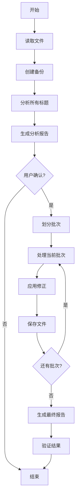
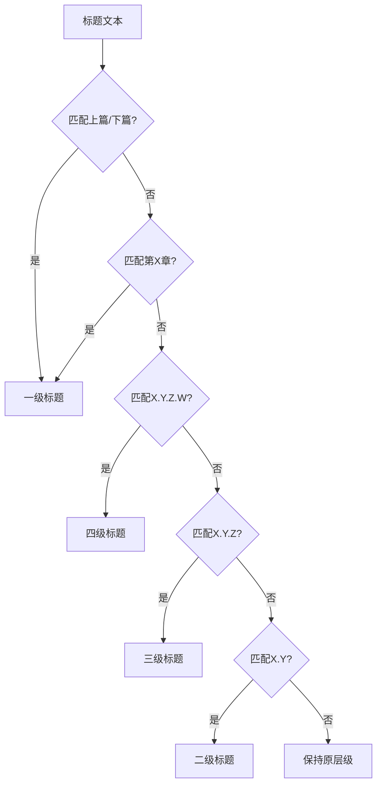

# Design Document

## Overview

本设计文档描述了Markdown标题规范化系统的架构和实现方案。系统将采用Python脚本实现，通过正则表达式识别和修正标题格式，支持分批次处理大文件，确保处理过程的安全性和可控性。

## Architecture

### 系统架构

系统采用模块化设计，主要包含以下组件：

```
┌─────────────────────────────────────┐
│         主控制器                     │
│    (Main Controller)                │
└──────────┬──────────────────────────┘
           │
           ├──────────┬──────────┬──────────┐
           │          │          │          │
      ┌────▼───┐ ┌───▼────┐ ┌──▼─────┐ ┌──▼──────┐
      │文件读取│ │标题分析│ │标题修正│ │结果验证 │
      │ Reader │ │Analyzer│ │ Fixer  │ │Validator│
      └────────┘ └────────┘ └────────┘ └─────────┘
```

### 处理流程

1. **文件读取阶段**: 读取Markdown文件内容
2. **标题分析阶段**: 识别所有标题并分析其规范性
3. **标题修正阶段**: 按批次修正不规范的标题
4. **结果验证阶段**: 验证修正结果的正确性

## Components and Interfaces

### 1. 文件读取器 (FileReader)

**职责**: 负责读取和写入Markdown文件

**接口**:
- `read_file(file_path: str) -> List[str]`: 读取文件内容，返回行列表
- `write_file(file_path: str, lines: List[str]) -> bool`: 写入文件内容
- `backup_file(file_path: str) -> str`: 创建文件备份

### 2. 标题分析器 (TitleAnalyzer)

**职责**: 分析标题的规范性并确定正确的层级

**接口**:
- `extract_titles(lines: List[str]) -> List[TitleInfo]`: 提取所有标题信息
- `analyze_title_level(title_text: str) -> int`: 根据标题文本确定应有层级
- `detect_issues(title_info: TitleInfo) -> List[Issue]`: 检测标题问题
- `generate_report(issues: List[Issue]) -> str`: 生成分析报告

**数据结构**:
```python
class TitleInfo:
    line_number: int      # 行号
    original_text: str    # 原始文本
    current_level: int    # 当前层级
    expected_level: int   # 应有层级
    title_content: str    # 标题内容
    has_issue: bool       # 是否有问题
```

### 3. 标题修正器 (TitleFixer)

**职责**: 修正不规范的标题格式

**接口**:
- `fix_title(title_info: TitleInfo) -> str`: 修正单个标题
- `fix_batch(lines: List[str], start: int, end: int) -> List[str]`: 批量修正标题
- `apply_fixes(lines: List[str], fixes: List[Fix]) -> List[str]`: 应用修正

**修正规则**:
- 一级标题: `# 内容` (用于"上篇"、"下篇"、"第X章"等)
- 二级标题: `## X.Y 内容` (如"## 1.1 系统架构概述")
- 三级标题: `### X.Y.Z 内容` (如"### 1.1.1 系统架构的定义")
- 四级标题: `#### X.Y.Z.W 内容` (如"#### 1.1.1.1 详细说明")

### 4. 结果验证器 (ResultValidator)

**职责**: 验证修正结果的正确性

**接口**:
- `validate_structure(lines: List[str]) -> ValidationResult`: 验证文档结构
- `compare_versions(original: List[str], modified: List[str]) -> ComparisonReport`: 对比版本
- `count_changes(comparison: ComparisonReport) -> Dict[str, int]`: 统计修改数量

## Data Models

### 标题层级判断规则

```python
TITLE_PATTERNS = {
    'part': r'^(上篇|下篇)$',                    # 一级标题
    'chapter': r'^第\d+章',                      # 一级标题
    'section_2': r'^\d+\.\d+\s',                # 二级标题
    'section_3': r'^\d+\.\d+\.\d+\s',           # 三级标题
    'section_4': r'^\d+\.\d+\.\d+\.\d+\s',      # 四级标题
    'special': r'^(目录|前言|内容简介)$'          # 一级标题
}
```

### 批次处理策略

文件按章节划分批次：
- 批次1: 前言、目录、上篇标题
- 批次2-N: 每章作为一个批次
- 批次N+1: 下篇及后续内容

每个批次处理完成后保存并等待用户确认。

## Error Handling

### 错误类型

1. **文件访问错误**: 文件不存在、无读写权限
2. **格式解析错误**: 无法识别的标题格式
3. **层级冲突错误**: 标题层级逻辑不一致
4. **编码错误**: 文件编码问题

### 错误处理策略

- 所有错误都应记录详细日志
- 文件操作前创建备份
- 遇到无法自动修正的问题时，标记并跳过
- 提供回滚机制

## Testing Strategy

### 单元测试

- 测试标题层级判断逻辑
- 测试标题修正规则
- 测试文件读写功能
- 测试备份和恢复功能

### 集成测试

- 测试完整的处理流程
- 测试批次处理功能
- 测试错误恢复机制

### 验证测试

- 使用小样本文件验证
- 对比修改前后的文档结构
- 确保非标题内容未被修改

## Implementation Notes

### 技术选型

- **语言**: Python 3.8+
- **主要库**: 
  - `re`: 正则表达式处理
  - `pathlib`: 文件路径处理
  - `shutil`: 文件备份
  - `difflib`: 版本对比

### 性能考虑

- 使用逐行处理避免内存溢出
- 批次处理减少单次修改风险
- 使用生成器优化大文件处理

### 安全考虑

- 处理前自动创建备份文件
- 每个批次独立保存
- 提供手动回滚选项
- 保持原文件编码格式

## Diagrams

### 处理流程图



### 标题层级判断流程



## Design Decisions

### 决策1: 使用Python而非直接文本编辑

**理由**: 
- Python提供强大的文本处理能力
- 可以实现复杂的逻辑判断
- 便于添加验证和错误处理
- 可重用于其他类似文件

### 决策2: 批次处理而非一次性修改

**理由**:
- 降低大规模修改的风险
- 便于用户逐步验证结果
- 出现问题时影响范围可控
- 符合用户"分步骤实现"的要求

### 决策3: 基于内容编号判断层级

**理由**:
- 编号格式清晰明确（1.1, 1.1.1等）
- 规则简单易于实现
- 符合文档原有结构
- 减少误判可能性

### 决策4: 保持标题内容不变

**理由**:
- 只修正格式，不改变内容
- 降低引入错误的风险
- 保持文档语义完整性
- 便于用户审查修改
