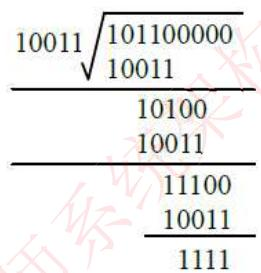
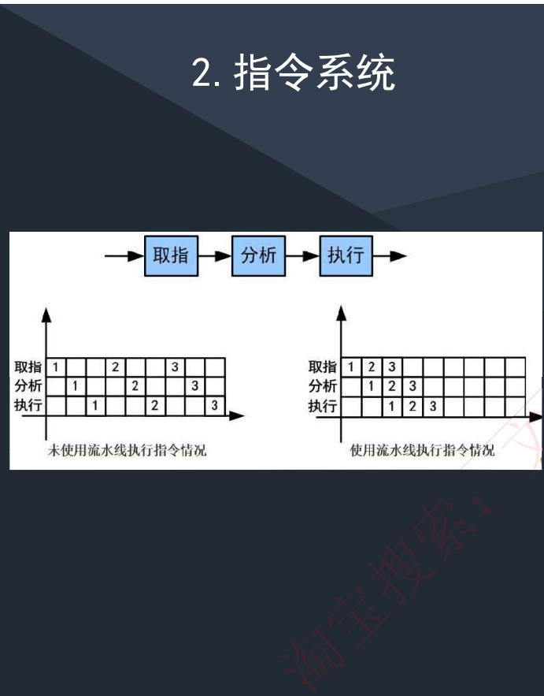
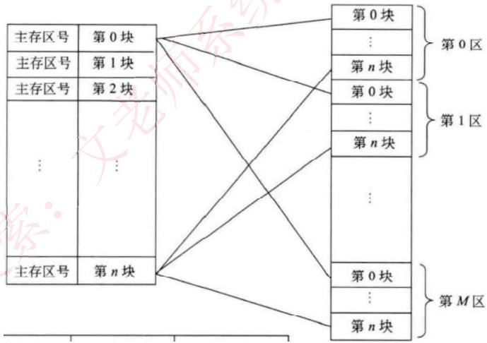
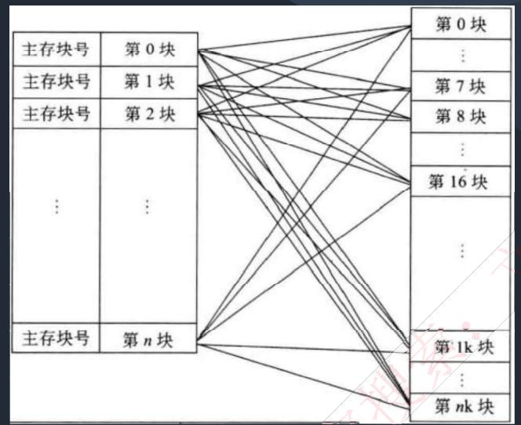
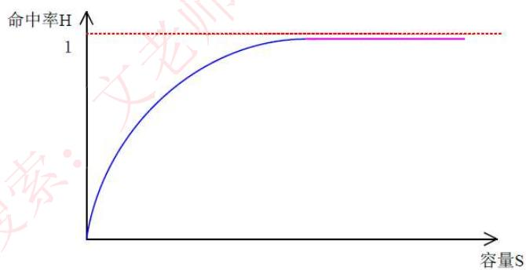

# 计算机硬件

## 历年真题考情

本章节 19-21 年没有考过，但在 22 年真题考过磁盘调度，根据趋势，以后考察的概率很小。

## 第二版更新

第二版教材改版后在 2.2 增加了这块内容，但是内容很少，只有基础的硬件组成介绍，因此我们根据历年真题考察情况做了调整。相比较原来的视频，删除了不考的编码、海明码等内容，同时将可靠性独立到可靠性章节。学员看到课件编号不连续无需疑问，是有删减的，按我们最新视频学习即可。

**本章核心知识点：**
计算机硬件组成、校验码、指令系统、存储系统、输入/输出技术、总线结构

---

# 计算机硬件组成

计算机的基本硬件系统由**运算器、控制器、存储器、输入设备和输出设备** 5 大部件组成。

-   **运算器、控制器**等部件被集成在一起统称为**中央处理单元（Central Processing Unit，CPU）**。CPU 是硬件系统的核心，用于数据的加工处理，能完成各种算术、逻辑运算及控制功能。
-   **存储器**是计算机系统中的记忆设备，分为内部存储器和外部存储器。前者速度高、容量小，一般用于临时存放程序、数据及中间结果。而后者容量大、速度慢，可以长期保存程序和数据。
-   **输入设备和输出设备**合称为外部设备（简称外设），输入设备用于输入原始数据及各种命令，而输出设备则用于输出计算机运行的结果。

---

# 中央处理单元 (CPU)

### CPU 的功能

1.  **程序控制**：CPU 通过执行指令来控制程序的执行顺序，这是 CPU 的重要功能。
2.  **操作控制**：一条指令功能的实现需要若干操作信号配合来完成，CPU 产生每条指令的操作信号并将操作信号送往对应的部件，控制相应的部件按指令的功能要求进行操作。
3.  **时间控制**：CPU 对各种操作进行时间上的控制，即指令执行过程中操作信号的出现时间、持续时间及出现的时间顺序都需要进行严格控制。
4.  **数据处理**：CPU 通过对数据进行算术运算及逻辑运算等方式进行加工处理，数据加工处理的结果被人们所利用。所以，对数据的加工处理也是 CPU 最根本的任务。

此外，CPU 还需要对系统内部和外部的中断（异常）做出响应，进行相应的处理。

### CPU 的组成

CPU 主要由运算器、控制器、寄存器组和内部总线等部件组成。

-   **运算器**：由算术逻辑单元 ALU（实现对数据的算术和逻辑运算）、累加寄存器 AC（运算结果或源操作数的存放区）、数据缓冲寄存器 DR（暂时存放内存的指令或数据）、状态条件寄存器 PSW（保存指令运行结果的条件码内容，如溢出标志等）组成。执行所有的算术运算（如加减乘除等）与逻辑运算（如与、或、非、比较等）。
-   **控制器**：由指令寄存器 IR（暂存 CPU 执行指令）、程序计数器 PC（存放指令执行地址）、地址寄存器 AR（保存当前 CPU 所访问的内存地址）、指令译码器 ID（分析指令操作码）等组成。负责控制整个 CPU 的工作，最为重要。
-   CPU 依据指令周期的不同阶段来区分二进制的指令和数据，因为在指令周期的不同阶段，指令会命令 CPU 分别去取指令或者数据。

---

## 考试真题

**【问题】** CPU 执行算术运算或者逻辑运算时，常将源操作数和结果暂存在（）中。
A. 程序计数器 (PC)
B. 累加器 (AC)
C. 指令寄存器 (IR)
D. 地址寄存器 (AR)

**【答案】** B

**【问题】** 执行 CPU 指令时，在一个指令周期的过程中，首先需从内存读取要执行的指令，此时先要将指令的地址即（）的内容送到地址总线上。
A. 指令寄存器 (IR)
B. 通用寄存器 (GR)
C. 程序计数器 (PC)
D. 状态寄存器 (PSW)

**【答案】** C

---

# 校验码

-   **码距**：在两个编码中，从 A 码到 B 码转换所需要改变的位数称为码距（汉明距离）。一般来说，码距越大，越利于检错和纠错。
-   **奇偶校验码**：在编码中增加 1 位校验位，来使编码中 1 的个数为奇数（奇校验）或者偶数（偶校验），从而使码距变为 2。
    -   **奇校验**：编码中含有奇数个 1。接收方收到后，会计算收到的编码有多少个 1，如果是奇数个，则无误；是偶数个，则有误。
    -   **偶校验**同理，只是编码中有偶数个 1。
    -   奇偶校验只能检测出 1 位的错误，并且无法纠错。

-   **循环冗余校验码 (CRC)**
    -   CRC 只能检错，不能纠错。使用 CRC 编码，需要先约定一个**生成多项式 G(x)**。生成多项式的最高位和最低位必须是 1。
    -   **原理**：假设原始信息有 m 位，则对应多项式 M(x)。生成校验码的思想就是在原始信息位后追加若干校验位，使得追加后的信息能被 G(x) 整除。接收方接收到带校验位的信息，然后用 G(x) 去除，若余数为 0，则没有错误；反之则发生错误。
    -   **计算步骤**：
        1.  假设生成多项式的阶为 r，则在原始信息位后添加 r 个 0。
        2.  用第一步生成的新串，对生成多项式对应的二进制串做**模 2 除法**（异或运算，不进位不借位），得到余数。
        3.  将得到的余数（若不足 r 位，在前面补 0）拼接到原始信息串后面，即为最终要发送的 CRC 编码。

    **【例】** 假设原始信息串为 `10110`，CRC 的生成多项式为 G(x) = x⁴ + x + 1，求 CRC 校验码。
    1.  G(x) 的阶为 4 (r=4)，所以在原始信息串后加 4 个 0，得到 `101100000`。
    2.  由多项式 G(x) = 1·x⁴ + 0·x³ + 0·x² + 1·x¹ + 1·x⁰ 得到除数为 `10011`。
    3.  进行模 2 除法运算，如下图所示：
        
    4.  上图求得余数为 `1111` (r=4位，无需补位)。
    5.  将余数添加到原始信息后，最终发送的信息串为 `101101111`。

-   **接收方校验**：接收方用接收到的信息串 `101101111` 除以生成多项式 `10011`，若余数为 0，则表示信息无错；否则要求发送方进行重传。（注：收发信息双方需使用相同的生成多项式）

---

## 考试真题

**【问题】** 循环冗余校验码（Cyclic Redundancy Check, CRC) 是数据通信领域中最常用的一种差错校验码。若数据信息为 `1100`，生成多项式为 X³+X+1 (即 `1011`)，则 CRC 编码是（）。
A. 1100010
B. 1011010
C. 1100011
D. 1011110

**【解析】**
CRC 循环校验码的编码流程为：
1.  生成多项式 `1011` 阶数为 3 (k=3)，在原始信息 `1100` 后加 3 个 0，得到 `1100000`。
2.  将 `1100000` 与生成多项式 `1011` 做模 2 除法，得到余数为 `010`。
3.  将原始信息位与余数连接起来得到：`1100010`。

**【答案】** A

---

# 指令系统

-   **计算机指令的组成**：一条指令由**操作码**和**操作数**两部分组成。操作码决定要完成的操作，操作数指参加运算的数据及其所在的单元地址。在计算机中，操作要求和操作数地址都由二进制数码表示，分别称作操作码和地址码，整条指令以二进制编码的形式存放在存储器中。
-   **计算机指令执行过程**：取指令 → 分析指令 → 执行指令。
    1.  **取指令**：将程序计数器 PC 中的指令地址取出，送入地址总线，CPU 依据指令地址去内存中取出指令内容存入指令寄存器 IR。
    2.  **分析指令**：由指令译码器进行分析，分析指令操作码。
    3.  **执行指令**：取出指令执行所需的源操作数，进行运算。

### 指令寻址方式

-   **顺序寻址方式**：当执行一段程序时，是一条指令接着一条指令地顺序执行。
-   **跳跃寻址方式**：指下一条指令的地址码不是由程序计数器给出，而是由本条指令直接给出。程序跳跃后，按新的指令地址开始顺序执行。

### 指令操作数的寻址方式

-   **立即寻址方式**：指令的地址码字段指出的不是地址，而是操作数本身。
-   **直接寻址方式**：在指令的地址字段中直接指出操作数在主存中的地址。
-   **间接寻址方式**：指令地址码字段所指向的存储单元中存储的是操作数的地址。
-   **寄存器寻址方式**：指令中的地址码是寄存器的编号。
-   **基址寻址方式**：将基址寄存器的内容加上指令中的形式地址而形成操作数的有效地址，其优点是可以扩大寻址能力。
-   **变址寻址方式**：将变址寄存器的内容加上指令中的形式地址而形成操作数的有效地址。

### 指令集类型 (CISC vs RISC)

-   **CISC** (Complex Instruction Set Computer)：复杂指令系统，兼容性强，指令繁多、长度可变，由微程序实现。
-   **RISC** (Reduced Instruction Set Computer)：精简指令系统，指令少，使用频率接近，主要依靠硬件实现（通用寄存器、硬布线逻辑控制）。

| 指令系统类型 | 指令 | 寻址方式 | 实现方式 | 其它 |
| :--- | :--- | :--- | :--- | :--- |
| **CISC（复杂）** | 数量多，使用频率差别大，可变长格式 | 支持多种 | 微程序控制技术（微码） | 研制周期长 |
| **RISC（精简）** | 数量少，使用频率接近，定长格式，大部分为单周期指令，操作寄存器，只有 Load/Store 操作内存 | 支持方式少 | 增加了通用寄存器；硬布线逻辑控制为主；适合采用流水线 | 优化编译，有效支持高级语言 |

### 流水线技术

-   **指令流水线原理**：将一条指令的执行过程分成多个阶段（如取指、译码、执行），每个阶段由不同的功能部件来处理。这样就可以让多条指令的不同阶段重叠执行，从而提高效率。
-   **RISC 中的流水线技术**：
    1.  **超流水线 (Super Pipe Line)**：通过细化流水、增加级数和提高主频，使得在每个机器周期内能完成更多的操作。其实质是以时间换取空间。
    2.  **超标量 (Super Scalar)**：通过内置多条流水线来同时执行多个处理。其实质是以空间换取时间。
    3.  **超长指令字 (VLIW)**：依靠编译器将多条可以并行执行的指令组合成一条很长的指令字，由硬件直接执行，从而简化硬件，提高性能。

### 流水线性能计算

-   **流水线周期**：指令分成不同执行段，其中**执行时间最长的段**为流水线周期。
-   **流水线执行时间**：`第 1 条指令执行时间 + (总指令条数 - 1) * 流水线周期`
-   **流水线吞吐率**：单位时间内执行的指令条数。公式：`指令条数 / 流水线执行时间`
-   **流水线加速比**：使用流水线后的效率提升度。公式：`不使用流水线执行时间 / 使用流水线执行时间`

---

## 考试真题

**【问题】** 流水线的吞吐率是指流水线在单位时间里所完成的任务数或输出的结果数。设某流水线有 5 段，有 1 段的时间为 2ns，另外 4 段的每段时间为 1ns，利用此流水线完成 100 个任务的吞吐率约为（）个/s。
A. 500×10⁶
B. 490×10⁶
C. 250×10⁶
D. 167×10⁶

**【解析】**
-   流水线周期 = 最长段的时间 = 2ns。
-   第 1 个任务执行时间 = 各段之和 = 2+1+1+1+1 = 6ns。
-   流水线执行 100 个任务总时间 = 6ns + (100 - 1) * 2ns = 6 + 198 = 204ns。
-   吞吐率 = 100 / 204ns = (100 / 204) * 10⁹ 个/s ≈ 0.490 * 10⁹ 个/s = 490 * 10⁶ 个/s。
-   （注：1s = 10⁹ns）

**【答案】** B

**【问题】** 流水线技术是通过并行硬件来提高系统性能的常用方法。对于一个 k 段流水线，假设其各段的执行时间均相等（设为 t），输入到流水线中的任务是连续的理想情况下，完成 n 个连续任务需要的总时间为（）。若某流水线浮点加法运算器分为 5 段，所需要的时间分别是 6ns、7ns、8ns、9ns 和 6ns，则其最大加速比为（）。
(1)
A. nkt
B. (k+n-1)t
C. (n-k)kt
D. (k+n+1)t
(2)
A. 4
B. 5
C. 6
D. 7

**【解析】**
1.  当流水线各段执行时间相等时，完成 n 个连续任务需要的总时间为 `(k+n-1)*t`。
2.  不使用流水线执行时间 = n * (6+7+8+9+6) = 36n。
    流水线周期 = max(6,7,8,9,6) = 9ns。
    使用流水线执行时间 = (6+7+8+9+6) + (n-1)*9 = 36 + 9n - 9 = 9n + 27。
    加速比 = 36n / (9n + 27)。
    当 n 趋向于无穷大时，加速比取得最大值，即 36n / 9n = 4。

**【答案】** B, A

---

# 存储系统

-   计算机采用**分级存储体系**的主要目的是为了解决存储容量、成本和速度之间的矛盾问题。
-   **常见分级**：Cache - 主存、主存 - 辅存（构成虚拟存储体系）。
-   **局部性原理**：CPU 运行时，所访问的数据会趋向于一个较小的局部空间地址内。
    -   **时间局部性原理**：如果一个数据项正在被访问，那么在近期它很可能会被再次访问。
    -   **空间局部性原理**：在最近的将来会用到的数据的地址和现在正在访问的数据地址很可能是相近的。

### 高速缓存 (Cache)

-   Cache 用来存储当前最活跃的程序和数据，直接与 CPU 交互，位于 CPU 和主存之间。其容量小，速度快（为内存的 5-10 倍），内容是主存部分内容的副本拷贝，对程序员来说是透明的。
-   **工作流程**：Cache 由控制部分和存储器组成。控制部分判断 CPU 要访问的数据是否在 Cache 中，如果在则**命中**，直接从 Cache 读取；如果不在则**未命中**，需要依据一定的算法从主存中读取数据并替换 Cache 中的内容。

### 地址映射

将主存地址转换为 Cache 存储器地址的过程，由硬件自动完成，主要有以下三种方法：

-   **直接映像**：主存和 Cache 都等分成块。主存中的块与 Cache 中块的对应关系是固定的（例如通过取模运算）。地址变换简单但不灵活，冲突概率高。
    
-   **全相联映像**：主存中任意一块都可以调入 Cache 中任意一块位置。地址变换复杂，速度较慢，但块冲突概率最低。
    
-   **组相联映像**：是前两种方式的结合。将 Cache 先分块再分组，主存也同样。组间采用直接映像，但组内采用全相联映像。

### 替换算法

当 Cache 已满但需要调入新块时，需要选择一个旧块替换出去。目标是使 Cache 获得尽可能高的命中率。
-   **随机替换 (RAND)**：随机选择一个块替换出去。
-   **先进先出 (FIFO)**：将最先进入 Cache 的信息块替换出去。
-   **近期最少使用 (LRU)**：将近期最少被访问的 Cache 信息块替换出去。
-   **优化替换 (OPT)**：替换未来最长时间内不会被访问的块（理想情况，无法实现，作为衡量标准）。

### 命中率及平均访问时间

-   **命中率 (H)**：CPU 访问的数据在 Cache 中的比率。
-   **平均访问时间 (Ta)**：`Ta = H * T_cache + (1 - H) * T_memory`
    -   其中 T_cache 为访问 Cache 的时间，T_memory 为访问主存的时间。
    -   **【例】** 设访问一次 Cache 时间为 1ns，访问一次内存的时间为 100ns，若命中率为 90%，则 CPU 读取一次的平均时间为:
        `Ta = 90% * 1ns + (1 - 90%) * 100ns = 0.9ns + 10ns = 10.9ns`

### 磁盘结构与参数

-   **磁盘结构**：磁盘有盘面，每个盘面有多个同心圆（**磁道**），每个磁道又被划分为多个**扇区**。
-   **存取时间**：`存取时间 = 寻道时间 + 等待时间`
    -   **寻道时间**：磁头移动到目标磁道所需的时间。
    -   **等待时间**（旋转延迟）：等待目标扇区旋转到磁头下方所用的时间。

### 磁盘调度算法

磁盘调度主要是为了减少平均寻道时间。
-   **先来先服务 (FCFS)**：按进程请求访问磁盘的先后顺序进行调度，最公平但效率不高。
-   **最短寻道时间优先 (SSTF)**：优先调度与当前磁头所在磁道距离最近的请求，可能导致“饥饿”现象。
-   **扫描算法 (SCAN/电梯算法)**：磁头在磁盘上双向移动，选择在移动方向上与当前磁道最近的请求。移动到一端后才掉头。
-   **单向扫描调度算法 (C-SCAN)**：与 SCAN 类似，但只做单向移动。从一端到另一端，然后立即返回起始端，再次开始单向扫描。

---

## 考试真题

**【问题】** 按照 Cache 地址映像的块冲突概率，从高到低排列的是（）。
A. 全相联映像 → 直接映像 → 组相联映像
B. 直接映像 → 组相联映像 → 全相联映像
C. 组相联映像 → 全相联映像 → 直接映像
D. 直接映像 → 全相联映像 → 组相联映像

**【答案】** B

**【问题】** 以下关于 Cache 与主存间地址映射的叙述中，正确的是（）。
A. 操作系统负责管理 Cache 与主存之间的地址映射
B. 程序员需要通过编程来处理 Cache 与主存之间的地址映射
C. 应用软件对 Cache 与主存之间的地址映射进行调度
D. 由硬件自动完成 Cache 与主存之间的地址映射

**【答案】** D

**【问题】** 假设某磁盘的每个磁道划分成 11 个物理块，每块存放 1 个逻辑记录。逻辑记录 R0, R1, ..., R10 存放在同一个磁道上，记录的存放顺序如下表所示：

| 物理块 | 1 | 2 | 3 | 4 | 5 | 6 | 7 | 8 | 9 | 10 | 11 |
| :--- | :--- | :--- | :--- | :--- | :--- | :--- | :--- | :--- | :--- | :--- | :--- |
| **逻辑记录** | R0 | R1 | R2 | R3 | R4 | R5 | R6 | R7 | R8 | R9 | R10 |

如果磁盘的旋转周期为 33ms，磁头当前处在 R0 的开始处。若系统使用单缓冲区顺序处理这些记录，每个记录处理时间为 3ms，则处理这 11 个记录的最长时间为（）；若对信息存储进行优化分布后，处理 11 个记录的最少时间为（）。
(1)
A. 33ms
B. 336ms
C. 366ms
D. 376ms
(2)
A. 33ms
B. 66ms
C. 86ms
D. 93ms

**【解析】**
-   读取一个记录（一个物理块）的时间 `Tr = 33ms / 11 = 3ms`。
-   处理一个记录的时间 `Tp = 3ms`。

1.  **最长时间（顺序存放）**：
    -   处理一个记录的总时间 = `Tr + Tp = 3 + 3 = 6ms`。
    -   在这 6ms 内，磁盘旋转了 `6ms / 3ms = 2` 个扇区的位置。
    -   当处理完 R(i) 后，磁头已经移动到了 R(i+2) 的起始位置，错过了 R(i+1)。
    -   为了读取 R(i+1)，需要等待磁盘旋转 10 个扇区的位置，即 `10 * 3ms = 30ms`。
    -   总时间 = 总工作时间 + 总等待时间。
    -   总工作时间 = `11 * (Tr + Tp) = 11 * 6 = 66ms`。
    -   总等待时间 = `10` 次等待（从 R0 到 R9 后都需要等待）* `30ms = 300ms`。
    -   总计 = `66ms + 300ms = 366ms`。

2.  **最少时间（优化分布）**：
    -   为了不产生等待时间，可以在处理 R(i) 的 6ms 内，让磁头刚好转到 R(i+1) 的起始位置。
    -   6ms 磁头转过 2 个扇区，所以应将记录间隔 1 个扇区存放，即 `R0, 空, R1, 空, R2, ...`。
    -   优化后，读取和处理可以连续进行，没有等待时间。
    -   总时间 = `11 * (Tr + Tp) = 11 * 6 = 66ms`。

**【答案】** C, B

**【问题】** 在磁盘调度管理中，应先进行移臂调度，再进行旋转调度。假设磁盘移动臂位于 21 号柱面上，进程的请求序列如下表所示。如果采用最短移臂调度算法 (SSTF)，那么系统的响应序列应为（）。

| 请求序列 | ① | ② | ③ | ④ | ⑤ | ⑥ | ⑦ | ⑧ | ⑨ |
| :--- | :--- | :--- | :--- | :--- | :--- | :--- | :--- | :--- | :--- |
| **柱面号** | 17 | 23 | 23 | 32 | 17 | 32 | 17 | 23 | 38 |
| **磁头号** | 8 | 6 | 9 | 10 | 8 | 3 | 7 | 10 | 10 |
| **扇区号** | 9 | 3 | 6 | 5 | 4 | 10 | 9 | 4 | 8 |

A. ②③④⑤①⑦⑥⑧⑨
B. ②③⑧④⑥⑨①⑤⑦
C. ①②③④⑤⑥⑦⑧⑨
D. ②③⑧①⑤⑦④⑥⑨

**【解析】**
SSTF 算法选择与当前磁头位置最近的柱面进行服务。
1.  当前在 21 号柱面。最近的请求是 23 号柱面（距离 2），其次是 17 号柱面（距离 4）。移动到 23。
2.  在 23 号柱面，服务所有请求：②, ③, ⑧。
3.  从 23 号柱面出发，最近的请求是 17 号柱面（距离 6），其次是 32 号柱面（距离 9）。移动到 17。
4.  在 17 号柱面，服务所有请求：①, ⑤, ⑦。
5.  从 17 号柱面出发，最近的请求是 32 号柱面（距离 15）。移动到 32。
6.  在 32 号柱面，服务所有请求：④, ⑥。
7.  从 32 号柱面出发，只剩下 38 号柱面的请求。移动到 38。
8.  在 38 号柱面，服务请求：⑨。
最终服务序列为：(②, ③, ⑧) -> (①, ⑤, ⑦) -> (④, ⑥) -> (⑨)。选项 D 与此序列顺序一致。

**【答案】** D

---

# 输入/输出 (I/O) 技术

### I/O 地址编址方式

-   **内存与接口地址独立编址**：I/O 设备的地址空间与内存的地址空间是分开的。使用专门的 I/O 指令来访问设备。
-   **内存与接口地址统一编址**：I/O 设备和内存单元共用同一个地址空间。访问设备就像访问内存一样，不需要专门的 I/O 指令，功能更强，但会占用内存地址空间。

### I/O 控制方式

计算机和外设间的数据交互方式：
-   **程序控制（查询）方式**：CPU 主动、循环查询外设是否准备好，CPU 效率极低。
-   **程序中断方式**：外设准备好后，向 CPU 发送中断请求，CPU 响应中断并处理数据，效率相对较高。
    -   **中断向量**：提供中断服务程序的入口地址。
    -   多级中断嵌套时，使用堆栈来保护断点和现场。
-   **DMA 方式（直接内存存取）**：数据传输的整个过程都由 DMA 控制器来完成，在主存和外设之间建立直接的数据通路，不占用 CPU 时间，效率很高。

**注意**：CPU 响应 DMA 请求是在一个**总线周期**结束后；CPU 响应程序中断请求是在一条**指令执行**结束后。

---

# 总线结构

**总线 (Bus)**，是指计算机设备和设备之间传输信息的公共数据通道。
-   **内部总线**：芯片级别的总线，用于芯片与处理器之间通信。
-   **系统总线**：板级总线，用于计算机内各部分之间的连接。
    -   **数据总线**：决定并行数据传输的位数。
    -   **地址总线**：决定系统可管理的内存空间的大小。
    -   **控制总线**：传送控制命令。
    -   代表：ISA 总线、PCI 总线。
-   **外部总线**：设备级的总线，用于微机和外部设备的连接。
    -   代表：RS232（串行总线）、SCSI（并行总线）、USB（通用串行总线，支持即插即用和热插拔）。

---

## 考试真题

**【问题】** 计算机系统中常用的输入/输出控制方式有无条件传送、中断、程序查询和 DMA 方式等。当采用（）方式时，不需要 CPU 执行程序指令来传送数据。
A. 中断
B. 程序查询
C. 无条件传送
D. DMA

**【答案】** D

**【问题】** 以下关于总线的说法中，正确的是（）。
A. 串行总线适合近距离高速数据传输，但线间串扰会导致速率受限
B. 并行总线适合长距离数据传输，易提高通信时钟频率来实现高速数据传输
C. 单总线结构在一个总线上适应不同种类的设备，设计简单但可能导致性能瓶颈
D. 半双工总线只能在一个方向上传输信息

**【解析】**
-   A: 串行总线适合长距离，并行总线适合近距离高速，但会受串扰限制。
-   B: 并行总线不适合长距离。
-   C: 单总线结构简单，连接方便，但所有设备共享总线，容易成为性能瓶颈。叙述正确。
-   D: 半双工总线可以双向传输，但不能同时进行。

**【答案】** C

