# 数据库系统

**历年真题考情：** 本章节每年考3-5分左右。

**第二版更新：** 第二版教材对应2.3.3及第6章，主要考点在第6章，这里一起合并到本章节视频中。从历年真题考点来看无变化，按本视频学习即可。主要改动在数据设计部分，至于增加的NoSQL在案例专题中有讲解，这里不新增。

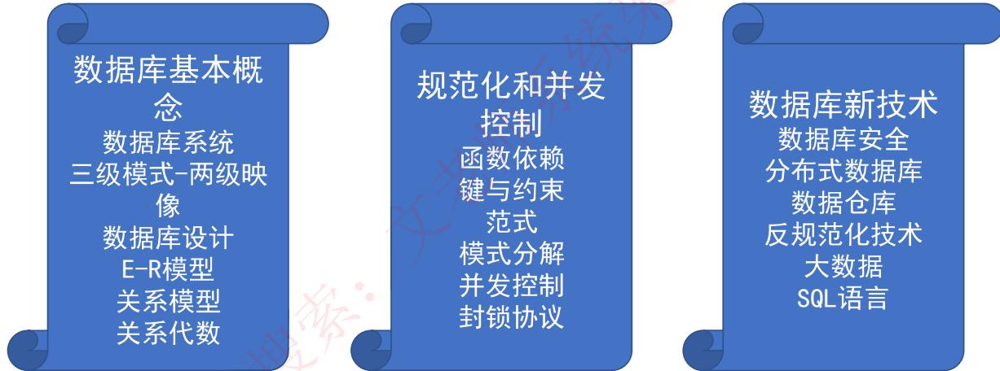

## 数据库系统基础

*   **数据**：是数据库中存储的基本对象，是描述事物的符号记录。数据的种类包括：文本、图形、图像、音频、视频、学生的档案记录、货物的运输情况等。
*   **数据库（DB）**：是长期存储在计算机内、有组织的、可共享的大量数据的集合。
*   **数据库的基本特征**：
    *   数据按一定的数据模型组织、描述和存储
    *   可为各种用户共享
    *   冗余度较小
    *   数据独立性较高
    *   易扩展

### 数据库系统（DBS）

*   **数据库系统（DBS）**：是一个采用了数据库技术，有组织地、动态地存储大量相关数据，方便多用户访问的计算机系统。它由以下四个部分组成：
    *   **数据库**：统一管理、长期存储在计算机内的、有组织的相关数据的集合
    *   **硬件**：构成计算机系统的硬件，包括存储数据所需的外部设备
    *   **软件**：操作系统、数据库管理系统及应用程序
    *   **人员**：系统分析和数据库设计人员、应用程序员、最终用户、数据库管理员（DBA）
*   **数据库管理系统（DBMS）**：其功能是实现对共享数据的有效组织、管理和存取，包括数据定义、数据库操作、数据库运行管理、数据的存储管理、数据库的建立和维护等。

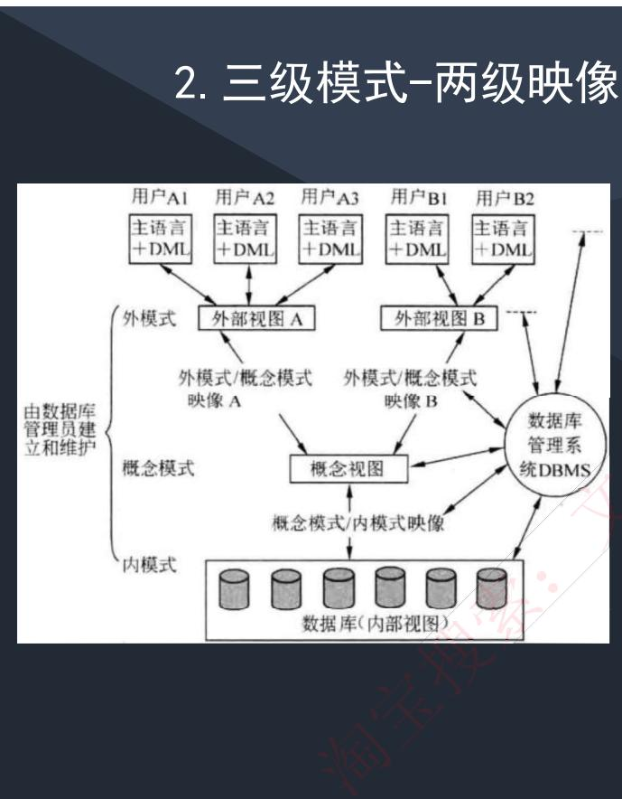

### 三级模式结构

*   **内模式**：管理如何存储物理数据，对应具体的物理存储文件。
*   **模式**：又称为概念模式，就是我们通常使用的基本表，根据应用需求将物理数据划分成一张张表。
*   **外模式**：对应数据库中的视图级别，将表进行一定的处理后再提供给用户使用。
*   **外模式-模式映像**：是表和视图之间的映射，存在于概念级和外部级之间。若表中数据发生了修改，只需要修改此映像，而无需修改应用程序。
*   **模式-内模式映像**：是表和数据的物理存储之间的映射，存在于概念级和内部级之间。若修改了数据存储方式，只需要修改此映像，而不需要修改应用程序。

## 数据库设计

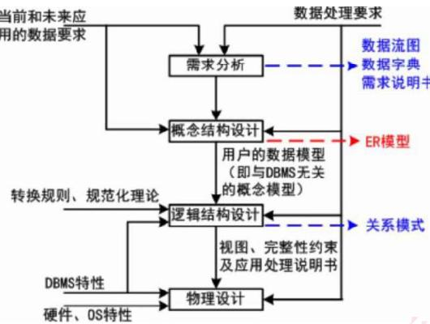

1.  **需求分析**：分析数据存储的要求，产出物有数据流图、数据字典、需求说明书。获得用户对系统的三个要求：信息要求、处理要求、系统要求。
2.  **概念结构设计**：设计E-R图，即实体-联系图。工作步骤包括：选择局部应用、逐一设计分E-R图、E-R图合并。
    分E-R图进行合并时，它们之间存在的冲突主要有以下3类：
    *   **属性冲突**：同一属性可能会存在于不同的分E-R图中
    *   **命名冲突**：相同意义的属性在不同的分E-R图上有着不同的命名，或是名称相同的属性在不同的分E-R图中代表着不同的意义
    *   **结构冲突**：同一实体在不同的分E-R图中有不同的属性，同一对象在某一分E-R图中被抽象为实体而在另一分E-R图中又被抽象为属性
3.  **逻辑结构设计**：将E-R图转换成关系模式。工作步骤包括：确定数据模型、将E-R图转换成为指定的数据模型、确定完整性约束和确定用户视图。
4.  **物理设计**：步骤包括确定数据分布、存储结构和访问方式。
5.  **数据库实施阶段**：根据逻辑设计和物理设计阶段的结果建立数据库，编制与调试应用程序，组织数据入库，并进行试运行。
6.  **数据库运行和维护阶段**：数据库应用系统经过试运行后即可投入正式运行，在该阶段需要不断地对系统进行评价、调整与修改。

### **考试真题**

> 在数据库系统中，数据库的视图、基本表和存储文件的结构分别与（）对应；数据的物理独立性和数据的逻辑独立性是分别通过修改（）来完成的。
>
> **第一空：**
> A. 模式、外模式、内模式
> B. 模式、内模式、外模式
> C. 外模式、模式、内模式
> D. 外模式、内模式、模式
>
> **第二空：**
> A. 模式与内模式之间的映像、外模式与模式之间的映像
> B. 外模式与内模式之间的映像、外模式与模式之间的映像
> C. 外模式与模式之间的映像、模式与内模式之间的映像
> D. 外模式与内模式之间的映像、模式与内模式之间的映像

**答案：** C, A

> 在数据库逻辑结构设计阶段，需要（）阶段形成的（）作为设计依据。
>
> **第一空：**
> A. 需求分析
> B. 概念结构设计
> C. 物理结构设计
> D. 数据库运行和维护
>
> **第二空：**
> A. 程序文档、数据字典和数据流图。
> B. 需求说明文档、程序文档和数据流图
> C. 需求说明文档、数据字典和数据流图
> D. 需求说明文档、数据字典和程序文档

**答案：** A, C

## **数据模型**

*   **关系模型**：是二维表的形式表示的实体-联系模型，是将实体-联系模型转换而来的，经过开发人员设计的。
*   **概念模型**：是从用户的角度进行建模的，是现实世界到信息世界的第一抽象，是真正的实体-联系模型。
*   **网状模型**：表示实体类型及其实体之间的联系，一个事物和另外几个都有联系，形成一张网。
*   **面向对象模型**：是采用面向对象的方法设计数据库，以对象为单位，每个对象包括属性和方法，具有类和继承等特点。
*   **数据模型三要素**：数据结构（所研究的对象类型的集合）、数据操作（对数据库中各种对象的实例允许执行的操作的集合）、数据的约束条件（一组完整性规则的集合）。

### **E-R模型**

*   用E-R图来描述概念数据模型，世界是由一组称作实体的基本对象和这些对象之间的联系构成的。
*   在E-R图型中，使用椭圆表示属性（一般没有）、长方形表示实体、菱形表示联系，联系的两端要填写联系类型，示例如下图：

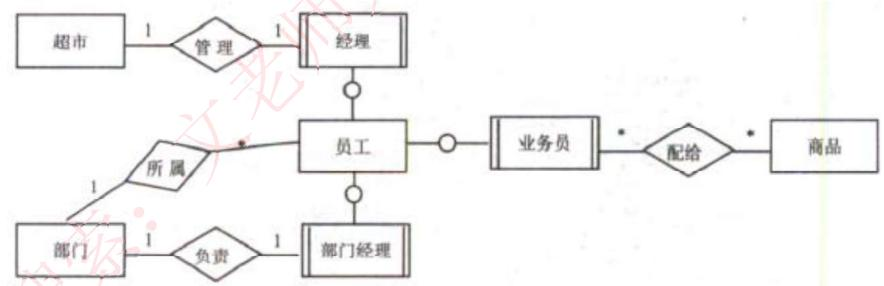

*   **实体**：客观存在并可相互区别的事物。可以是具体的人、事、物或抽象概念。如人、汽车、图书、账户、贷款。
*   **弱实体和强实体**：弱实体依赖于强实体的存在而存在。
*   **实体集**：具有相同类型和共享相同属性的实体的集合，如学生、课程。
*   **属性**：实体所具有的特性。
*   **属性分类**：简单属性和复合属性；单值属性和多值属性；NULL属性；派生属性。
*   **域**：属性的取值范围称为该属性的域。
*   **码（key）**：唯一标识实体的属性集。
*   **联系**：现实世界中事物内部以及事物之间的联系，在E-R图中反映为实体内部的联系和实体之间的联系。
*   **联系类型**：一对一（1:1）、一对多（1:N）、多对多（M:N）。

### **两个以上实体型的联系**

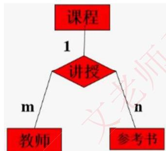*两个以上实体型间1:n联系*

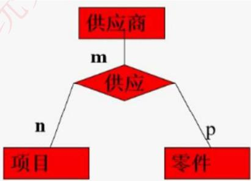
*两个以上实体型间m:n联系*

### **关系模型**

*   关系模型中数据的逻辑结构是一张二维表，由行列组成。用表格结构表达实体集，用外键标识实体间的联系。如下图：

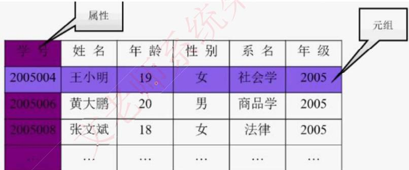

*   **优点**：建立在严格的数学概念基础上；概念单一、结构简单、清晰，用户易懂易用；存取路径对用户透明，从而数据独立性、安全性好，简化数据库开发工作。
*   **缺点**：由于存取路径透明，查询效率往往不如非关系数据模型。

### **E-R模型转换为关系模型**

每个实体都对应一个关系模式；联系分为三种：

*   **1:1联系**：联系可以放到任意的两端实体中，作为一个属性（要保证1:1的两端关联），也可以转换为一个单独的关系模式。
*   **1:N的联系**：联系可以单独作为一个关系模式，也可以在N端中加入1端实体的主键。
*   **M:N的联系**：联系必须作为一个单独的关系模式，其主键是M和N端的联合主键。

### **考试真题 1**

> 某本科高校新建教务管理系统，支撑各学院正常的教学教务管理工作。经过初步分析，系统中包含的实体有学院、教师、学生、课程等。考虑需要将本科学生的考试成绩及时通报给学生家长，新增家长实体；考虑到夜大、网络教育学生管理方式的不同，需要额外的管理数据，新增进修学生实体：规定一个学生可以选择多门课程，每门课程可以被多名学生选修；一个教师可以教授多门课程，一门课程只能被一名教师讲授。（）实体之间为多对多联系，（）属于弱实体对强实体的依赖联系。
>
> **第一空：**
> A、学生、学院
> B、教师、学院
> C、学生、课程
> D、教师、课程
>
> **第二空：**
> A、家长、学生
> B、学生、教师
> C、学生、学院
> D、教师、学院

**答案：** C, A

**解析：** 一个学生可以选择多门课程，每门课程可以被多名学生选修，因此学生和课程是多对多。弱实体依赖于强实体的存在而存在，只有学生存在，其家长信息才会存在，否则单独的家长信息无意义。

### **考试真题 2**

> 54-56. 部门、员工和项目的关系模式及它们之间的E-R图如下所示，其中关系模式中带实下划线的属性表示主键属性。图中：
>
> *   部门（<u>部门代码</u>，部门名称，电话）
> *   员工（<u>员工代码</u>，姓名，部门代码，联系方式，薪资）
> *   项目（<u>项目编号</u>，项目名称，承担任务）
>
> 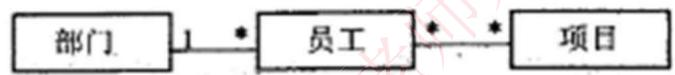
>
> 若部门和员工关系进行自然连接运算，其结果为（54）元关系。由于员工和项目之间的联系类型为（55），所以员工和项目之间的联系需要转换成一个独立的关系模式，该关系模式的主键是（56）。
>
> **(54)**
> A. 5
> B. 6
> C. 7
> D. 8
>
> **(55)**
> A. 1对1
> B. 1对多
> C. 多对1
> D. 多对多
>
> **(56)**
> A. （项目名称，员工代码）
> B. （项目编号，员工代码）
> C. （项目名称，部门代码）
> D. （项目名称，承担任务）

**答案：** C, D, B

## **关系代数**

*   **并**：结果是两张表中所有记录数合并，相同记录只显示一次。
*   **交**：结果是两张表中相同的记录。
*   **差**：S1 - S2，结果是S1表中有而S2表中没有的那些记录。

| 关系S1 | | |
| :--- | :--- | :--- |
| **Sno** | **Sname** | **Sdept** |
| No0001 | Mary | IS |
| No0003 | Candy | IS |
| No0004 | Jam | IS |

| 关系S2 | | |
| :--- | :--- | :--- |
| **Sno** | **Sname** | **Sdept** |
| No0001 | Mary | IS |
| No0008 | Katter | IS |
| No0021 | Tom | IS |

| S1 ∩ S2 (交) | | |
| :--- | :--- | :--- |
| **Sno** | **Sname** | **Sdept** |
| No0001 | Mary | IS |

| S1 - S2 (差) | | |
| :--- | :--- | :--- |
| **Sno** | **Sname** | **Sdept** |
| No0003 | Candy | IS |
| No0004 | Jam | IS |

| S1 U S2 (并) | | |
| :--- | :--- | :--- |
| **Sno** | **Sname** | **Sdept** |
| No0001 | Mary | IS |
| No0003 | Candy | IS |
| No0004 | Jam | IS |
| No0008 | Katter | IS |
| No0021 | Tom | IS |

---

*   **笛卡尔积**：S1 * S2，产生的结果包括S1和S2的所有属性列，并且S1中每条记录依次和S2中所有记录组合成一条记录，最终属性列为S1+S2属性列，记录数为S1 * S2记录数。
*   **投影**：实际是按条件选择某关系模式中的某列，也可以用数字表示。
*   **选择**：实际是按条件选择某关系模式中的某条记录。

| 关系S1 | | |
| :--- | :--- | :--- |
| **Sno** | **Sname** | **Sdept** |
| No0001 | Mary | IS |
| No0001 | Mary | IS |
| No0003 | Candy | IS |
| No0004 | Jam | IS |

| 关系S2 | | |
| :--- | :--- | :--- |
| **Sno** | **Sname** | **Sdept** |
| No0001 | Mary | IS |
| No0008 | Katter | IS |
| No0021 | Tom | IS |

| S1 × S2 (笛卡尔积) | | | | | |
| :--- | :--- | :--- | :--- | :--- | :--- |
| **Sno** | **Sname** | **Sdept** | **Sno** | **Sname** | **Sdept** |
| No0001 | Mary | IS | No0001 | Mary | IS |
| No0001 | Mary | IS | No0008 | Katter | IS |
| No0001 | Mary | IS | No0021 | Tom | IS |
| No0003 | Candy | IS | No0001 | Mary | IS |
| No0003 | Candy | IS | No0008 | Katter | IS |
| No0003 | Candy | IS | No0021 | Tom | IS |
| No0004 | Jam | IS | No0001 | Mary | IS |
| No0004 | Jam | IS | No0008 | Katter | IS |
| No0004 | Jam | IS | No0021 | Tom | IS |

| 投影 (π <sub>Sno, Sname</sub>(S1)) | |
| :--- | :--- |
| **Sno** | **Sname** |
| No0001 | Mary |
| No0003 | Candy |
| No0004 | Jam |

| 选择 (σ <sub>Sname='Candy'</sub>(S1)) | | |
| :--- | :--- | :--- |
| **Sno** | **Sname** | **Sdept** |
| No0003 | Candy | IS |

---

*   **自然连接**的结果显示全部的属性列，但是相同属性列只显示一次，显示两个关系模式中属性相同且值相同的记录。设有关系R、S如下左图所示，自然连接结果如下右图所示：

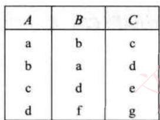
*（a）关系R*

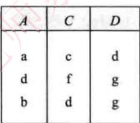
*（b）关系S*

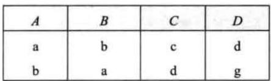
*R ⋈ S*

### **考试真题**

> 给定关系R(A,B,C,D)和关系S(C,D,E)，对其进行自然连接运算R⋈S后的属性列为（）个；与 σ<sub>R.B > S.E</sub>(R ⋈ S) 等价的关系代数表达式为（）。
>
> **第一空：**
> A. 4
> B. 5
> C. 6
> D. 7
>
> **第二空：**
> A. σ<sub>2 > 7</sub>(R × S)
> B. π<sub>1,2,3,4,7</sub>(σ<sub>2 > 7</sub> ∧ <sub>3=5</sub> ∧ <sub>4=6</sub>(R × S))
> C. σ<sub>2 > 7</sub>(R ⋈ S)
> D. π<sub>1,2,3,4,7</sub>(σ<sub>2 > 7</sub> ∧ <sub>3=5</sub> ∧ <sub>4=6</sub>(R × S))

**答案：** B, D

**解析：** 对R与S做自然联接运算时，联接条件为：R.C = S.C and R.D = S.D。运算结果会自动去重复列，所以结果的列为：A、B、C、D、E，一共5列。

## **函数依赖与范式**

### **函数依赖**

*   给定一个X，能唯一确定一个Y，就称X确定Y，或者说Y依赖于X，例如 Y = X * X 函数。

函数依赖又可扩展以下两种规则：

*   **部分函数依赖**：A可确定C，(A,B)也可确定C，(A,B)中的一部分（即A）可以确定C，称为部分函数依赖。
*   **传递函数依赖**：当A和B不等价时，A可确定B，B可确定C，则A可确定C，是传递函数依赖；若A和B等价，则不存在传递，直接就可确定C。

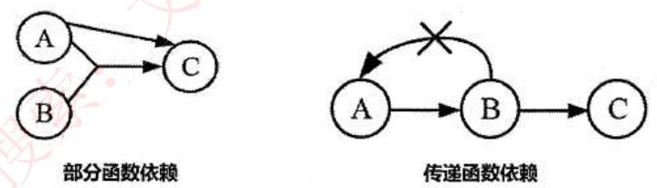

### **函数依赖的公理系统（Armstrong）**

设关系模式R<U，F>，U是关系模式R的属性全集，F是关系模式R的一个函数依赖集。对于R<U，F>来说有以下的：
*   **自反律**：若Y ⊆ X ⊆ U，则 X → Y 为F所逻辑蕴含。
*   **增广律**：若X → Y为F所逻辑蕴含，且Z ⊆ U，则 XZ → YZ为F所逻辑蕴含。
*   **传递律**：若X → Y和Y → Z为F所逻辑蕴含，则 X → Z为F所逻辑蕴含。
*   **合并规则**：若X → Y，X → Z，则 X → YZ为F所蕴涵。
*   **伪传递率**：若X → Y，WY → Z，则 XW → Z为F所蕴涵。
*   **分解规则**：若X → Y，Z ⊆ Y，则 X → Z为F所蕴涵。

### **键与约束**

*   **超键**：超键中去掉冗余的属性，剩余的属性就是候选键。
*   **主键**：任选一个候选键，即可作为主键。
*   **外键**：其他表中的主键。
*   **主属性**：候选键内的属性为主属性，其他属性为非主属性。
*   **实体完整性约束**：即主键约束，主键值不能为空，也不能重复。
*   **参照完整性约束**：即外键约束，外键必须是其他表中已经存在的主键的值，或者为空。
*   **用户自定义完整性约束**：自定义表达式约束，如设定年龄属性的值必须在0到150之间。

### **范式（Normalization）**

#### **第一范式（1NF）**

关系中的每一个分量必须是一个不可分的数据项。通俗地说，第一范式就是表中不允许有小表的存在。比如，对于如下的员工表，就不属于第一范式：

| 员工编号 | 员工姓名 | 出生日期 | 薪资/月 | 所属部门 |
| :--- | :--- | :--- | :--- | :--- |
| | | | **基本工资/月** | **补贴/月** | |
| 1 | 王红 | 19900908 | 9000 | 1000 | 101 |
| ... | ... | ... | ... | ... | |

#### **范式实例**

*   用一个单一的关系模式学生来描述学校的教务系统：
    学生(<u>学号</u>, 学生姓名, 系号, 系主任姓名, <u>课程号</u>, 成绩)
*   依赖关系：
    *   学号 → 学生姓名
    *   学号 → 系号
    *   系号 → 系主任姓名
    *   (学号, 课程号) → 成绩

| 学号 | 学生姓名 | 所在系 | 系主任姓名 | 课程号 | 成绩 |
| :--- | :--- | :--- | :--- | :--- | :--- |
| 201102 | 张明 | 计算机系 | 章三 | 04 | 70 |
| 201103 | 王红 | 计算机系 | 章三 | 05 | 60 |
| 201103 | 王红 | 计算机系 | 章三 | 04 | 80 |
| 201103 | 王红 | 计算机系 | 章三 | 06 | 87 |
| 201104 | 李青 | 机械系 | 王五 | 09 | 79 |
| ... | ... | ... | ... | ... | ... |

#### **第二范式（2NF）**

如果关系R属于1NF，且每一个非主属性完全函数依赖于任何一个候选码，则R属于2NF。通俗地说，2NF就是在1NF的基础上，表中的每一个非主属性不会依赖复合主键中的某一个列。按照定义，上面的学生表就不满足2NF，因为学生姓名、系号等部分依赖于主键(学号, 课程号)中的学号。

将学生表分解为：
*   学生（<u>学号</u>，学生姓名，系编号，系名，系主任）
*   选课（<u>学号，课程号</u>，成绩）
每张表均属于2NF。

#### **第三范式（3NF）**

在满足2NF的基础上，表中不存在非主属性对码的传递依赖。

继续上面的实例，学生关系模式就不属于3NF，因为学生无法直接决定系主任和系名，存在传递依赖：学号 → 系编号 → 系主任，学号 → 系编号 → 系名。

将学生表进一步分解为：
*   学生（<u>学号</u>，学生姓名，系编号）
*   系（<u>系编号</u>，系名，系主任）
*   选课（<u>学号，课程号</u>，成绩）
每张表都属于3NF。

#### **BC范式（BCNF）**

在第三范式的基础上进一步消除主属性对于码的部分函数依赖和传递依赖。通俗的来说，就是在每一种情况下，每一个依赖的左边决定因素都必然包含候选键，如下：

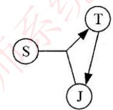

*   上图中，候选键有两种情况：组合键(S,T)或者(S,J)，依赖集为 {SJ → T, T → J}，可知，STJ三个属性都是主属性，因此其达到了3NF（无非主属性），然而，对于依赖T → J，决定因素T不包含任意候选码，因此上图不是BCNF。
*   要使上图关系模式转换为BCNF也很简单，只需要将依赖T → J变为TS → J即可，这样其左边决定因素就包含了候选键之一S。

### **考试真题 1**

> 给定关系模式R(U,F)，U={A,B,C,D}，F={AB→C, C→D, D→B}。关系R（），且分别有（）。
>
> **第一空：**
> A. 只有1个候选关键字ACB
> B. 只有1个候选关键字BCD
> C. 有2个候选关键字ACD和ABD
> D. 有2个候选关键字ACB和BCD
>
> **第二空：**
> A. 0个非主属性和4个主属性
> B. 1个非主属性和3个主属性
> C. 2个非主属性和2个主属性
> D. 3个非主属性和1个主属性

**答案：** C, A

**解析：** 候选关键字的求法：根据依赖集，找出从未在右边出现过的属性，必然是候选键之一，以该属性为基础，根据依赖集依次扩展，看能否遍历所有属性，将无法遍历的加入候选键中。本题中A只在左边出现，所以候选键必然包含A。A+ = {A}，AB+ = {A,B,C,D}，AC+ = {A,C,D,B}。所以AB和AC是候选键。所有属性A,B,C,D都在候选键中，都是主属性，没有非主属性。

### **考试真题 2**

> 设有关系模式R（E，N，M，L，Q），其函数依赖集为F={E→N, EM→Q, M→L}。则关系模式R达到了____；该关系模式____。
>
> **第一空：**
> A. 1NF
> B. 2NF
> C. 3NF
> D. BCNF
>
> **第二空：**
> A. 无需进行分解，因为已经达到了3NF
> B. 无需进行分解，因为已经达到了BCNF
> C. 尽管不存在部分函数依赖，但还存在传递依赖，所以需要进行分解
> D. 需要进行分解，因为存在冗余、修改操作的不一致性、插入和删除异常

**答案：** A, D

## **模式分解**

范式之间的转换一般都是通过拆分属性，即模式分解，将具有部分函数依赖和传递依赖的属性分离出来，来达到一步步优化，一般分为以下两种：

### **保持函数依赖分解**

对于关系模式R，有依赖集F，若对R进行分解，分解出来的多个关系模式，保持原来的依赖集不变，则为保持函数依赖的分解。另外，注意要消除掉冗余依赖（如传递依赖）。

**实例**：设原关系模式R(A,B,C)，依赖集F={A→B, B→C, A→C}，将其分解为两个关系模式R1(A,B)和R2(B,C)，此时R1中保持依赖A→B，R2保持依赖B→C，说明分解后的R1和R2是保持函数依赖的分解，因为A→C这个函数依赖实际是一个冗余依赖，可以由前两个依赖传递得到，因此不需要管。

#### **保持函数依赖的判断**

1.  如果F上的每一个函数依赖都在其分解后的某一个关系上成立，则这个分解是保持依赖的（这是一个充分条件）。也即我们课堂上说的简单方法，看函数每个依赖的左右两边属性是否都在同一个分解的模式中。
2.  如果上述判断失败，并不能断言分解不是保持依赖的，还要使用下面的通用方法来做进一步判断。该方法的表述如下：
    算法二：对F上的每一个 α → β 使用下面的过程：
    result := α;
    while(result发生变化) do
        for each分解后的Ri
            t = (result ∩ Ri)<sup>+</sup> ∩ Ri
            result = result ∪ t
    如果最终β ⊆ result，则该依赖保持。

### **考试真题**

> 假设关系模式R(U，F)，属性集U={A，B，C），函数依赖集F={A→B，B→C）。若将其分解为p={R1(U1，F1)，R2(U2，F2)），其中U1={A，B），U2={A，C}。那么，分解p（）。
>
> A. 有损连接但保持函数依赖
> B. 既无损连接又保持函数依赖
> C. 有损连接且不保持函数依赖
> D. 无损连接但不保持函数依赖

**答案：** D

**解析：**
*   **无损连接判断**：R1 ∩ R2 = {A}。R1 - R2 = {B}，R2 - R1 = {C}。A→(R1-R2)即A→B成立。所以是无损连接。
*   **保持函数依赖判断**：依赖A→B在R1(A,B)中保持。依赖B→C的左右两边属性不在任何一个分解后的模式中，所以不保持函数依赖。因此是无损连接但不保持函数依赖。

### **无损分解**

*   **无损分解**：分解后的关系模式能够还原出原关系模式，就是无损分解，不能还原就是有损。
*   **当分解为两个关系模式**，可以通过以下定理判断是否无损分解：
    定理：如果R的分解为p={R1，R2}，F为R所满足的函数依赖集合，分解p具有无损连接性的充分必要条件是 (R1 ∩ R2) → (R1 - R2) 或者 (R1 ∩ R2) → (R2 - R1)。
*   **当分解为三个及以上关系模式时**，可以通过表格法求解，如下：

**思考题：**
有关系模式：成绩（学号，姓名，课程号，课程名，分数）
函数依赖：学号 → 姓名，课程号 → 课程名，（学号，课程号） → 分数
若将其分解为：
*   成绩（学号，课程号，分数）
*   学生（学号，姓名）
*   课程（课程号，课程名）
请思考该分解是否为无损分解？

**解：**
初始表如下：

| | 学号 | 姓名 | 课程号 | 课程名 | 分数 |
| :--- | :---: | :---: | :---: | :---: | :---: |
| **成绩** | √ | × | √ | × | √ |
| **学生** | √ | √ | × | × | × |
| **课程** | × | × | √ | √ | × |

根据 **学号 → 姓名**，如果某一行在学号列是√，则它在姓名列也应该是√。第二行满足，将第一行的姓名列由×改成√。
根据 **课程号 → 课程名**，如果某一行在课程号列是√，则它在课程名列也应该是√。第三行满足，将第一行的课程名列由×改成√。
处理后得下表：

| | 学号 | 姓名 | 课程号 | 课程名 | 分数 |
| :--- | :---: | :---: | :---: | :---: | :---: |
| **成绩** | √ | √ | √ | √ | √ |
| **学生** | √ | √ | × | × | × |
| **课程** | × | × | √ | √ | × |

从上图中可以看出，第1行已全部为√，因此本次R分解是无损联接分解。

### **考试真题 2**

> 给定关系模式R<U，F>，U = {A，B，C，D，E}，F = {B→A，D→A，A→E，AC→B}，则R的候选关键字为（），分解 ρ = {R1（ABCE），R2（CD）}（）。
>
> **第一空：**
> A. CD
> B. ABD
> C. ACD
> D. ADE
>
> **第二空：**
> A. 具有无损连接性，且保持函数依赖
> B. 不具有无损连接性，但保持函数依赖
> C. 具有无损连接性，但不保持函数依赖
> D. 不具有无损连接性，也不保持函数依赖

**答案：** C, D

## **并发控制**

*   **事务**：由一系列操作组成，这些操作，要么全做，要么全不做，拥有四种特性，详解如下：
    *   **（操作）原子性（Atomicity）**：要么全做，要么全不做。
    *   **（数据）一致性（Consistency）**：事务发生后数据是一致的，例如银行转账，不会存在A账户转出，但是B账户没收到的情况。
    *   **（执行）隔离性（Isolation）**：任一事务的更新操作直到其成功提交的整个过程对其他事务都是不可见的，不同事务之间是隔离的，互不干涉。
    *   **（改变）持续性（Durability）**：事务操作的结果是持续性的。

*   事务是并发控制的前提条件，并发控制就是控制不同的事务并发执行，提高系统效率，但是并发控制中存在下面三个问题：

### **并发问题**

*   **丢失更新**：事务1对数据A进行了修改并写回，事务2也对A进行了修改并写回，此时事务2写回的数据会覆盖事务1写回的数据，就丢失了事务1对A的更新。即对数据A的更新会被覆盖。
*   **不可重复读**：事务2读A，而后事务1对数据A进行了修改并写回，此时若事务2再读A，发现数据不对。即一个事务重复读A两次，会发现数据A有误。
*   **读脏数据**：事务1对数据A进行了修改后，事务2读数据A，而后事务1回滚，数据A恢复了原来的值，那么事务2对数据A做的事是无效的，读到了脏数据。

**丢失更新**
| T1 | T2 |
| :--- | :--- |
| ① 读A=10 | 读A=10 |
| ② A=A-5写回 (A=5) | A=A-8写回 (A=2)|
| ③ (T1的更新丢失) | |

**不可重复读**
| T1 | T2 |
| :--- | :--- |
| ① 读A=20 <br> 读B=30 <br> 求和=50 | |
| | 读A=20 <br> A←A+50 <br> 写A=70 |
| ② 读A=70 <br> 读B=30 <br> 求和=100 (验算不对) | |

**读“脏”数据**
| T1 | T2 |
| :--- | :--- |
| ① 读A=20 <br> A←A+50 <br> 写回70 | |
| | 读A=70 |
| ② ROLLBACK <br> A恢复为20 | (T2读到的是脏数据)|

### **封锁协议**

*   **X锁**是排它锁（写锁）。若事务T对数据对象A加上X锁，则只允许T读取和修改A，其他事务都不能再对A加任何类型的锁，直到T释放A上的锁。
*   **S锁**是共享锁（读锁）。若事务T对数据对象A加上S锁，则只允许T读取A，但不能修改A，其他事务只能再对A加S锁（也即能读不能修改），直到T释放A上的S锁。

共分为三级封锁协议，如下：

*   **一级封锁协议**：事务在修改数据R之前必须先对其加X锁，直到事务结束才释放。可解决**丢失更新**问题。
    | T1 | T2 |
    | :--- | :--- |
    | ① 对A加写锁 | 对A加写锁 (等待) |
    | ② 读A=10 | 等待 |
    | ③ A=A-5写回 | 等待 |
    | ④ 释放对A的写锁 | 等待 |
    | | ⑤ 获得写锁 |
    | | ⑥ 读A=5 |
    | | ⑦ A=A-8写回 |
    | | ⑧ 释放对A的写锁 |

*   **二级封锁协议**：一级封锁协议的基础上加上事务T在读数据R之前必须先对其加S锁，读完后即可释放S锁。可解决**丢失更新、读脏数据**问题。
    | T1 | T2 |
    | :--- | :--- |
    | ① 对A加写锁 | 对A加读锁 (等待) |
    | ② 读A=20 | 等待 |
    | ③ A←A+50 | 等待 |
    | ④ 写回70 | |
    | ⑤ ROLLBACK | |
    | ⑥ A恢复为20 | |
    | ⑦ 释放对A的写锁 | |
    | | ⑧ 获得读锁, 读A=20 <br> 释放对A的读锁 |

*   **三级封锁协议**：一级封锁协议加上事务T在读取数据R之前先对其加S锁，直到事务结束才释放。可解决**丢失更新、读脏数据、数据重复读**问题。
    | T1 | T2 |
    | :--- | :--- |
    | ① 对A与B加S锁（读锁） <br> 读A=20 <br> 读B=30 <br> 求和=50 | |
    | | 对A加X锁（写锁）(等待) |
    | ② | 等待 |
    | ③ 读A=20 <br> 读B=30 <br> 求和=50 <br> 释放对A和B的读锁 | 等待 |
    | | 等待 |
    | | 获得写锁, 读A=20 <br> A←A+50 <br> 写A=70 <br> 释放对A的写锁 |

### **考试真题**

> “当多个事务并发执行时，任一事务的更新操作直到其成功提交的整个过程对其他事务都是不可见的”，这一性质通常被称为事务的()。
>
> A. 原子性
> B. 一致性
> C. 隔离性
> D. 持久性

**答案：** C

> 若事务T1对数据D1加了共享锁，事务T2、T3分别对数据D2、D3加了排它锁，则事务T1对数据()；事务T2对数据()
>
> **第一空：**
> A. D2、D3加排它锁都成功
> B. D2、D3加共享锁都成功
> C. D2加共享锁成功，D3加排它锁失败
> D. D2、D3加排它锁和共享锁都失败
>
> **第二空：**
> A. D1、D3加共享锁都失败
> B. D1、D3加共享锁都成功
> C. D1加共享锁成功，D3加排它锁失败
> D. D1加排它锁成功，D3加共享锁失败

**答案：** D, C

## **数据库高级主题**

### **数据库安全与恢复**

| 措施 | 说明 |
| :--- | :--- |
| **用户标识和鉴定** | 最外层的安全保护措施，可以使用用户帐户、口令及随机数检验等方式 |
| **存取控制** | 对用户进行授权，包括操作类型（如查找、插入、删除、修改等动作）和数据对象（主要是数据范围）的权限。 |
| **密码存储和传输** | 对远程终端信息用密码传输 |
| **视图的保护** | 对视图进行授权 |
| **审计** | 使用一个专用文件或数据库，自动将用户对数据库的所有操作记录下来 |

| 故障类型 | 故障原因 | 解决方法 |
| :--- | :--- | :--- |
| **事务本身的可预期故障** | 本身逻辑 | 在程序中预先设置Rollback语句 |
| **事务本身的不可预期故障** | 算术溢出、违反存储保护 | 由DBMS的恢复子系统通过日志，撤消事务对数据库的修改，回退到事务初始状态 |
| **系统故障** | 系统停止运转 | 通常使用检查点法 |
| **介质故障** | 外存被破坏 | 一般使用日志重做业务 |

*   **静态转储**：即冷备份，指在转储期间不允许对数据库进行任何存取、修改操作；优点是非常快速的备份方法、容易归档（直接物理复制操作）；缺点是只能提供到某一时间点上的恢复，不能做其他工作，不能按表或按用户恢复。
*   **动态转储**：即热备份，在转储期间允许对数据库进行存取、修改操作，因此，转储和用户事务可并发执行；优点是可在表空间或数据库文件级备份，数据库扔可使用，可达到秒级恢复；缺点是不能出错，否则后果严重，若热备份不成功，所得结果几乎全部无效。
*   **完全备份**：备份所有数据。
*   **差量备份**：仅备份上一次完全备份之后变化的数据。
*   **增量备份**：备份上一次备份之后变化的数据。
*   **日志文件**：在事务处理过程中，DBMS把事务开始、事务结束以及对数据库的插入、删除和修改的每一次操作写入日志文件。一旦发生故障，DBMS的恢复子系统利用日志文件撤销事务对数据库的改变，回退到事务的初始状态。

### **分布式数据库**

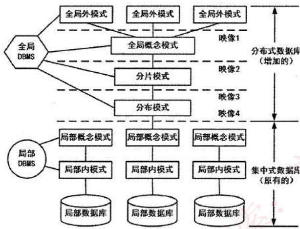

*   局部数据库位于不同的物理位置，使用一个全局DBMS将所有局部数据库联网管理，这就是分布式数据库。
*   **分片模式**
    *   **水平分片**：将表中水平的记录分别存放在不同的地方。
    *   **垂直分片**：将表中的垂直的列值分别存放在不同的地方。
*   **分布透明性**
    *   **分片透明性**：用户或应用程序不需要知道逻辑上访问的表具体是如何分块存储的。
    *   **位置透明性**：应用程序不关心数据存储物理位置的改变。
    *   **逻辑透明性**：用户或应用程序无需知道局部使用的是哪种数据模型。
    *   **复制透明性**：用户或应用程序不关心复制的数据从何而来。

### **数据仓库技术**

**数据仓库**是一个面向主题的、集成的、非易失的、且随时间变化的数据集合，用于支持管理决策。

*   **面向主题**：按照一定的主题域进行组织的。
*   **集成的**：数据仓库中的数据是在对原有分散的数据库数据抽取、清理的基础上经过系统加工、汇总和整理得到的，必须消除源数据中的不一致性，以保证数据仓库内的信息是关于整个企业的一致的全局信息。
*   **相对稳定的**：数据仓库的数据主要供企业决策分析之用，所涉及的数据操作主要是数据查询，一旦某个数据进入数据仓库以后，一般情况下将被长期保留，也就是数据仓库中一般有大量的查询操作，但修改和删除操作很少，通常只需要定期的加载、刷新。
*   **反映历史变化**：数据仓库中的数据通常包含历史信息，系统记录了企业从过去某一时点（如开始应用数据仓库的时点）到目前的各个阶段的信息，通过这些信息，可以对企业的发展历程和未来趋势做出定量分析和预测。

数据仓库的结构通常包含四个层次，如下图所示：

1.  **数据源**：是数据仓库系统的基础，是整个系统的数据源泉。
2.  **数据的存储与管理**：是整个数据仓库系统的核心。
3.  **OLAP（联机分析处理）服务器**：对分析需要的数据进行有效集成，按多维模型组织，以便进行多角度、多层次的分析，并发现趋势。
4.  **前端工具**：主要包括各种报表工具、查询工具、数据分析工具、数据挖掘工具以及各种基于数据仓库或数据集市的应用开发工具。

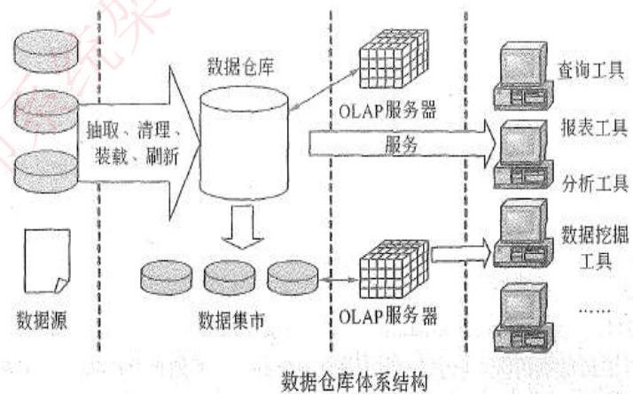

**BI系统**主要包括数据预处理、建立数据仓库、数据分析和数据展现四个主要阶段。

*   **数据预处理**是整合企业原始数据的第一步，它包括数据的抽取（Extraction）、转换（Transformation）和加载（Load）三个过程（ETL过程）；
*   **建立数据仓库**则是处理海量数据的基础；
*   **数据分析**是体现系统智能的关键，一般采用联机分析处理（OLAP）和数据挖掘两大技术。联机分析处理不仅进行数据汇总/聚集，同时还提供切片、切块、下钻、上卷和旋转等数据分析功能，用户可以方便地对海量数据进行多维分析。数据挖掘的目标则是挖掘数据背后隐藏的知识，通过关联分析、聚类和分类等方法建立分析模型，预测企业未来发展趋势和将要面临的问题；
*   在海量数据和分析手段增多的情况下，**数据展现**则主要保障系统分析结果的可视化。

### **反规范化技术**

**反规范化技术**：规范化设计后，数据库设计者希望牺牲部分规范化来提高性能。

*   **采用反规范化技术的益处**：降低连接操作的需求、降低外码和索引的数目，还可能减少索引的数目，能够提高查询效率。
*   **可能带来的问题**：数据的重复存储，浪费了磁盘空间；可能出现数据的完整性问题，为了保障数据的一致性，增加了数据维护的复杂性，会降低修改速度。

**具体方法**：

1.  **增加冗余列**：在多个表中保留相同的列，通过增加数据冗余减少或避免查询时的连接操作。
2.  **增加派生列**：在表中增加可以由本表或其它表中数据计算生成的列，减少查询时的连接操作并避免计算或使用集合函数。
3.  **重新组表**：如果许多用户需要查看两个表连接出来的结果数据，则把这两个表重新组成一个表来减少连接而提高性能。
4.  **水平分割表**：根据一列或多列数据的值，把数据放到多个独立的表中，主要用于表数据规模很大、表中数据相对独立或数据需要存放到多个介质上时使用。
5.  **垂直分割表**：对表进行分割，将主键与部分列放到一个表中，主键与其它列放到另一个表中，在查询时减少I/O次数。

### **大数据**

*   **特点**：大量化、多样化、价值密度低、快速化。
*   **大数据和传统数据的比较**：
    | 比较维度 | 传统数据 | 大数据 |
    | :--- | :--- | :--- |
    | **数据量** | GB或TB级 | PB级或以上 |
    | **数据分析需求** | 现有数据的分析与检测 | 深度分析（关联分析、回归分析） |
    | **硬件平台** | 高端服务器 | 集群平台 |

*   要处理大数据，一般使用集成平台，称为**大数据处理系统**，其特征为：
    *   高度可扩展性
    *   高性能
    *   高度容错
    *   支持异构环境
    *   较短的分析延迟
    *   易用且开放的接口
    *   较低成本
    *   向下兼容性

### **考试真题**

> 为了保证数据库中数据的安全可靠和正确有效，系统在进行事务处理时，对数据的插入、删除或修改的全部有关内容先写入()；当系统正常运行时，按一定的时间间隔，把数据库缓冲区内容写入（）；当发生故障时，根据现场数据内容及相关文件来恢复系统的状态。
>
> **第一空：**
> A. 索引文件
> B. 数据文件
> C. 日志文件
> D. 数据字典
>
> **第二空：**
> A. 索引文件
> B. 数据文件
> C. 日志文件
> D. 数据字典

**答案：** C, B

**解析：** 在数据库中引入了日志文件，记录系统进行事务处理时的一切操作，但只记录操作内容，数据是存放在数据文件中，恢复现场时，依据日志文件可知有哪些操作，依据数据文件可知操作的数据是哪些。

> 数据仓库中数据（）的特点是指数据一旦进入数据仓库后，将被长期保留并定期加载和刷新，可以进行各种查询操作，但很少对数据进行修改和删除操作。
>
> A. 面向主题
> B. 集成性
> C. 相对稳定性
> D. 反映历史变化

**答案：** C

## **SQL语言**

*   SQL语言中的语法关键字，不区分大小写：
    创建表 `create table`; 指定主键 `primary key()`; 指定外键 `foreign key()`; 修改表 `alter table`; 删除表 `drop table`; 索引 `index`，视图 `view`;

```sql
CREATE TABLE S(
    SNO CHAR(5) NOT NULL UNIQUE,
    Sname CHAR(30) UNIQUE,
    Status CHAR(8),
    City CHAR(20),
    PRIMARY KEY(Sno)
);

ALTER TABLE S ADD Zap CHAR(6);

DROP TABLE Student;

CREATE UNIQUE INDEX S_SNO ON S(Sno);

CREATE VIEW CS_STUDENT ...;
```

---

*   数据库查询 `select...from...where;`
*   分组查询 `group by`，分组时要注意select后的列名要适应分组，`having` 为分组查询附加条件：
    ```sql
    select sno, avg(score)
    from student
    group by sno
    having(avg(score) > 60);
    ```
*   更名运算 `as`：`select sno as "学号" from t1`
*   字符串匹配 `like`，`%` 匹配多个字符串，`_` 匹配任意一个字符串：`select * from t1 where sname like 'a_'`
*   数据库插入 `insert into...values();`：`insert into t1 values('a', 66)`
*   数据库删除 `delete from...where`：`delete from t1 where sno=4`
*   数据库修改 `update...set...where`：`update t1 set sname='aa' where sno=3`
*   排序 `order by`，默认为升序，降序要加关键字 `DESC`：`select * from t1 order by sno desc`

```sql
SELECT [ALL|DISTINCT] <目标列表达式>[,<目标列表达式>]…
FROM <表名或视图名>[,<表名或视图名>]…
[WHERE <条件表达式>]
[GROUP BY <列名1> [HAVING <条件表达式>]]
[ORDER BY <列名2> [ASC|DESC]…];
```

---

*   **DISTINCT**：过滤重复的选项，只保留一条记录。
*   **UNION**：出现在两个SQL语句之间，将两个SQL语句的查询结果取并集，即值存在于第一句或第二句都会被选出。
*   **INTERSECT**：对两个SQL语句的查询结果做交集，即值同时存在于两个语句才被选出。
*   **MIN、AVG、MAX**：分组查询时的聚合函数。

### **考试真题 1**

> 某销售公司数据库的零件关系P(<u>零件号</u>，零件名称，<u>供应商</u>，供应商所在地，库存量)，函数依赖集F={零件号→零件名称, (零件号，供应商)→库存量，供应商→供应商所在地)。零件关系P属于\_54\_。
>
> 查询各种零件的平均库存量、最多库存量与最少库存量之间差值的SQL语句如下：
>
> ```sql
> SELECT 零件号，_55_ FROM P _56_;
> ```
>
> **54、**
> A. 1NF
> B. 2NF
> C. 3NF
> D. 4NF
>
> **55、**
> A. AVG(库存量) AS 平均库存量, MAX(库存量) - MIN(库存量) AS 差值
> B. 平均库存量 AS AVG(库存量), 差值 AS MAX(库存量) - MIN(库存量)
> C. AVG(库存量) AS 平均库存量, MAX(库存量) - MIN(库存量) AS 差值
> D. 平均库存量 AS AVG(库存量), 差值 AS MAX(库存量) - MIN(库存量)
>
> **56、**
> A. ORDER BY 供应商
> B. ORDER BY 零件号
> C. GROUP BY 供应商
> D. GROUP BY 零件号

**答案：** A, A, D

**解析：** 依题意，基于函数依赖集F，零件P关系中的(零件号，供应商)可决定零件P关系的所有属性，因此零件P关系的主键为(零件号，供应商)。又因为“零件号→零件名称”、“供应商→供应商所在地”，由此可知零件名称和供应商所在地都部分依赖于码，所以关系模式P属于1NF。
查询各种零件的平均库存量、最多库存量与最少库存量之间差值时，首先需要在结果列中的第一空缺处填入“AVG(库存量) AS 平均库存量, MAX(库存量) - MIN(库存量) AS 差值”。其次必须用分组语句按零件号分组，因第二空缺处应填入“GROUP BY 零件号”。

### **考试真题 2**

> 若有关系R（A,B,C,D,E）和S（B,C,F,G），则R和S自然连接运算后的属性列有（51）个，与表达式 π<sub>1,3,6,7</sub>（σ<sub>3<6</sub>（R⋈S））等价的SQL语句如下：
>
> SELECT （52） FROM （53） WHERE （54）；
>
> **（51）** A. 5  B. 6  C. 7  D. 9
> **（52）** A. R.A, R.C, S.F, S.G  B. A, C, S.B, S.F  C. A, C, S.B, S.C  D. R.A, R.C, S.B, S.C
> **（53）** A. R  B. S  C. R, S  D. R.S
> **（54）** A. R.B=S.B AND R.C=S.C AND R.C < S.B
> B. R.B=S.B AND R.C=S.C AND R.C < S.F
> C. R.B=S.B OR R.C=S.C OR R.C < S.B
> D. R.B=S.B OR R.C=S.C OR R.C < S.F

**答案：** C, A, C, B

**解析：**
*   **（51）** 自然连接后的属性列取两个表所有属性列，但相同属性列只显示一次，R有A,B,C,D,E (5个)，S有B,C,F,G (4个)，共同属性是B,C。所以结果属性是A,B,C,D,E,F,G，共7列。
*   **（52）** `SELECT`后是要查询显示的列，与投影π下标相同。连接后的7列为1:A, 2:B, 3:C, 4:D, 5:E, 6:F, 7:G。取第1,3,6,7列，即A, C, F, G。需要指定来源表以避免歧义，如 `R.A, R.C, S.F, S.G`。
*   **（53）** `FROM`后面是要查询的表格，是R和S两张表，以逗号分开：`R, S`。
*   **（54）** `WHERE`后面是条件。自然连接的条件是公共属性值相等，即 `R.B=S.B AND R.C=S.C`。表达式中的选择条件是第3列小于第6列，即 `R.C < S.F`。合并所有条件得到 `R.B=S.B AND R.C=S.C AND R.C < S.F`。


