---

# **计算机网络**

**历年真题考情：** 本章节每年考3-5分左右。

**第二版更新：** 但本章节超纲率也有50%，在第二版教材改版后的2.5节，同样没有增加以往真题超纲的内容，比较坑人了，还是一些简单的介绍性内容，可能这个编写架构的人默认大家既然考高级，都具备基本的计算机知识能力吧。没有体系化的内容，也只能通过我们每年直播讲题来补充了。主要改变在于网络概述和协议。

**本章主要内容：**
*   网络功能和分类
*   OSI七层模型
*   TCP/IP协议
*   传输介质
*   通信方式和交换方式
*   IP地址
*   网络规划和设计
*   网络存储技术
*   其他考点补充

## **网络功能和分类**

计算机网络是计算机技术与通信技术相结合的产物，它实现了远程通信、远程信息处理和资源共享。
*   **计算机网络的功能：** 数据通信、资源共享、管理集中化、实现分布式处理、负载均衡。
*   **网络性能指标：** 速率、带宽（频带宽度或传送线路速率）、吞吐量、时延、往返时间、利用率。
*   **网络非性能指标：** 费用、质量、标准化、可靠性、可扩展性、可升级性、易管理性和可维护性。

计算机网络按分布范围和拓扑结构划分如下图所示：

**按分布范围划分：**

| 网络分类 | 缩写 | 分布距离 | 计算机分布范围 | 传输速率范围 |
| :--- | :-- | :--- | :--- | :--- |
| **局域网** | LAN | 10m左右 100m左右 1000m左右 | 房间 楼宇 校园 | 4Mbps～1Gbps |
| **城域网** | MAN | 10km | 城市 | 50Kbps～100Mbps |
| **广域网** | WAN | 100km以上 | 国家或全球 | 9.6Kbps～45Mbps |

**按拓扑结构划分：**
*   **总线型**：利用率低、干扰大、价格低
*   **星型**：交换机形成的局域网、中央单元负荷大
*   **环型**：流动方向固定、效率低扩充难
*   **树型**：总线型的扩充、分级结构
*   **分布式**：任意节点连接、管理难成本高

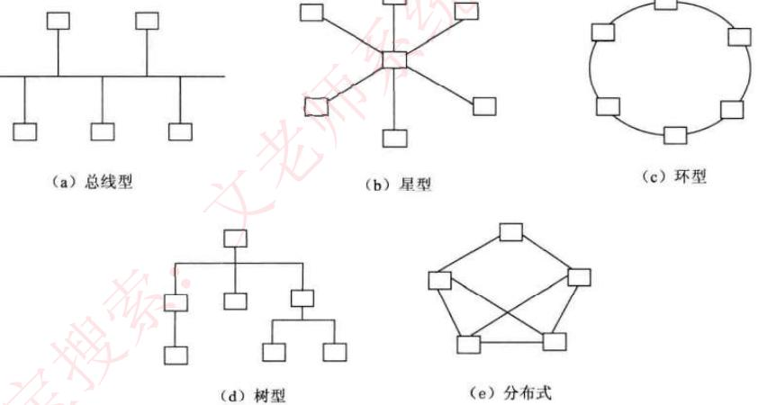

## **通信技术**

计算机网络是利用通信技术将数据从一个结点传送到另一结点的过程。通信技术是计算机网络的基础。信道可分为物理信道和逻辑信道。物理信道由传输介质和设备组成，根据传输介质的不同，分为无线信道和有线信道。逻辑信道是指在数据发送端和接收端之间存在的一条虚拟线路，可以是有连接的或无连接的。逻辑信道以物理信道为载体。

发信机进行的信号处理包括信源编码、信道编码、交织、脉冲成形和调制。相反地，收信机进行的信号处理包括解调、采样判决、去交织、信道译码和信源译码。如果同时传递多路数据就需要复用技术和多址技术。复用技术是指在一条信道上同时传输多路数据的技术，如TDM时分复用、FDM频分复用和CDM码分复用等。多址技术是指在一条线上同时传输多个用户数据的技术，在接收端把多个用户的数据分离（TDMA时分多址、FDMA频分多址和CDMA码分多址）。

**5G技术特征：**
1.  基于OFDM优化的波形和多址接入
2.  实现可扩展的OFDM间隔参数配置
3.  OFDM加窗提高多路传输效率
4.  灵活框架设计
5.  大规模MIMO：最多256根天线
6.  毫米波：频率大于24GHz以上的频段
7.  频谱共享
8.  先进的信道编码设计

**5G网络的主要特征：** 服务化架构、网络切片。

## **OSI七层模型**

| 层 | 功能 | 单位 | 协议 | 设备 |
| :-- | :--- | :--- | :--- | :--- |
| **1.物理层** | 在链路上透明地传输位。需要完成的工作包括线路配置、确定数据传输模式、确定信号形式、对信号进行编码、连接传输介质。为此定义了建立、维护和拆除物理链路所具备的机械特性、电气特性、功能特性以及规程特性。 | 比特 | EIA/TIA RS-232、RS-449、V.35、RJ-45、FDDI | 中继器、集线器 |
| **2.数据链路层** | 把不可靠的信道变为可靠的信道。为此将比特组成帧，在链路上提供点到点的帧传输，并进行差错控制、流量控制等。 | 帧 | SDLC、HDLC、LAPB、PPP、STP、帧中继等、IEEE802、ATM | 交换机、网桥 |
| **3.网络层** | 在源节点-目的节点之间进行路由选择、拥塞控制、顺序控制、传送包，保证报文的正确性。网络层控制着通信子网的运行，因而它又称为通信子网层。 | IP分组 | IP、ICMP、IGMP、ARP、RARP | 路由器 |
| **4.传输层** | 提供端-端间可靠的、透明的数据传输，保证报文顺序的正确性、数据的完整性。 | 报文段 | TCP、UDP | 网关 |
| **5.会话层** | 建立通信进程的逻辑名字与物理名字之间的联系，提供进程之间建立、管理和终止会话的方法，处理同步与恢复问题。 | 数据 | RPC、SQL、NFS | 网关 |
| **6.表示层** | 实现数据转换（包括格式转换、压缩、加密等），提供标准的应用接口、公用的通信服务、公共数据表示方法。 | 数据 | JPEG、ASCII、GIF、MPEG、DES | 网关 |
| **7.应用层** | 对用户不透明的提供各种服务，如E-mail。 | 数据 | Telnet、FTP、HTTP、SMTP、POP3、DNS、DHCP等 | 网关 |

## **局域网和广域网协议**

以太网是一种计算机局域网组网技术。

**以太网规范IEEE802.3是重要的局域网协议，包括：**
*   **IEEE802.3** 标准以太网 10Mb/s (传输介质为细同轴电缆)
*   **IEEE802.3u** 快速以太网 100Mb/s (双绞线)
*   **IEEE802.3z** 千兆以太网 1000Mb/s (光纤或双绞线)
*   **IEEE802.3ae** 万兆以太网 10Gb/s (光纤)

**以太网帧结构：**

| DMAC | SMAC | Length/Type | DATA/PAD | FCS |
| :--- | :--- | :--- | :--- | :--- |

上图依次为：目的MAC地址、源MAC地址、长度/类型、数据填充、校验。最小帧长：64字节。

**无线局域网WLAN技术标准：IEEE802.11**
在WLAN中，通常使用的拓扑结构主要有3种形式：点对点型、HUB型和全分布型。

**广域网相关技术：**
*   **同步光网络（SONET）**：利用光纤进行数字化信息通信
*   **数字数据网（DDN）**：利用数字信道提供半永久性连接电路以传输数据
*   **帧中继（FR）**：数据包交换技术
*   **异步传输技术（ATM）**：以信元为基础的面向连接的一种分组交换和复用技术

## **TCP/IP协议**

网络协议三要素：语法、语义、时序。其中语法部分规定传输数据的格式，语义部分规定所要完成的功能，时序部分规定执行各种操作的条件、顺序关系等。

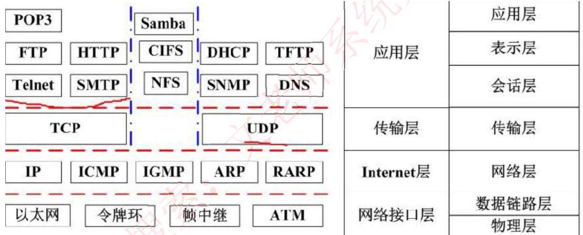

### **网络层协议**

*   **IP**：网络层最重要的核心协议，在源地址和目的地址之间传送数据报，无连接、不可靠。
*   **ICMP**：因特网控制报文协议，用于在IP主机、路由器之间传递控制消息。控制消息是指网络通不通、主机是否可达、路由是否可用等网络本身的消息。
*   **ARP和RARP**：地址解析协议，ARP是将IP地址转换为物理地址，RARP是将物理地址转换为IP地址。
*   **IGMP**：网络组管理协议，允许因特网中的计算机参加多播，是计算机用做向相邻多目路由器报告多目组成员的协议，支持组播。

### **传输层协议**

*   **TCP**：整个TCP/IP协议族中最重要的协议之一，在IP协议提供的不可靠数据基础上，采用了重发技术，为应用程序提供了一个可靠的、面向连接的、全双工的数据传输服务。一般用于传输数据量比较少，且对可靠性要求高的场合。
*   **UDP**：是一种不可靠、无连接的协议，有助于提高传输速率，一般用于传输数据量大，对可靠性要求不高，但要求速度快的场合。

### **应用层协议**

基于TCP的FTP、HTTP等都是可靠传输。基于UDP的DHCP、DNS等都是不可靠传输。

*   **FTP**：可靠的文件传输协议，用于因特网上的控制文件的双向传输。
*   **HTTP**：超文本传输协议，用于从WWW服务器传输超文本到本地浏览器的传输协议。使用SSL加密后的安全网页协议为HTTPS。
*   **SMTP和POP3**：简单邮件传输协议，是一组用于由源地址到目的地址传送邮件的规则，邮件报文采用ASCII格式表示。
*   **Telnet**：远程连接协议，是因特网远程登录服务的标准协议和主要方式。
*   **TFTP**：不可靠的、开销不大的小文件传输协议。
*   **SNMP**：简单网络管理协议，由一组网络管理的标准协议，包含一个应用层协议、数据库模型和一组资源对象。该协议能够支持网络管理系统，用于监测连接到网络上的设备是否有任何引起管理人员关注的情况。
*   **DHCP**：动态主机配置协议，基于UDP，基于C/S模型，为主机动态分配IP地址，有三种方式：固定分配、动态分配、自动分配。
*   **DNS**：域名解析协议，通过域名解析出IP地址。

### **协议端口号对照表**

| 端口 | 服务 | 端口 | 服务 |
| :--- | :--- | :--- | :--- |
| 20 | 文件传输协议（数据） | 80 | 超文本传输协议（HTTP） |
| 21 | 文件传输协议（控制） | 110 | POP3 服务器（邮箱接收服务器） |
| 23 | Telnet 终端仿真协议 | 69 | 简单文件传输协议（TFTP） |
| 67 | DHCP（服务端） | 68 | DHCP（客户端） |
| 25 | SMTP 简单邮件发送协议 | 161 | SNMP（轮询） |
| 53 | 域名服务器（DNS） | 162 | SNMP（陷阱） |

### **考试真题**

> 在OSI参考模型中能实现路由选择、拥塞控制与互连功能的层是（）。
>
> A. 传输层
> B. 应用层
> C. 网络层
> D. 物理层

**答案：** C

> 在TCP/IP体系结构中，将IP地址转化为MAC地址的协议是（）。
>
> A. RARP
> B. ARP
> C. ICMP
> D. TCP

**答案：** B
**解析：** 网络层协议ARP，地址转换协议，将网络层的IP地址转换为物理MAC地址。

> 下列网络互连设备中，属于物理层的是（）。
>
> A. 交换机
> B. 中继器
> C. 路由器
> D. 网桥

**答案：** B

## **网络设备**

### **交换技术**

*   数据在网络中转发通常离不开交换机。人们日常使用的计算机通常就是通过交换机接入网络的。
*   **交换机功能包括：**
    *   **集线功能**：提供大量可供线缆连接的端口达到部署星状拓扑网络的目的。
    *   **中继功能**：在转发帧时重新产生不失真的电信号。
    *   **桥接功能**：在内置的端口上使用相同的转发和过滤逻辑。
    *   **隔离冲突域功能**：将部署好的局域网分为多个冲突域，而每个冲突域都有自己独立的带宽，以提高交换机整体宽带利用效率。
*   **交换机需要实现的功能如下所述：**
    1.  **转发路径学习**：根据收到数据帧中的源MAC地址建立该地址同交换机端口的映射，写入MAC地址表中。
    2.  **数据转发**：如果交换机根据数据帧中的目的MAC地址在建立好的MAC地址表中查询到了，就向对应端口进行转发。
    3.  **数据泛洪**：如果数据帧中的目的MAC地址不在MAC地址表中，则向所有端口转发，也就是泛洪。广播帧和组播帧向所有端口（不包括源端口）进行转发。
    4.  **链路地址更新**：MAC地址表会每隔一定时间（如300s）更新一次。

### **路由技术**

*   路由功能由路由器来提供，具体包括：
    1.  异种网络互连，比如具有异种子网协议的网络互连。
    2.  子网协议转换，不同子网间包括局域网和广域网之间的协议转换。
    3.  数据路由，即将数据从一个网络依据路由规则转发到另一个网络。
    4.  速率适配，利用缓存和流控协议进行适配。
    5.  隔离网络，防止广播风暴，实现防火墙。
    6.  报文分片和重组，超过接口的MTU报文被分片，到达目的地之后的报文被重组。
    7.  备份、流量控制，如主备线路的切换和复杂流量控制等。
*   路由器工作在OSI七层协议中的第3层，即网络层。其主要任务是接收来源于一个网络接口的数据包，通常根据此数据包的目的地址决定待转发的下一个地址（即下一跳地址）。路由器中维持着数据转发所需的路由表，所有数据包的发送或转发都通过查找路由表来实现。这个路由表可以静态配置，也可以通过动态路由协议自动生成。
*   一般来说，路由协议可分为**内部网关协议（IGP）** 和 **外部网关协议（EGP）** 两类。
*   网络建设工程可分为网络规划、网络设计和网络实施三个环节。

## **传输介质**

*   **双绞线**：将多根铜线按规则缠绕在一起，能够减少干扰；分为无屏蔽双绞线UTP和屏蔽双绞线STP，都是由一对铜线簇组成。也即我们常说的网线；双绞线的传输距离在100m以内。

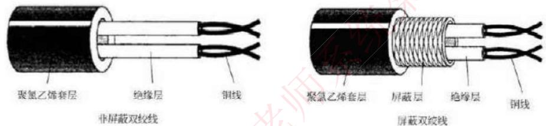

*   **无屏蔽双绞线（UTP）**：价格低，安装简单，但可靠性相对较低，分为CAT3（3类UTP，速率为10Mbps）、CAT4（4类UTP，与3类差不多，无应用）、CAT5（5类UTP，速率为100Mbps，用于快速以太网）、CAT5E（超5类UTP，速率为1000Mbps）、CAT6（6类UTP，用来替代CAT5E，速率也是1000Mbps）。
*   **屏蔽双绞线（STP）**：比之UTP增加了一层屏蔽层，可以有效的提高可靠性，但对应的价格高，安装麻烦，一般用于对传输可靠性要求很高的场合。

*   **网线安装标准**：有两种，都是八根不同颜色的网线，按照不同的顺序排序，插入水晶头中，区分在第1、2、3、6四根网线的位置不同。

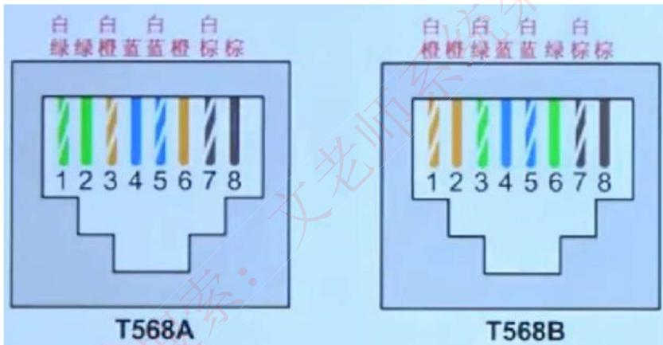

*   **光纤**：由纤芯和包层组成，传输的光信号在纤芯中传输。然而从PC端出来的信号都是电信号，要经过光纤传输的话，就必须将电信号转换为光信号。
    *   **多模光纤（MMF）**：纤芯半径较大，因此可以同时传输多种不同的信号，光信号在光纤中以全反射的形式传输，采用发光二极管LED为光源，成本低，但是传输的效率和可靠性都较低，适合于短距离传输，其传输距离与传输速率相关，速率为100Mbps时为2KM，速率为1000Mbps时为550m。

    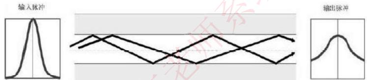

    *   **单模光纤（SMF）**：纤芯半径很小，一般只能传输一种信号，采用激光二极管LD作为光源，并且只支持激光信号的传播，同样是以全反射形式传播，只不过反射角很大，看起来像一条直线，成本高，但是传输距离远，可靠性高。传输距离可达5KM。

    

*   **无线信道**：分为无线电波和红外光波。

| 无线电波 | | 红外光波 |
| :--- | :--- | :--- |
| 长波 | | 近红外线 |
| 中波 | | |
| 短波 | | 中红外线 |
| 超短波 | | |
| 微波 | 地面微波 | 远红外线 |
| | 卫星微波 | |

## **通信方式和交换方式**

### **通信方向**
数据通信是指发送方发送数据到接收方，这个传输过程可以分类如下：
*   **单工**：只能由设备A发给设备B，即数据流只能单向流动。
*   **半双工**：设备A和设备B可以互相通信，但是同一时刻数据流只能单向流动。
*   **全双工**：设备A和设备B在任意时刻都能互相通信。

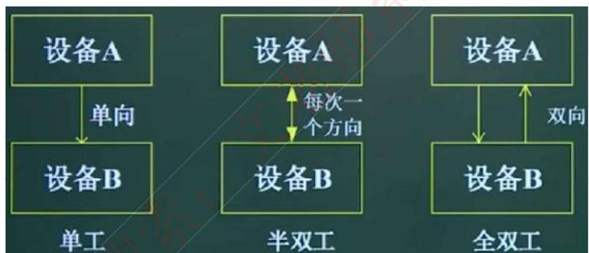

### **同步方式与传输方式**
*   **异步传输**：发送方每发送一个字符，需要约定一个起始位和停止位插入到字符的起始和结尾处，这样当接收方接收到该字符时能够识别，但是这样会造成资源浪费，传输效率降低。
*   **同步传输**：以数据块为单位进行传输，当发送方要发送数据时，先发送一个同步帧，接收方收到后做好接收准备，开始接收数据块，结束后又会有结束帧确认，这样一次传输一个数据块，效率高。
*   **串行传输**：只有一根数据线，数据只能1bit挨个排队传送，适合低速设备、远距离的传送，一般用于广域网中。
*   **并行传输**：有多根数据线，可以同时传输多个bit数据，适合高速设备的传送，常用语计算机内部各硬件模块之间。

### **交换方式**
*   **电路交换**：通信一方进行呼叫，另一方接收后，在二者之间会建立一个专用电路，特点为面向连接、实时性高、链路利用率低，一般用于语音视频通信。
*   **报文交换**：以报文为单位，存储转发模式，接收到数据后先存储，进行差错校验，没有错误则转发，有错误则丢弃，因此会有延时，但可靠性高，是面向无连接的。
*   **分组交换**：以分组为单位，也是存储转发模式，因为分组的长度比报文小，所以时延小于报文交换，又可分为三种方式：
    *   **数据报**：是现在主流的交换方式，各个分组携带地址信息，自由的选择不同的路由路径传送到接收方，接收方接收到分组后再根据地址信息重新组装成原数据，是面向无连接的，但是不可靠的。
    *   **虚电路**：发送方发送一个分组，接收方收到后二者之间就建立了一个虚拟的通信线路，二者之间的分组数据交互都通过这条线路传送，在空闲的时候这条线路也可以传输其他数据，是面向连接的，可靠的。
    *   **信元交换**：异步传输模式ATM采用的交换方式，本质是按照虚电路方式进行转发，只不过信元是固定长度的分组，共53B，其中5B为头部，48B为数据域，也是面向连接的，可靠的。

### **考试真题**
> 以下关于光纤的说法中，错误的是（）
>
> A. 单模光纤的纤芯直径更细
> B. 单模光纤采用 LED 作为光源
> C. 多模光纤比单模光纤的传输距离近
> D. 多模光纤中光波在光导纤维中以多种模式传播

**答案：** B

> 数据通信模型按照数据信息在传输链路上的传送方向，可以分为三类。下列选项中，（）不属于这三类传输方式。
>
> A、单工通信：信号只能向一个方向传送
> B、半双工通信：信息的传递可以是双向的
> C、全双工通信：通信的双方可以同时发送和接收信息
> D、全单工通信：信号同时向两个方向传输

**答案：** D
**解析：** 根据数据信息在传输线上的传送方向，数据通信方式分为单工通信、半双工通信和全双工通信3种。

## **IP地址**

### **IP地址表示**
*   机器中存放的IP地址是32位的二进制代码，每隔8位插入一个空格，可提高可读性。为了便于理解和设置，一般会采用点分十进制方法来表示：将32位二进制代码每8位二进制转换成十进制，就变成了4个十进制数，而后在每个十进制数间隔中插入`.`，如下所示，最终为128.11.3.31：

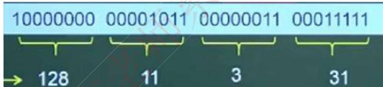

*   因为每个十进制数都是由8个二进制数转换而来，因此每个十进制数的取值范围为0-255（掌握二进制转十进制的快速计算方法，牢记2的幂指数值，实现快速转换）。

### **分类IP地址**
IP地址分四段，每段八位，共32位二进制数组成。在逻辑上，这32位IP地址分为网络号和主机号，依据网络号位数的不同，可以将IP地址分为以下几类：

| 类别 | 点分十进制范围 | 二进制表示 (最高位) |
| :--- | :--- | :--- |
| **A类** | 0.0.0.0 到 127.255.255.255 | `0xxxxxxx` ... |
| **B类** | 128.0.0.0 到 191.255.255.255 | `10xxxxxx` ... |
| **C类** | 192.0.0.0 到 223.255.255.255 | `110xxxxx` ... |
| **D类** | 224.0.0.0 到 239.255.255.255 | `1110xxxx` ... (组播地址) |
| **E类** | 240.0.0.0 到 255.255.255.255 | `1111xxxx` ... (保留地址) |

### **无分类编址（CIDR）**
*   即不按照A B C类规则，自动规定网络号，无分类编址格式为：`IP地址/网络号位数`。
*   示例：`128.168.0.11/20` 表示的IP地址为128.168.0.11，其网络号占20位，因此主机号占 32 - 20 = 12位。

### **特殊IP地址**
*   **公有地址**：通过它直接访问因特网。是全网唯一的IP地址。
*   **私有地址**：属于非注册地址，专门为组织机构内部使用，不能直接访问因特网。
    | 类别 | IP地址范围 |
    | :--- | :--- |
    | **A类** | 10.0.0.0 ~ 10.255.255.255 |
    | **B类** | 172.16.0.0 ~ 172.31.255.255 |
    | **C类** | 192.168.0.0 ~ 192.168.255.255 |

*   **其他特殊地址**：
    | 网络号 | 主机号 | 代表的意思 |
    | :--- | :--- | :--- |
    | 0 | 0 | 在本网络上的本主机 (源地址) |
    | 全1 | 全1 | 在本网络上进行广播 (目的地址) |
    | Net-ID | 全1 | 对特定网络上的所有主机进行广播 |
    | 127.x.x.x | 非全0或全1 | 用作本地软件环回测试 (loopback) |
    | 169.254.x.x| 非全0或全1 | Windows主机DHCP服务器故障时自动分配 |

## **子网划分与超网**

*   **子网划分**：将一个大的网络（如一个B类地址）划分成多个更小的网络（子网）。这是通过将主机号的一部分位用作子网号来实现的。此时IP地址组成为：**网络号 + 子网号 + 主机号**。
*   **子网掩码**：用来区分IP地址中的网络部分（网络号+子网号）和主机部分。网络部分和子网号对应的位都为1，主机号对应的位都为0。
*   **注意事项**：在划分子网时，主机号不能为全0（代表子网地址）或全1（代表广播地址），因此可用主机数需要减2。子网号可以为全0和全1。
*   **超网（CIDR）**：划分子网的逆过程，将多个连续的C类（或其他类）网络聚合成一个更大的网络。这是通过将网络号的一部分位用作主机号来实现的，从而增加了网络内的主机数量。

### **考试真题**

> 把网络`117.15.32.0/23`划分为`117.15.32.0/27`，得到的子网是（）个，每个子网中可使用的主机地址是（）个。
>
> **第一空：** A. 4 B. 8 C. 16 D. 32
> **第二空：** A. 30 B. 31 C. 32 D. 34

**答案：** C, A
**解析：** 网络号前缀从 /23 变为 /27，说明拿出了 27 - 23 = 4位作为子网号，可以划分出 24 = 16个子网。此时，主机号是 32 - 27 = 5位，每个子网的主机数是 25 = 32，减去全0（网络地址）和全1（广播地址）后，可用主机地址是 32 - 2 = 30个。

> 分配给某公司网络的地址块是`220.17.192.0/20`，该网络被划分为（）个C类子网，不属于该公司网络的子网地址是（）。
>
> **第一空：** A. 4 B. 8 C. 16 D. 32
> **第二空：** A. 220.17.203.0 B. 220.17.205.0 C. 220.17.207.0 D. 220.17.213.0

**答案：** C, D
**解析：** C类子网的网络前缀是/24。公司的网络前缀是/20，要划分为/24的子网，需要从主机号中借用 24 - 20 = 4位。因此可以划分出 24 = 16个C类子网。
公司网络的地址范围是 `220.17.192.0` 到 `220.17.207.255`。`220.17.213.0` 的前20位与公司网络块的前20位不同，因此不属于该公司网络。

## **IPv6**

*   主要为了解决IPv4地址数不够用的情况而提出的设计方案，IPv6具有以下特性：
    *   IPv6地址长度为128位，地址空间增大了296倍。
    *   灵活的IP报文头部格式，使用一系列固定格式的扩展头部取代了IPv4中可变长度的选项字段。IPv6中选项部分的出现方式也有所变化，使路由器可以简单略过选项而不做任何处理，加快了报文处理速度。
    *   IPv6简化了报文头部格式，加快报文转发，提高了吞吐量。
    *   提高安全性，身份认证和隐私权是IPv6的关键特性。
    *   支持更多的服务类型。
    *   允许协议继续演变，增加新的功能，使之适应未来技术的发展。

*   **IPv4和IPv6的过渡技术：**
    1.  **双协议栈**：主机同时运行IPv4和IPv6两套协议栈，同时支持两套协议，一般来说IPv4和IPv6地址之间存在某种转换关系，如IPv6的低32位可以直接转换为IPv4地址，实现互相通信。
    2.  **隧道技术**：这种机制用来在IPv4网络之上建立一条能够传输IPv6数据报的隧道，例如可以将IPv6数据报当做IPv4数据报的数据部分加以封装，只需要加一个IPv4的首部，就能在IPv4网络中传输IPv6报文。
    3.  **翻译技术**：利用一台专门的翻译设备（如转换网关），在纯IPv4和纯IPv6网络之间转换IP报头的地址，同时根据协议不同对分组做相应的语义翻译，从而使纯IPv4和纯IPv6站点之间能够透明通信。

## **网络规划与设计**

*   **三层模型**将网络划分为核心层、汇聚层和接入层，每一层都有着特定的作用。
    *   **核心层**：提供不同区域之间的最佳路由和高速数据传送。
    *   **汇聚层**：将网络业务连接到接入层，并且实施与安全、流量、负载和路由相关的策略。
    *   **接入层**：为用户提供了在本地网段访问应用系统的能力，还要解决相邻用户之间的互访需要，接入层要负责一些用户信息（例如用户IP地址、MAC地址和访问日志等）的收集工作和用户管理功能（包括认证和计费等）。

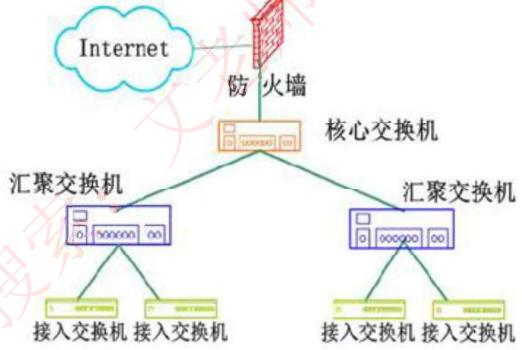

*   **建筑物综合布线系统（PDS）：**
    1.  **工作区子系统**：实现工作区终端设备到水平子系统的信息插座之间的互联。
    2.  **水平布线子系统**：实现信息插座和管理子系统之间的连接。
    3.  **设备间子系统**：实现中央主配线架与各种不同设备之间的连接。
    4.  **垂直干线子系统**：实现各楼层设备间子系统之间的互连。
    5.  **管理子系统**：连接各楼层水平布线子系统和垂直干缆线，负责连接控制其他子系统为连接其他子系统提供连接手段。
    6.  **建筑群子系统**：各个建筑物通信系统之间的互联。

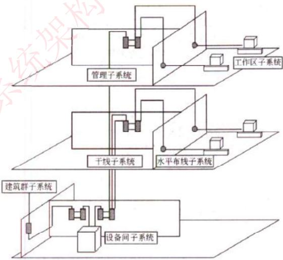
*图：结构化布线示意图*

### **考试真题**

> 以下关于层次化局域网模型中核心层的叙述，正确的是（）。
>
> A. 为了保障安全性，对分组要进行有效性检查
> B. 将分组从一个区域高速地转发到另一个区域
> C. 由多台二、三层交换机组成
> D. 提供多条路径来缓解通信瓶颈

**答案：** B

> 结构化布线系统分为六个子系统，其中水平子系统（）。
>
> A. 由各种交叉连接设备以及集线器和交换机等设备组成
> B. 连接了干线子系统和工作区子系统
> C. 由终端设备到信息插座的整个区域组成
> D. 实现各楼层设备间子系统之间的互连

**答案：** B
**解析：** 水平子系统是指的，从楼层管理间到信息插口这一段，它连接了垂直干线子系统与工作区子系统。

## **网络存储技术**

### **廉价磁盘冗余阵列（RAID）**

*   RAID即磁盘冗余阵列技术，将数据分散存储在不同磁盘中，可并行读取，可冗余存储，提高磁盘访问速度，保障数据安全性。
*   **RAID0**：将数据分散的存储在不同磁盘中，磁盘利用率100%，访问速度最快，但是没有提供冗余和错误修复技术。
*   **RAID1**：在成对的独立磁盘上产生互为备份的数据，增加存储可靠性，可以纠错，但磁盘利用率只有50%。

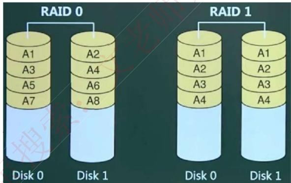

*   **RAID2**：将数据条块化的分布于不同硬盘上，并使用海明码校验。
*   **RAID3**：使用奇偶校验，并用单块磁盘存储奇偶校验信息（可靠性低于RAID5）。
*   **RAID5**：在所有磁盘上交叉的存储数据及奇偶校验信息（所有校验信息存储总量为一个磁盘容量，但分布式存储在不同的磁盘上），读/写指针可同时操作。

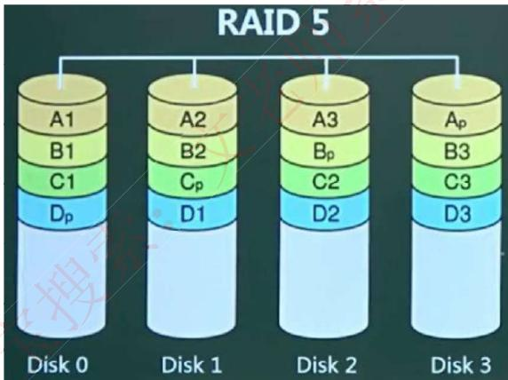

*   **RAID0+1**：是两个RAID0，若一个磁盘损坏，则当前RAID0无法工作，即有一半的磁盘无法工作。
*   **RAID1+0**：是两个RAID1，不允许同一组中的两个磁盘同时损坏。与RAID1原理类似，磁盘利用率都只有50%，但安全性更高。

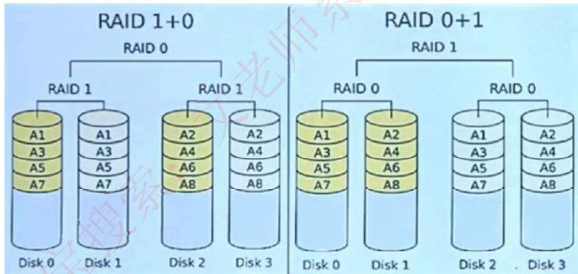

### **存储技术类型**

1.  **直接附加存储（DAS）**：是指将存储设备通过SCSI接口直接连接到一台服务器上使用，其本身是硬件的堆叠，存储操作依赖于服务器，不带有任何存储操作系统。
    *   **存在问题**：在传递距离、连接数量、传输速率等方面都受到限制。容量难以扩展升级；数据处理和传输能力降低；服务器异常会波及存储器。
2.  **网络附加存储（NAS）**：通过网络接口与网络直接相连，由用户通过网络访问，有独立的存储系统。如下图所示。NAS存储设备类似于一个专用的文件服务器，去掉了通用服务器大多数计算功能，而仅仅提供文件系统功能。以数据为中心，将存储设备与服务器分离，其存储设备在功能上完全独立于网络中的主服务器。客户机与存储设备之间的数据访问不再需要文件服务器的干预，同时它允许客户机与存储设备之间进行直接的数据访问，所以不仅响应速度快，而且数据传输速率也很高。
    *   **NAS的性能特点**：进行小文件级的共享存取；支持即插即用；可以很经济的解决存储容量不足的问题，但难以获得满意的性能。
3.  **存储区域网(SAN)**：SAN是通过专用交换机将磁盘阵列与服务器连接起来的高速专用子网。它没有采用文件共享存取方式，而是采用块（block）级别存储。SAN是通过专用高速网将一个或多个网络存储设备和服务器连接起来的专用存储系统，其最大特点是将存储设备从传统的以太网中分离了出来，成为独立的存储区域网络。根据数据传输过程采用的协议，其技术划分为FC SAN（光纤通道）、IP SAN（IP网络）和IB SAN（无线带宽）技术。

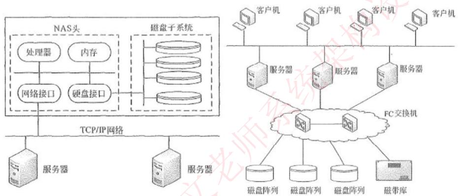
*左：NAS存储系统的结构；右：SAN存储系统的结构*

## **其他考点**

*   **网络地址翻译（NAT）**：公司内有很多电脑，在公司局域网内可以互联通信，但是要访问外部因特网时，只提供固定的少量IP地址能够访问因特网，将公司所有电脑这个大的地址集合映射到能够访问因特网的少量IP地址集合的过程就称为NAT。很明显，使用了NAT后，一个公司只有少量固定IP地址可以上网，大大减少了IP地址的使用量。
*   **默认网关**：一台主机可以有多个网关。默认网关的意思是一台主机如果找不到可用的网关，就把数据包发给默认指定的网关，由这个网关来处理数据包。现在主机使用的网关，一般指的是默认网关。默认网关的IP地址必须与本机IP地址在同一个网段内，即同网络号。
*   **虚拟局域网（VLAN）**：是一组逻辑上的设备和用户，这些设备和用户并不受物理位置的限制，可以根据功能、部门及应用等因素将它们组织起来，相互之间的通信就好像它们在同一个网段中一样。
    *   VLAN工作在OSI参考模型的第2层和第3层，一个VLAN就是一个广播域，VLAN之间的通信是通过第3层的路由器来完成的。
    *   与传统的局域网技术相比较，VLAN技术更加灵活，它具有以下优点：网络设备的移动、添加和修改的管理开销减少；可以控制广播活动；可提高网络的安全性。
*   **虚拟专用网（VPN）**：是在公用网络上建立专用网络的技术。其之所以称为虚拟网，主要是因为整个VPN网络的任意两个节点之间的连接并没有传统专网所需的端到端的物理链路，而是架构在公用网络服务商所提供的网络平台，如Internet、ATM（异步传输模式）、Frame Relay（帧中继）等之上的逻辑网络，用户数据在逻辑链路中传输。
*   **PPP（点对点协议）**：
    *   PPP的NCP可以承载多种协议的三层数据包。PPP使用LCP控制多种链路的参数（建立、认证、压缩、回拨）。
    *   PPP的认证类型：**PAP**认证是通过二次握手建立认证（明文不加密），**CHAP**挑战握手认证协议，通过三次握手建立认证（密文采用MD5加密）。
*   **冲突域和广播域**：路由器可以阻断广播域和冲突域，交换机只能阻断冲突域，因此一个路由器下可以划分多个广播域和多个冲突域；一个交换机下整体是一个广播域，但可以划分多个冲突域；而物理层设备集线器下整体作为一个冲突域和一个广播域。

### **考试真题**

> 一个虚拟局域网（VLAN）是一个（）。
>
> A. 广播域
> B. 冲突域
> C. 组播域
> D. 物理上隔离的区域

**答案：** A
**解析：** 一个VLAN构成一个独立的广播域。VLAN间的通信需要通过路由器。

> 以下关于URL的说法中，错误的是（）。
>
> A. 使用www.abc.com和abc.com打开的是同一个页面
> B. 在地址栏中输入www.abc.com默认使用http协议
> C. www.abc.com中的“www”是主机名
> D. www.abc.com中的“abc.com”是域名

**答案：** A
**解析：** URL格式为：`协议://主机名.域名:端口号/路径`。`www.abc.com` 和 `abc.com` 是两个不同的主机名，它们可能解析到不同的IP地址，不一定指向同一个页面。
