---

# **信息系统基础知识**

**历年真题考情：** 本章节每年会考3分左右，超纲率也有50%。

**第二版更新：** 第二版教材里对应第3章，相较于之前做了比较大的改动，然后改版之后的跟历年真题考点也是牛头不对马嘴的，真的很迷惑啊。本章节内容会先按第二版教材顺序讲解最新知识点，然后根据历年真题考察情况保留一些老的视频考点，至于每年超纲的内容，还是得通过每年直播讲真题来补充了。

**本章主要内容：**
*   信息系统概述
*   业务处理系统
*   管理信息系统
*   决策支持系统
*   专家系统
*   办公自动化系统
*   企业资源规划
*   典型信息系统架构模型

## **信息系统概述**

*   **信息系统**是由计算机硬件、网络和通信设备、计算机软件、信息资源、信息用户和规章制度组成的以处理信息流为目的的人机一体化系统。
*   **信息系统的5个基本功能**：输入、存储、处理、输出和控制。
*   信息系统的性质影响着系统开发者和系统用户的知识需求。“以计算机为基础”要求系统设计者必须具备计算机及其在信息处理中的应用知识。“人机交互”要求系统设计者还需要了解人作为系统组成部分的能力以及人作为信息使用者的各种行为。

### **诺兰模型**

信息系统进化的阶段模型。将计算机信息系统的发展道路划分为6个阶段：

1.  **初始阶段**：计算机刚进入企业时只作为办公设备使用，应用非常少。一般仅用于财务部门。
2.  **传播阶段**：企业对计算机有了一定了解，想利用计算机解决工作中的问题，比如进行更多的数据处理，给管理工作和业务带来便利。会大幅度增加软件投入，盲目投入产生问题，效率低。
3.  **控制阶段**：从整体上控制计算机信息系统的发展，在客观上要求组织协调、解决数据共享问题。信息系统呈现单点、分散的特点，系统和资源利用率不高。是计算机管理变为数据管理的关键。
4.  **集成阶段**：在控制的基础上，企业开始重新进行规划设计，建立基础数据库，并建成统一的信息管理系统。使人、财、物等资源信息能够在企业集成共享，更有效地利用现有的IT系统和资源。
5.  **数据管理阶段**：企业高层意识到信息战略的重要，信息成为企业的重要资源，企业的信息化建设也真正进入到数据处理阶段。使用统一平台，各部门、各系统基本实现资源整合和信息共享。
6.  **成熟阶段**：信息系统已经可以满足企业各个层次的需求，从简单的事务处理到支持高效管理的决策。企业真正把IT与管理过程结合起来，将组织内部、外部的资源充分整合和利用。

### **信息系统的分类（低级到高级）**
1.  **业务（数据）处理系统（TPS/DPS）**：随着企业业务需求的增长和技术条件的发展，人们逐步将计算机应用于企业局部业务（数据）的管理，如财会管理、销售管理、物资管理和生产管理等，即计算机应用发展到对企业的局部事务的管理。
2.  **管理信息系统（MIS）**：由人和计算机等组成的，能进行管理信息的收集、传输、存储、加工、维护和使用的系统。形成了对企业全局性的、整体性的计算机应用。能提供企业各级领导从事管理需要的信息，但其收集信息的范围还更多地侧重于企业内部。
3.  **决策支持系统（DSS）**：帮助决策者利用数据和模型去解决半结构化决策问题和非结构化决策问题的交互式系统。服务于高层决策的管理信息系统，按功能可分为专用DSS、DSS工具和DSS生成器。
4.  **专家系统（ES）**：一个智能计算机程序系统，其内部含有某个领域具有专家水平的大量知识与经验，能够利用人类专家的知识和解决问题的方法来处理该领域的问题。
5.  **办公自动化系统（OAS）**：人机结合的综合性的办公事务管理系统，或称办公事务处理系统。该系统将当代各种先进技术和设备应用于办公室的办公活动中，使办公活动实现科学化、自动化，以达到改善工作环境、最大限度地提高办公事务工作质量和工作效率。

### **企业主要信息化系统**
*   **ERP系统（企业资源管理）**：主要管理公司的各种资源，负责处理进销存、供应链、生产计划MPS、MRP计算、生产订单、管理会计，是财务数据的强力支撑。
*   **WMS系统（仓储管理系统）**：主要包括库房货位管理，主要有收发料，通过扫码进出库、对库存进行库位、先进先出与盘点；栈板出货管控、库龄管理等内容，主要是立体仓库或大批量仓库数据需求。
*   **MES系统（制造执行系统，也称SFC）**：负责生产过程和生产过程中防呆、自动化设备集成，是各个客户审核的重点，是生产全流程管控。
*   **PDM系统（产品数据管理系统）**：管理研发阶段的物料、BOM、工程变更数据，负责产品数据为主。PDM系统是产品研发全过程管理，主要涉及协同研发等能力。

### **信息系统的生命周期（产生、开发、运行、消亡）**
1.  **产生阶段**：即概念阶段或需求分析阶段。分为两个过程：
    *   **概念产生**：提出建设信息系统的初步想法。
    *   **需求分析**：深入调研分析并形成需求分析报告。

2.  **开发阶段**：最重要、关键的阶段。包括总体规划、系统分析、系统设计、系统实施和系统验收5个阶段。
    *   **总体规划**：确定开发目标、总体架构、实施计划等。
    *   **系统分析**：提供系统的逻辑模型，包括组织结构、业务流程、数据流程分析等。
    *   **系统设计**：设计信息系统的实施方案，包括架构、数据库、功能模块设计等。
    *   **系统实施**：将设计文本变成能在计算机上运行的软件系统。
    *   **系统验收**：系统进入试运行，检验系统性能和用户友好性。

3.  **运行阶段**：系统正式移交用户后，进行系统维护，包括排错性、适应性、完善性和预防性维护。

4.  **消亡阶段**：系统因无法满足需求或技术落后而被淘汰。

*   **信息系统建设的原则**：高层管理人员介入原则、用户参与开发原则、自顶向下规划原则、工程化原则、其他原则（创新性，整体性，发展性，经济性等）。

### **信息系统开发方法**

1.  **结构化方法**
    *   由结构化分析（SA）、结构化设计（SD）和结构化程序设计（SP）三部分有机组合而成，其精髓是**自顶向下、逐步求精和模块化设计**。
    *   **特点**：开发目标清晰化、工作阶段化、文档规范化、设计方法结构化。
    *   **不足**：开发周期长、难以适应需求变化、很少考虑数据结构。常用工具有数据流图、数据字典、结构化语言、判定表及判定树等。

2.  **原型化方法**
    *   又称快速原型法。根据用户初步需求，快速建立一个系统模型展示给用户，在此基础上与用户交流，最终实现用户需求。
    *   **分类**：
        *   按是否实现功能：水平原型（行为原型）、垂直原型（结构化原型）。
        *   按最终结果：抛弃式原型、演化式原型。
    *   **优点**：开发周期短、成本风险低、速度快、用户参与度高、符合用户需求。
    *   **不足**：开发环境和管理水平要求高。适用于需求不明确、分析层面难度大、技术层面难度不大的系统。

3.  **面向对象方法（OO）**
    *   认为客观世界是由各种对象组成的。复杂的对象可由相对简单的对象构成，不同对象的组合及相互作用构成了系统。
    *   **特点**：具有更好的复用性。系统分析、设计和实现三个阶段界限不明确。
    *   **不足**：必须依靠一定的面向对象技术支持，在大型项目开发上有局限性。
    *   当前，大型系统开发常将**结构化方法**（自顶向下整体划分）和**OO方法**（自底向上开发）结合使用。

4.  **面向服务的方法（SO）**
    *   进一步将接口的定义与实现进行解耦。
    *   **目标**：使信息系统快速响应需求与环境变化，提高系统可复用性、信息资源共享和系统之间的互操作性。

## **业务处理系统（TPS）**

*   又称电子数据处理系统（EDP），是最初级形式的信息系统。
*   主要功能是对企业管理中日常事务所发生的数据进行输入、处理和输出。
*   **TPS数据处理周期**：数据输入、数据处理、数据库维护、文件报表生成和查询处理。
    1.  **数据输入**：将原始数据输入计算机系统。方式有人工、自动及二者结合。
    2.  **数据处理**：方式有批处理（定期处理）和联机事务处理（OLTP，实时处理）。
    3.  **数据库维护**：更新数据库以反映最新的经营状况。访问形式有检索、修改、存入和删除。
    4.  **文件报表的产生**：为用户提供文件和报表。分为行动文件、信息文件和周转文件。
    5.  **查询处理**：支持批次查询或联机实时查询。
*   **特点**：
    *   是其他类型信息系统的信息产生器。
    *   常处于企业系统边界，连接企业与外部环境。
    *   面对结构化程度很高的管理问题，可采用结构化生命周期法开发。

## **管理信息系统（MIS）**

*   由业务处理系统发展而来，在TPS基础上引进大量管理方法对企业整体信息进行处理，并利用信息进行预测、控制、计划、辅助企业全面管理。
*   **组成**：由信息源、信息处理器、信息用户和信息管理者四大部件组成。
*   **分类**：
    *   根据部件联系：开环（不收集外部信息不反馈）和闭环（不断收集信息反馈调整）。
    *   根据决策层次：金字塔结构，分为战略计划、管理控制和运行控制3层。
*   **功能结构**：表示成功能-过程结构。

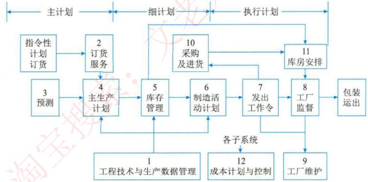

*   **组成（功能/层次矩阵表示）**：包括销售市场、生产、后勤、人事、财务会计、信息处理、高层管理等子系统。

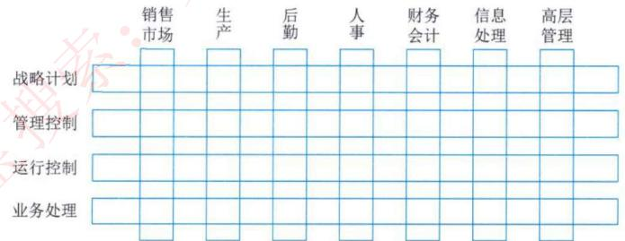

## **决策支持系统（DSS）**

*   是一个交互式的、灵活的、适应性强的基于计算机的信息系统，能够为解决非结构化管理问题提供支持，以改善决策的质量。
*   **基本模式**：管理者处于核心地位，运用知识和经验，结合DSS提供的支持，对其管理的“真实系统”进行决策。
*   **基本结构**：两库结构（数据库、模型库、对话子系统）和基于知识的结构。

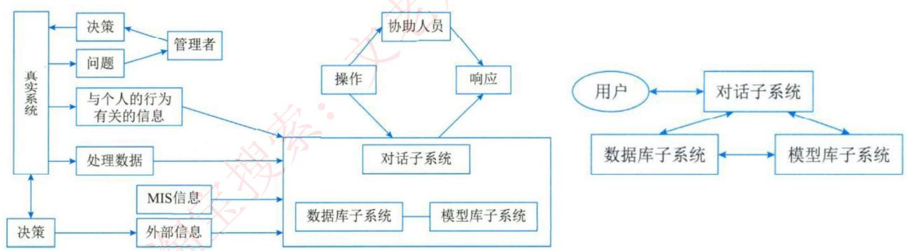

*   **总体功能**：支持各层次决策。具体包括整理提供数据、收集外部信息、提供反馈、管理模型和方法、加工数据、提供人机对话接口等。
*   **特点**：面向决策者、支持半结构化问题决策、辅助决策者、体现决策过程动态性、提倡交互式处理。
*   **组成**：
    1.  **数据的重组和确认**：通过数据仓库解决。
    2.  **数据字典的建立**：数据仓库与作业层系统分离。
    3.  **数据挖掘和智能体**：使用工具对数据仓库进行存取和查询。结果类型包括联合、定序、分类、聚类。
    4.  **模型建立**：帮助决策者理解现象。方法有穷举法、算法、启发式和模拟法。

## **专家系统（ES）**

*   基于知识的专家系统，是人工智能的一个重要分支。能力来自于拥有的专家知识。
*   **与传统程序不同**：
    1.  属于人工智能范畴，求解半结构化或非结构化问题。
    2.  模拟人类专家推理，而非问题领域本身。
    3.  由综合数据库、知识库和推理机三要素组成。
    4.  处理实际问题。
    5.  专用性强，通用性差。
*   **人工智能（AI）**：旨在利用机器模仿人类智能。智能行为特点：从经验中学习、处理不完整信息、处理符号和图像、想象力和创造力、善于启发。AI主要分支有专家系统、机器人技术、视觉系统、自然语言处理、学习系统和神经网络等。
*   **专家系统特点**：超越时间限制、操作成本低廉、易于传递与复制、处理手段一致、善于克服难题、适用特定领域。
*   **专家系统组成**：
    1.  **知识库**：存放领域知识（事实性知识和启发性知识）。
    2.  **综合数据库**：工作存储器，也称动态知识库。
    3.  **推理机**：专家系统核心，控制系统运行、搜索和推理。
    4.  **知识获取**：知识编辑、求精和自学习。
    5.  **解释程序**：面向用户服务，解答问题。
    6.  **人机接口**：与用户、领域专家和知识工程师的接口。

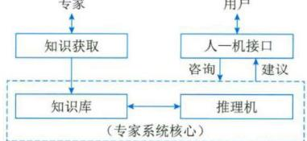

## **办公自动化系统（OAS）**

*   办公信息处理手段的自动化，解决数据、文字、声音、图像等信息的一体化处理问题。
*   **四大支柱**：计算机技术、通信技术、系统科学和行为科学。
*   **主要功能**：
    1.  **事务处理**：完成办公繁琐事情，分为单机和多机处理系统。
    2.  **信息管理**：对信息流的控制管理，是管理型办公系统。
    3.  **辅助决策**：是决策型办公系统，建立决策模型。
*   **组成**：计算机设备、办公设备、数据通信及网络设备、软件系统。

## **企业资源规划（ERP）**

*   建立在信息技术基础上，以系统化的管理思想，为企业提供决策和运营手段的管理平台。是将企业所有资源进行集成整合，并进行全面、一体化管理的信息系统。
*   **演变过程**：物料需求计划（MRP）→ 制造资源计划（MRP II）→ 企业资源计划（ERP）。
*   **企业三大资源**：物流、资金流、信息流。人力资源被认为是第四大资源。
*   **理解ERP**：
    *   **管理思想**：将企业资源分类管理。
    *   **软件产品**：提供一体化解决方案，需个性化开发。
    *   **管理系统**：包含众多互联互通的子系统。
*   **ERP的结构**：包括生产预测、销售管理、经营计划、主生产计划、物料需求计划、能力需求计划、车间作业计划、采购与库存管理、质量与设备管理、财务管理以及扩展应用模块（如CRM, SCM等）。

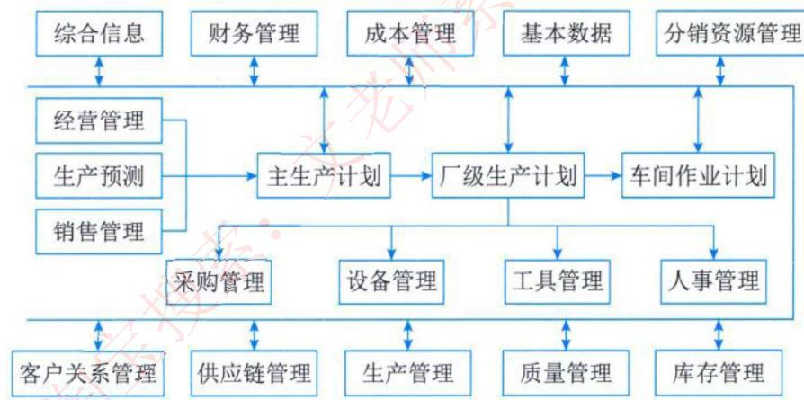

*   **ERP的功能**：支持决策、提供针对性IT解决方案、从企业内部供应链发展为全行业和跨行业的供应链。

## **典型信息系统架构模型**

### **政府信息化和电子政务**
*   利用信息技术对政府形态进行改造，在网络上实现政府组织结构和工作流程优化重组。
*   **组成部分**：政府部门内部电子化办公、政府部门间信息共享、政府与居民双向信息交流。
*   **内容**：G2G（政府对政府）、G2B（政府对企业）、G2C（政府对公民）、B2G（企业对政府）、C2G（公民对政府）。
*   **发展特征**：以互联网为基础设施、强调政府服务功能。
*   **发展阶段**：起步阶段、单向互动、双向互动、网上事务处理。
*   **应用领域**：面向社会、政府部门之间、政府部门内部的各类应用系统等。

### **企业信息化和电子商务**
*   企业利用现代信息技术，通过信息资源开发利用，实现生产自动化、管理网络化、决策智能化和商务电子化。
*   **根本目的**：提高企业竞争力。
*   **技术和业务的融合**：
    1.  **企业战略层面**：分析业务策略和发展方向。
    2.  **业务运作层面**：分析关键驱动力和流程。
    3.  **管理运作层面**：提出应用功能需求和信息技术体系。
*   **企业战略数据模型**：分为数据库模型（描述日常事务）和数据仓库模型（描述高层决策信息）。
*   **企业信息化方法**：业务流程重构、核心业务应用、信息系统建设、主题数据库、资源管理（ERP、SCM）、人力资本投资。

### **信息化战略体系**
*   **企业战略规划**：评价环境和现状，确定总体和长远目标，制定行动方案。
*   **信息系统战略规划**：关注如何通过信息系统支撑业务流程，实现业务目标。
*   **信息技术战略规划（IT战略规划）**：对支撑信息系统运行的硬件、软件、环境等进行具体规划。
*   **信息资源规划**：为信息化项目进行数据需求分析、标准建立、资源整合。
*   **系统规划**：单个项目的立项分析，确定信息系统发展战略。

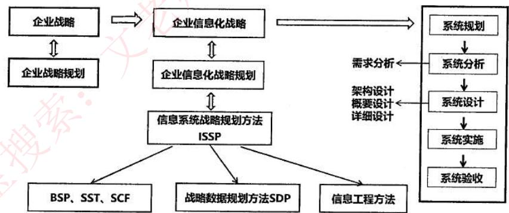
*单个系统开发*

### **考试真题**
> 电子政务是对现有的政府形态的一种改造，利用信息技术和其他相关技术，将其管理和服务职能进行集成，在网络上实现政府组织结构和工作流程优化重组。与电子政务相关的行为主体有三个，即政府、（）及居民。国家和地方人口信息的采集、处理和利用，属于（）的电子政务活动。
>
> **第一空：** A. 部门 B. 企（事）业单位 C. 管理机构 D. 行政机关
> **第二空：** A. 政府对政府 B. 政府对居民 C. 居民对居民 D. 居民对政府

**答案：** B, A

> 企业信息化规划是一项长期而艰巨的任务，是融合企业战略、管理规划、业务流程重组等内容的综合规划活动。其中（）战略规划是评价企业现状，选择和确定企业的总体和长远目标，制定和扶择实现目标的行动方案；（）战略规划关注的是如何通过信息系统来支撑业务流程的运作，进而实现企业的关键业务目标；（）战略规划对支撑信息系统运行的硬件、软件、支撑环境等进行具体的规划。
>
> **(19)** A. 信息资源 B. 企业 C. 企业行动 D. 业务
> **(20)** A. 信息系统 B. 企业技术 C. 业务流程 D. 业务指标
> **(21)** A. 信息资源 B. 信息系统 C. 信息技术 D. 信息环境

**答案：** (19) B, (20) A, (21) C

### **信息系统战略规划方法**
一个企业信息系统的战略规划可分为下面三个阶段：

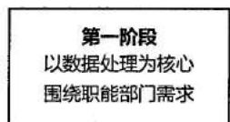

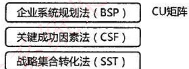

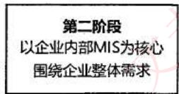
*价值链分析法（VCA）*

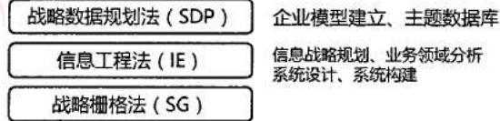

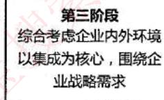
*战略一致性模型（SAM）*

*   **第一阶段：以数据处理为核心，围绕职能部门需求**
    *   **企业系统规划法（BSP）**：自上而下识别企业目标、过程和数据，自下而上设计信息系统。建立CU矩阵。
    *   **关键成功因素法（CSF）**：重视企业在某阶段的关键因素，抓住关键信息。
    *   **战略集合转化法（SST）**：将企业战略信息转换为信息系统战略信息。

*   **第二阶段：以企业内部MIS为核心，围绕企业整体需求**
    *   **战略数据规划法（SDP）**：强调建立企业模型和主题数据库。
    *   **信息工程法（IE）**：以工程方法建立信息系统，以数据为中心。划分为信息规划、业务领域分析、系统设计、系统构建四个阶段。
    *   **战略栅格法（SG）**：建立2*2矩阵，表示过程对数据类的创建和使用。

*   **第三阶段：综合考虑企业内外环境，以集成为核心，围绕企业战略需求**
    *   **价值链分析法（VCA）**：分析对企业增值最大的信息活动。
    *   **战略一致性模型（SAM）**：保证企业战略和信息系统战略一致。

### **考试真题 2**
> 在综合考虑企业内外环境，以集成为核心，围绕企业战略需求进行信息系统规划时，适合于采用的方法是（）。
>
> A. 战略栅格法 B. 价值链分析法 C. 信息工程法 D. 战略集合转化法

**答案：** B

> 用于管理信息系统规划的方法有很多，其中（）将整个过程看成是一个“信息集合”，并将组织的战略目标转变为管理信息系统的战略目标。（）通过自上而下地识别企业目标、企业过程和数据，然后对数据进行分析，自下而上地设计信息系统。
>
> **第一空：** A. 关键成功因素法 B. 战略目标集转化法 C. 征费法 D. 零线预算法
> **第二空：** A. 企业信息分析与集成法 B. 投资回收法 C. 企业系统规划法 D. 阶石法

**答案：** B, C

## **客户关系管理（CRM）**
*   **客户关系管理（CRM）**：以客户为中心，提高客户满意度、增加客户的忠诚度。是一个集成化的信息管理系统，存储客户信息并自动处理，产生更人性化的市场管理策略。
*   **CRM涵盖的要素**：
    1.  以信息技术为手段，但更是一种以客户为中心的商业策略。
    2.  注重提高客户满意度的同时，帮助企业提高获取利润的能力。
    3.  要求企业重新设计业务功能和重组工作流程，以客户为中心。
*   **CRM系统的主要模块**：销售自动化、营销自动化、客户服务与支持、商业智能。
*   **CRM的功能**：
    *   **客户服务**：提高客户忠诚度。
    *   **市场营销**：商机产生、获取和管理。
    *   **共享的客户资料库**：连接市场营销和客户服务，是CRM的基础。
    *   **分析能力**：对资料库进行分析，使客户价值最大化。
*   **有效的CRM解决方案应具备**：畅通有效的客户交流渠道（触发中心）、有效的信息分析（挖掘中心）、与ERP的良好集成。
*   **CRM的实现过程**：客户服务与支持、客户群维系、商机管理。

## **供应链管理（SCM）**
*   **供应链管理（SCM）**：一种集成的管理思想和方法，将供应商、制造商、仓库和商店有效地结合成一体来生产商品，并有效地控制和管理信息流、资金流和物流。
*   **特点**：
    1.  以客户为中心。
    2.  集成化管理。
    3.  扩展性管理。
    4.  合作管理。
    5.  多层次管理（战略、战术、作业层次）。
*   **供应链节点**：供应商、制造商、分销商、零售商、仓库、配送中心、客户等。
*   **SCM包括五大基本内容**：
    *   **计划**：策略部分，管理所有资源以满足客户需求。
    *   **采购**：选择供应商。
    *   **制造**：安排生产、测试、打包和准备送货。
    *   **配送**：即物流，调整订单、建立仓库网络、配送、计价、收款。
    *   **退货**：问题处理部分。

### **考试真题 3**
> ERP（Enterprise Resource Planning）是建立在信息技术的基础上，利用现代企业的先进管理思想，对企业的物流、资金流和（）流进行全面集成管理的管理信息系统，为企业提供决策、计划、控制与经营业绩评估的全方位和系统化的管理平台。在ERP系统中，（）管理模块主要是对企业物料的进、出、存进行管理。
>
> **(20)** A. 产品 B. 人力资源 C. 信息 D. 加工
> **(21)** A. 库存 B. 物料 C. 采购 D. 销售

**答案：** (20) C, (21) A

> 供应链中的信息流覆盖了从供应商、制造商到分销商，再到零售商等供应链中的所有环节，其信息流分为需求信息流和供应信息流，（）属于需求信息流，（）属于供应信息流。
>
> **(18)** A. 库存记录 B. 生产计划 C. 商品入库单 D. 提货发运单
> **(19)** A. 客户订单 B. 采购合同 C. 完工报告单 D. 销售报告

**答案：** (18) B, (19) C
**解析：** 需求信息（如客户订单、生产计划、采购合同等）。供应信息（如入库单、完工报告单、库存记录、可供销售量、提货发运单等）。

### **考试真题 4**
> 在客户关系管理（CRM）系统将市场营销的科学管理理念通过信息技术的手段集成在软件上，能够帮助企业构建良好的客户关系。以下关于CRM系统的叙述中，错误的是（5）。
>
> A、销售自动化是CRM系统中最基本的模块
> B、营销自动化作为销售自动化的扩充，包括营销计划的编制和执行、计划结果分析
> C、CRM系统能够与ERP系统在财务、制造、库存等环节进行连接，但两者关系相对松散，一般不会形成闭环结构
> D、客户服务与支持是CRM系统的重要功能。目前，客户服务与支持的主要手段是通过呼叫中心和互联网来实现

**答案：** C
**解析：** CRM系统能与ERP系统在财务、制造、库存等环节进行连接，两者间会形成一定的闭环反馈结构。

> （）不属于客户关系管理（CRM）系统的基本功能。
>
> A、自动化销售
> B、自动化项目管理
> C. 自动化市场营销
> D. 自动化客户服务

**答案：** B
**解析：** 合格的CRM系统至少需要包括自动化的销售、自动化的市场营销、自动化的客户服务等基本功能模块。

## **企业应用集成（EAI）**

*   企业应用集成（EAI）可以适用于大多数要实施电子商务的企业，以及企业之间的应用集成。
1.  **表示集成（界面集成）**：最原始的集成，黑盒集成。将多个信息系统的界面集成在一起，统一入口。

    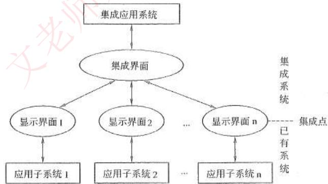

2.  **数据集成**：白盒集成。把不同来源、格式、特点性质的数据在逻辑上或者物理上有机地集中，从而为企业提供全面的数据共享。如数据仓库。

3.  **控制集成（功能集成、应用集成）**：黑盒集成。业务逻辑层次的集成，将多个应用系统功能进行绑定，实现多个系统功能的叠加。如钉钉。

    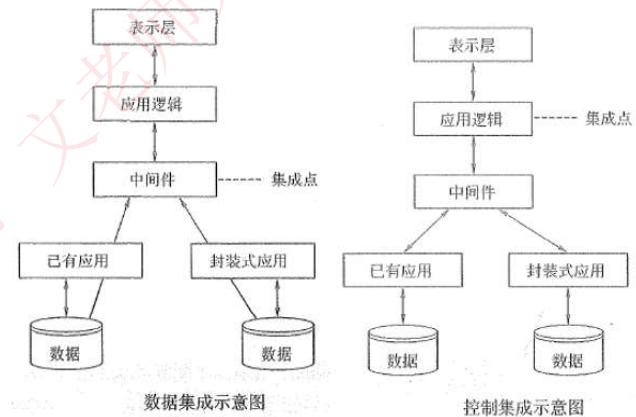

4.  **业务流程集成（过程集成）**：最彻底的、综合的集成。由一系列基于标准的、统一数据格式的工作流组成。包括应用集成、B2B集成、自动化业务流程管理、人工流程管理、企业门户等。如电子购物网站 - 第三方支付平台 - 银行 - 物流等流程集成。

### **考试真题 5**

> EAI（企业应用集成）可以包括表示集成、数据集成、控制集成和业务流程集成等多个层次和方面，下图所示的是（），适合于使用这种集成方式的情况是（）。
>
> 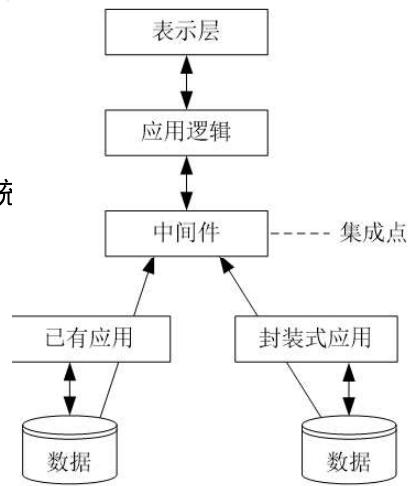
>
> **第一空：** A. 表示集成 B. 数据集成 C. 控制集成 D. 业务流程集成
> **第二空：** A. 要对多种信息源产生的数据进行综合分析和决策 B. 为用户提供一个看上去统一，但是由多个系统组成的应用系统 C. 在现有的基于终端的应用系统上配置基于PC的用户界面 D. 当只有可能在显示界面上实现集成时

**答案：** A, B

### **应用集成数据交换方式**
*   **共享数据库**：多个应用系统直接共享数据库，实时性强，但安全性、并发控制等问题突出。
*   **消息传递**：通过消息进行交互，适用于数据量小、要求频繁、立即、可靠、异步的数据交换。
*   **文件传输**：直接传送数据文件，适用于数据量大、交换频度小、即时性要求低的情况。

### **企业集成平台**
*   是支持企业集成的支撑环境。**基本功能**主要有：
    1.  **通信服务**：提供透明的同步/异步通信服务。
    2.  **信息集成服务**：提供透明的信息访问服务，实现异种数据库系统间数据交换。
    3.  **应用集成服务**：通过高层API实现对应用程序的访问。
    4.  **二次开发工具**：简化用户开发工作的支持工具。
    5.  **平台运行管理工具**：负责平台系统的配置、管理和维护。

### **企业信息集成**
分为企业内部和外部的信息集成。
1.  **企业内部信息集成**：
    *   **技术平台的集成**：系统底层的体系结构、软硬件、异构网络集成。
    *   **数据的集成**：解决数据和数据库集成，实现数据交流共享。
    *   **应用系统的集成**：实现不同系统间互操作，共享数据和方法。
    *   **业务过程的集成**：使不同应用系统中的流程无缝连接。
2.  **企业外部信息集成**：
    *   通过门户网站和互联网实现与公众、客户等的互动。
    *   通过与合作伙伴信息系统对接，建立动态企业联盟。

### **考试真题 6**
> 集成平台是支持企业信息集成的支撑环境，包括硬件、软件、软件工具和系统。集成平台的基本功能中，（）实现不同数据库系统之间的数据交换、互操作、分布数据管理和共享信息模型定义；（）能够为应用提供数据交换和访问操作，使各种不同的系统能够相互协作。
>
> **第一空：** A. 数据通信服务 B. 信息集成服务 C. 应用集成服务 D. 操作集成服务
> **第二空：** A. 数据通信服务 B. 信息集成服务 C. 应用集成服务 D. 操作集成服务

**答案：** B, C

> 企业信息集成按照组织范围分为企业内部的信息集成和外部的信息集成。在企业内部的信息集成中，（）实现了不同系统之间的互操作，使得不同系统之间能够实现数据和方法的共享：（）实现了不同应用系统之间的连接、协调运作和信息共享。
>
> **第一空：** A. 技术平台集成 B. 数据集成 C. 应用系统集成 D. 业务过程集成
> **第二空：** A. 技术平台集成 B. 数据集成 C. 应用系统集成 D. 业务过程集成

**答案：** C, D

## **电子商务**

*   **电子商务分三个方面**：电子商情广告、电子选购和交易；电子交易凭证的交换、电子支付与结算；网上售后服务等。
*   **参与电子商务的实体**有四类：顾客、商户、银行及认证中心。
*   **电子商务模式（按交易对象）**：
    1.  **B2B**：企业对企业
    2.  **B2C**：企业对消费者
    3.  **C2C**：消费者对消费者
    4.  **O2O**：线上购买线下服务/提货
*   **电子商务的基础设施**：网络基础设施、多媒体内容和网络出版的基础设施、报文和信息传播的基础设施、商业服务的基础设施。技术标准、政策、法律是重要保障。

### **考试真题 7**
> 关于电子商务的描述，正确的是（）。
>
> A、团购网站、电话购物、网上书店属于现代电子商务概念
> B、某网站通过推广最新影讯信息及团购折扣活动促进影票销售，这种方式属于O2O模式
> C、某农产品在线交易网站，为某地区农产品公司和本地销售商提供线上交易和信息咨询等服务，这种方式属于C2C模式
> D、消费者之间通过个人二手物品在线交易平台进行交易，这种商务模式属于B2C模式

**答案：** B

> 电子商务系统中参与电子商务活动的实体包括（）。
>
> A. 客户、商户、银行和认证中心
> B. 客户、银行、商户和政府机构
> C. 客户、商户、银行和物流企业
> D. 客户、商户、政府和物流企业

**答案：** A
