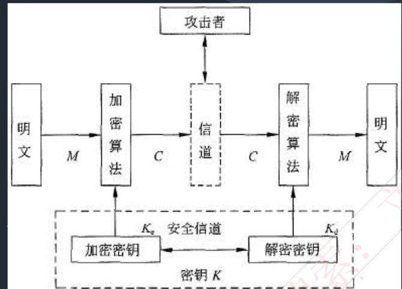
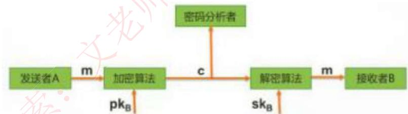
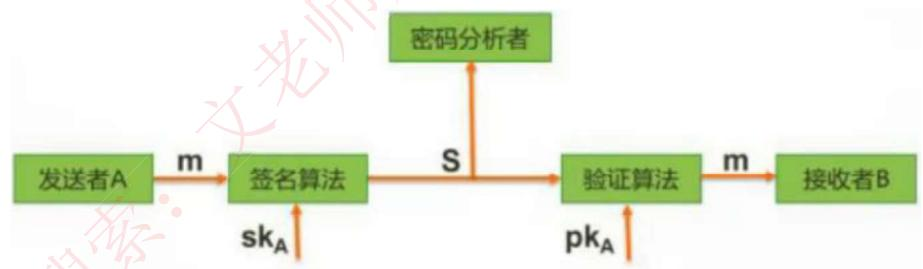
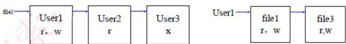
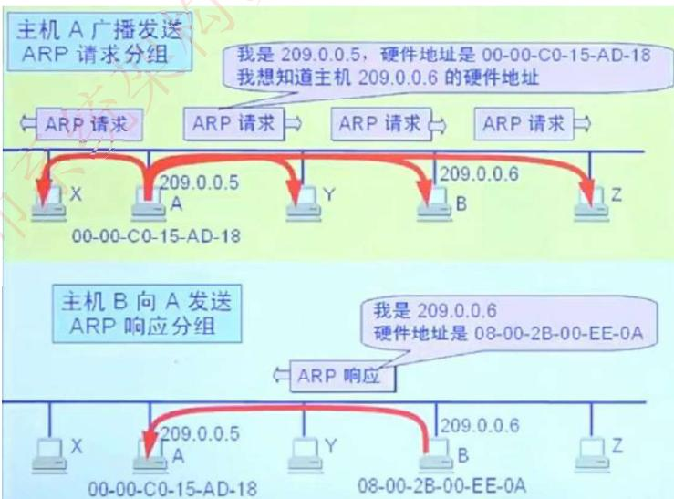
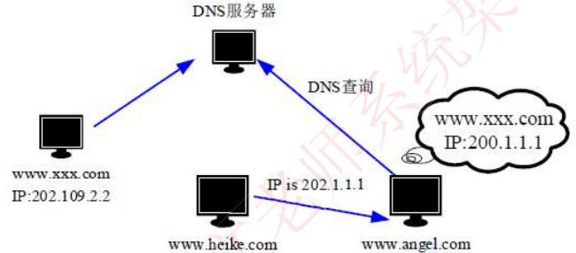
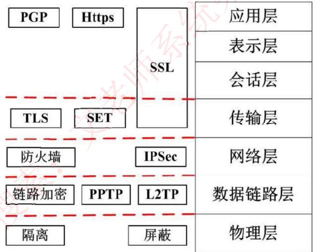
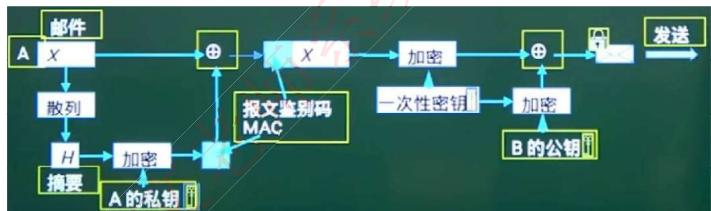
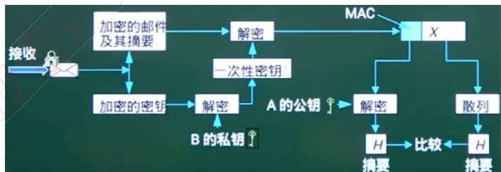

# 系统安全

历年真题考情：本章节每年会考2- 4分左右，基本无超纲。

第二版更新：第二版教材里对应第4章，改动的不多，经常考的信息安全属性、信息安全技术还是原来那些，只有细微变化，不影响做题，此外，就是新增了一些抗攻击技术，以及组织框架，安全架构，风险评估等文科性质内容。

信息安全基础安全系统组成框架信息安全技术信息安全的抗攻击技术信息安全的保证体系和评估方法网络安全技术网络安全协议

# 信息安全基础知识

$\bullet$  信息安全包括5个基本要素：机密性、完整性、可用性、可控性与可审查性。

（1）机密性：确保信息不暴露给未授权的实体或进程。

（2）完整性：只有得到允许的人才能修改数据，并且能够判别出数据是否已被篡改。

（3）可用性：得到授权的实体在需要时可访问数据，即攻击者不能占用所有的资源而阻碍授权者的工作。

（4）可控性：可以控制授权范围内的信息流向及行为方式。

（5）可审查性：对出现的信息安全问题提供调查的依据和手段。

$\bullet$  信息安全的范围包括：设备安全、数据安全、内容安全和行为安全。

（1）信息系统设备的安全是信息系统安全的首要问题，是信息系统安全的物质基础，它包括3个方面：设备的稳定性、可靠性、可用性。

（2）数据安全即采取措施确保数据免受未授权的泄露、篡改和毁坏，包括3个方面：数据的秘密性、完整性、可用性。

（3）内容安全是信息安全在政治、法律、道德层次上的要求，包括3个方面：信息内容政治上健康、符合国家法律法规、符合道德规范。

（4）信息系统的服务功能是指最终通过行为提供给用户，确保信息系统的行为安全，才能最终确保系统的信息安全。行为安全的特性包括：行为的秘密性、完整性、可控性。

# 信息安全基础知识

$\bullet$  信息的存储安全包括信息使用的安全、系统安全监控、计算机病毒防治、数据的加密和防止非法的攻击等。

（1）信息使用的安全。包括用户的标识与验证、用户存取权限限制。

（2）系统安全监控。系统必须建立一套安全监控系统，全面监控系统的活动，并随时检查系统的使用情况，一旦有非法入侵者进入系统，能及时发现并采取相应措施，确定和填补安全及保密的漏洞。还应当建立完善的审计系统和日志管理系统，利用日志和审计功能对系统进行安全监控。

（3）计算机网络服务器必须加装网络病毒自动检测系统，以保护网络系统的安全，防范计算机病毒的侵袭，并且必须定期更新网络病毒检测系统。

$\bullet$  网络安全

$\bullet$  网络安全隐患体现在：物理安全性、软件安全漏洞、不兼容使用安全漏洞、选择合适的安全哲理。 $\bullet$  网络安全威胁：非授权的访问、信息泄露或丢失、破坏数据完整性、拒绝服务攻击、利用网络传播病毒。

$\bullet$  安全措施的目标：访问控制、认证、完整性、审计、保密。

# 信息安全系统的组成框架

$\bullet$  技术体系：从实现技术上来看，信息安全系统涉及以下技术：

（1）基础安全设备包括密码芯片、加密卡、身份识别卡等，此外还涵盖运用到物理安全的物理环境保障技术，建筑物、机房条件及硬件设备条件满足信息系统的机械防护安全，通过对电力供应设备以及信息系统组件的抗电磁干扰和电磁泄漏性能的选择性措施达到相应的安全目的。

（2）计算机网络安全指信息在网络传输过程中的安全防范，用于防止和监控未经授权破坏、更改和盗取数据的行为。通常涉及物理隔离，防火墙及访问控制，加密传输、认证、数字签名、摘要，隧道及VPN技术，病毒防范及上网行为管理，安全审计等实现技术。

（3）操作系统安全是指操作系统的无错误配置、无漏洞、无后门、无特洛伊木马等，能防止非法用户对计算机资源的非法存取，一般用来表达对操作系统的安全需求。操作系统的安全机制包括标识与鉴别机制、访问控制机制、最小特权管理、可信通路机制、运行保障机制、存储保护机制、文件保护机制、安全审计机制，等等。

（4）数据库安全可粗略划分为数据库管理系统安全和数据库应用系统安全两个部分，主要涉及物理数据库的完整性、逻辑数据库的完整性、元素安全性、可审计性、访问控制、身份认证、可用性、推理控制、多级保护以及消除隐通道等相关技术。

（5）终端安全设备从电信网终端设备的角度分为电话密码机、传真密码机、异步数据密码机等。

# 考试真题

在进行软件系统安全性分析时，（）保证信息不泄露给未授权的用户、实体或过程；完整性保证信息的完整和准确，防止信息被非法修改；（）保证对信息的传播及内容具有控制的能力，防止为非法者所用。

A.完整性 
B.不可否认性 
C.可控性 
D.机密性 
A.完整性 
B.安全审计 
C.加密性 
D.可控性

答案：DD

完整的信息安全系统至少包含三类措施，即技术方面的安全措施、管理方面的安全措施和相应的（）。其中，信息安全的技术措施主要有：信息加密、数字签名、身份鉴别、访问控制、网络控制技术、反病毒技术、（）。

A.用户需求 
B.政策法律 
C.市场需求 
D.领域需求

A.数据备份和数据测试 
B.数据迁移和数据备份 
C.数据备份和灾难恢复 
D.数据迁移和数据测试

答案：BC

  
2.信息安全技术

# $\bullet$  加密技术

一个密码系统，通常简称为密码体制(Cryptosystem)，由五部分组成：

(1)明文空间M，它是全体明文的集合。(2)密文空间C，它是全体密文的集合。(3)密钥空间K，它是全体密钥的集合。其中每一个密钥K均由加密密钥Ke和解密密钥Kd组成，即  $k = < k_e$  ，Kd>。(4)加密算法E，它是一组由M至C的加密变换。(5)解密算法D，它是一组由C到M的解密变换。

$\bullet$  对于明文空间M中的每一个明文M，加密算法E在密钥Ke的控制下将明文M加密成密文C：  $C = E$  (M,Ke)

$\bullet$  而解密算法D在密钥Kd的控制下将密文C解密出同一明文M：M=D(C,Kd)=D(E(M,Ke),Kd)

# 信息安全技术

# $\bullet$  对称加密技术

数据的加密和解密的密钥（密码）是相同的，属于不公开密钥加密算法。其缺点是加密强度不高（因为密钥位数少），且密钥分发困难（因为密钥还需要传输给接收方，也要考虑保密性等问题）。优点是加密速度快，适合加密大数据。

$\bullet$  常见的对称密钥加密算法如下：

DES：替换  $^+$  移位、56位密钥、64位数据块、速度快，密钥易产生。3DES：三重DES，两个56位密钥K1、K2。

加密：K1加密- >K2解密- >K1加密

解密：K1解密- >K2加密- >K1解密

AES：是美国联邦政府采用的一种区块加密标准，这个标准用来替代原先的DES。对其的要求是“至少像3DES一样安全”。

RC- 5：RSA数据安全公司的很多产品都使用了RC- 5。

IDEA：128位密钥，64位数据块，比DES的加密性好，对计算机功能要求相对低。

# 信息安全技术

# $\bullet$  非对称加密技术

数据的加密和解密的密钥是不同的，分为公钥和私钥。是公开密钥加密算法。其缺点是加密速度慢。优点是安全性高，不容易破解。

$\bullet$  非对称技术的原理是：发送者发送数据时，使用接收者的公钥作加密密钥，私钥作解密密钥，这样只有接收者才能解密密文得到明文。安全性更高，因为无需传输密钥。但无法保证完整性。如下：

$\bullet$  常见的非对称加密算法如下：RSA：512位（或1024位）密钥，计算机量极大，难破解。Elgantal、ECC（椭圆曲线算法）、背包算法、Rabin、D- H等。

# 信息安全技术

$\bullet$  相比较可知，对称加密算法密钥一般只有56位，因此加密过程简单，适合加密大数据，也因此加密强度不高；而非对称加密算法密钥有1024位，相应的解密计算量庞大，难以破解，却不适合加密大数据。一般用来加密对称算法的密钥，这样，就将两个技术组合使用了，这也是数字信封的原理：

$\bullet$  数字信封原理：信是对称加密的密钥，数字信封就是对此密钥进行非对称加密，具体过程：发送方将数据用对称密钥加密传输，而将对称密钥用接收方公钥加密发送给对方。接收方收到数字信封，用自己的私钥解密信封，取出对称密钥解密得原文。

$\bullet$  数字信封运用了对称加密技术和非对称加密技术，本质是使用对称密钥加密数据，非对称密钥加密对称密钥，解决了对称密钥的传输问题。

# 信息安全技术

# $\bullet$  信息摘要

所谓信息摘要，就是一段数据的特征信息，当数据发生了改变，信息摘要也会发生改变，发送方会将数据和信息摘要一起传给接收方，接收方会根据接收到的数据重新生成一个信息摘要，若此摘要和接收到的摘要相同，则说明数据正确。信息摘要是由哈希函数生成的。

$\bullet$  信息摘要的特点：不算数据多长，都会产生固定长度的信息摘要；任何不同的输入数据，都会产生不同的信息摘要；单向性，即只能由数据生成信息摘要，不能由信息摘要还原数据。

$\bullet$  信息摘要算法：MD5（产生128位的输出）、SHA- 1（安全散列算法，产生160位的输出，安全性更高）。

# 信息安全技术

$\bullet$  数字签名：唯一标识一个发送方。

发送者发送数据时，使用发送者的私钥进行加密，接收者收到数据后，只能使用发送者的公钥进行解密，这样就能唯一确定发送方，这也是数字签名的过程。但无法保证机密性。如下：

# 信息安全技术

$\bullet$  公钥基础设施PKI：是以不对称密钥加密技术为基础，以数据机密性、完整性、身份认证和行为不可抵赖性为安全目的，来实施和提供安全服务的具有普适性的安全基础设施。

（1）数字证书：一个数据结构，是一种由一个可信任的权威机构签署的信息集合。在不同的应用中有不同的证书。如x.509证书必须包含下列信息：（1）版本号（2）序列号（3）签名算法标识符（4）认证机构（5）有效期限（6）主题信息（7）认证机构的数字签名（8）公钥信息。

公钥证书主要用于确保公钥及其与用户绑定关系的安全。这个公钥就是证书所标识的那个主体的合法的公钥。任何一个用户只要知道签证机构的公钥，就能检查对证书的签名的合法性。如果检查正确，那么用户就可以相信那个证书所携带的公钥是真实的，而且这个公钥就是证书所标识的那个主体的合法的公钥。例如驾照。

（2）签证机构CA：负责签发证书、管理和撤销证书。是所有注册用户所信赖的权威机构，CA在给用户签发证书时要加上自己的数字签名，以保证证书信息的真实性。任何机构可以用CA的公钥来验证该证书的合法性。

# 考试真题

数字签名技术属于信息系统安全管理中保证信息（）的技术。

A、保密性 B、可用性 C、完整性 D、可靠性

【答案】C

【解析】数字签名是保证信息传输的完整性、发送者的身份认证、防止交易中的抵赖发生。

为保障数据的存储和运输安全，防止信息泄露，需要对一些数据进行加密。由于对称密码算法（），所以特别适合对大量的数据进行加密。

A、比非对称密码算法更安全 B、比非对称密码算法密钥更长 C、比非对称密码算法效率更高 D、还能同时用于身份认证

【答案】C

# 考试真题

假设A和B之间要进行加密通信，则正确的非对称加密流程是（）。

$①$  A和B都要产生一对用于加密和解密的加密密钥和解密密钥 $②$  A将公钥传送给B，将私钥自己保存，B将公钥传送给A，将私钥自己保存 $③$  A发送消息给B时，先用B的公钥对信息进行加密，再将密文发送给B $④$  B收到A发来的消息时，用自己的私钥解密

A.  $①②③④$  
B.①③④② 
C.③①②④ 
D.②③①④

【答案】A

甲向乙发送其数据签名，要验证该签名，乙可使用（）对该签名进行解密。

A.甲的私钥 
B.甲的公钥 
C.乙的私钥 
D.乙的公钥

【答案】B

# 信息安全技术

$\bullet$  访问控制是指主体依据某些控制策略或权限对客体本身或是其资源进行的不同授权访问。访问控制包括3个要素，即主体、客体和控制策略。

$\bullet$  访问控制包括认证、控制策略实现和审计3方面的内容。

（1）访问控制矩阵（ACM）。是通过矩阵形式表示访问控制规则和授权用户权限的方法。主体作为行，

<table><tr><td></td><td>file1</td><td>file2</td><td>file3</td></tr><tr><td>User1</td><td>rw</td><td></td><td>rw</td></tr><tr><td>User2</td><td>r</td><td>rwx</td><td>x</td></tr><tr><td>User3</td><td>x</td><td>r</td><td></td></tr></table>

（2）访问控制表（ACL）。目前最流行、使用最多的访问控制实现技术。每个客体有一个访问控制表，是系统中每一个有权访问这个客体的主体的信息。这种实现技术实际上是按列保存访问矩阵。

（3）能力表。对应于访问控制表，这种实现技术实际上是按行保存访问矩阵。每个主体有一个能力表，是该主体对系统中每一个客体的访问权限信息。使用能力表实现的访问控制系统可以很方便地查询某一个主体的所有访问权限。

（4）授权关系表。每一行（或者说元组）就是访问矩阵中的一个非空元素，是某一个主体对应于某一个客体的访问权限信息。如果授权关系表按主体排序，查询时就可以得到能力表的效率；如果按客体排序，查询时就可以得到访问控制表的效率。

# 信息安全的抗攻击技术

$\bullet$  为对抗攻击者的攻击，密钥生成需要考虑3个方面的因素：增大密钥空间、选择强钥（复杂的）、密钥的随机性（使用随机数）。

$\bullet$  拒绝服务攻击有许多种，网络的内外部用户都可以发动这种攻击。内部用户可以通过长时间占用系统的内存、CPU处理时间使其他用户不能及时得到这些资源，而引起拒绝服务攻击；外部黑客也可以通过占用网络连接使其他用户得不到网络服务。

$\bullet$  外部用户针对网络连接发动拒绝服务攻击主要有以下几种模式：消耗资源、破坏或更改配置信息、物理破坏或改变网络部件、利用服务程序中的处理错误使服务失效。

$\bullet$  分布式拒绝服务DDoS攻击是传统DoS攻击的发展，攻击者首先侵入并控制一些计算机，然后控制这些计算机同时向一个特定的目标发起拒绝服务攻击。克服了传统DOS受网络资源的限制和隐蔽性两大缺点。

$\bullet$  拒绝服务攻击的防御方式

（1）加强对数据包的特征识别，攻击者发送的数据包中是有一些特征字符串。通过搜寻这些特征字符串，就可以确定攻击服务器和攻击者的位置。

（2）设置防火墙监视本地主机端口的使用情况。如果发现端口处于监听状态，则系统很可能受到攻击。

（3）对通信数据量进行统计也可获得有关攻击系统的位置和数量信息。在攻击时，攻击数据的来源地址会发出超出正常极限的数据量。

（4）尽可能的修正已经发现的问题和系统漏洞。

# 信息安全的抗攻击技术

$\bullet$  ARP欺骗

正常ARP原理：如图所示，主机A想知道局域网内主机B的MAC地址，那么主机A就广播发送ARP请求分组，局域网内主机都会收到，但只有B收到解析后知道是请求自己的MAC地址，所以只有B会返回单播的响应分组，告诉A自己的MAC地址。

ARP到响应分组后，会建立一个B的IP地址和MAC地址映射，这个映射是动态存在的，如果一定时间AB不再通信，那么就会清空这个地址映射，下次如果还要通信，则重复这个过程。

$\bullet$  ARP欺骗原理：上述过程主机A是不管其有没有发送过请求广播分组的，而是只要收到了返回的分组信息，就会刷新IP地址和MAC地址的映射关系，这样就存在安全隐患，假设有主机C，模拟返回分组格式，构造正确的IP地址和自己的MAC地址映射，A收到后也会刷新映射关系，那么当A再次向B发送信息时，实际就发送到了C的MAC地址，数据就被C监听到了。

# 信息安全的抗攻击技术

$\bullet$  ARP欺骗的防范措施： $①$  在winxp下输入命令：arp- s gate- way- ip gate- way- mac 固化arp表，阻止arp欺骗。

$②$  使用ARP服务器。通过该服务器查找自己的ARP转换表来响应其他机器的ARP广播。确保这台ARP服务器不被黑。

$③$  采用双向绑定的方法解决并且防止ARP欺骗。

$④$  ARP防护软件——ARPGuard。通过系统底层核心驱动，无须安装其他任何第三方软件（如WinPcap），以服务及进程并存的形式随系统启动并运行，不占用计算机系统资源。无需对计算机进行IP地址及MAC地址绑定，从而避免了大量且无效的工作量。也不用担心计算机会在重启后新建ARP缓存列表，因为此软件是以服务与进程相结合的形式存在于计算机中，当计算机重启后软件的防护功能也会随操作系统自动启动并工作。

# 信息安全的抗攻击技术

$\bullet$  DNS欺骗首先是冒充域名服务器，然后把查询的IP地址设为攻击者的IP地址，这样的话，用户上网就只能看到攻击者的主页，而不是用户想要取得的网站的主页了，这就是DNS欺骗的基本原理。也即改掉了域名和IP地址的对应关系。黑客是通过冒充DNS服务器回复查询IP的，如下图所示：

$\bullet$  DNS欺骗的检测：

IP:200.1.1.1

$①$  被动监听检测：通过旁路监听的方式，捕获所有DNS请求和应答数据包，并为其建立一个请求应答映射表。如果在一定的时间间隔内，一个请求对应两个或两个以上结果不同的应答包，则怀疑受到了DNS欺骗攻击。

$②$  虚假报文探测：采用主动发送探测包的手段来检测网络内是否存在DNS欺骗攻击者。如果向一个非DNS服务器发送请求包，正常来说不会收到任何应答，如果收到了应答包，则说明受到了攻击。

$③$  交叉检查查询：在客户端收到DNS应答包之后，向DNS服务器反向查询应答包中返回的IP地址所对应的DNS名字，如果二者一致说明没有受到攻击，否则说明被欺骗。

# 信息安全的抗攻击技术

$\bullet$  IP欺骗的原理和流程：

$①$  首先使被冒充主机hostb的网络暂时瘫痪，以免对攻击造成干扰； $②$  然后连接到目标机hosta的某个端口来猜测ISN基值和增加规律；

$③$  接下来把源址址伪装成被冒充主机hostb，发送带有SYN标志的数据段请求连接； $④$  然后等待目标机hosta发送SYN+ACK包给已经瘫痪的主机，因为现在看不到这个包：

$⑤$  最后再次伪装成主机hostb向目标主机hosta发送的ACK，此时发送的数据段带有预测的目标机的  $\mathsf{ISN} + 1$ $⑥$  连接建立，发送命令请求。

$\bullet$  IP欺骗的防范：虽然IP欺骗攻击有着相当难度，但这种攻击非常广泛，入侵往往由这里开始。预防这种攻击可以删除UNIX中所有的/etc/hosts.equiv、$HOME/.rhosts文件，修改/etc/inetd.conf文件，使得RPC机制无法应用。另外，还可以通过设置防火墙过滤来自外部而信源地址却是内部IP的报文。

# 信息安全的抗攻击技术

$\bullet$  端口扫描就是尝试与目标主机的某些端口建立连接，如果目标主机该端口有回复（见三次握手中的第二次），则说明该端口开放，即为“活动端口”。

$\bullet$  扫描原理分类：

（1）全TCP连接。这种扫描方法使用三次握手，与目标计算机建立标准的TCP连接。（2）半打开式扫描（SYN扫描）。在这种扫描技术中，扫描主机自动向目标计算机的指定端口发送SYN数据段，表示发送建立连接请求。·如果目标计算机的回应TCP报文中SYN=1ACK=1，则说明该端口是活动的。接着扫描主机传送一个RST给目标主机拒绝建立TCP连接，从而导致三次握手的过程失败。·如果目标计算机的回应是RST，则表示该端口为“死端口”，这种情况下，扫描主机不用做任何回应。

（3）FIN扫描。依靠发送FIN来判断目标计算机的指定端口是否是活动的。发送一个FIN=1的TCP报文到一个关闭的端口时，该报文会被丢掉，并返回一个RST报文。但是，如果当FIN报文到一个活动的端口时，该报文只是被简单的丢掉，不会返回任何回应。从FIN扫描可以看出，这种扫描没有涉及任何TCP连接部分。因此，这种扫描比前两种都安全，可以称之为秘密扫描。

（4）第三方扫描。第三方扫描又称“代理扫描”，这种扫描是利用第三方主机来代替入侵者进行扫描。这个第三方主机一般是入侵者通过入侵其他计算机而得到的，该“第三方”主机常被入侵者称之为“肉鸡”。这些“肉鸡”一般为安全防御系数极低的个人计算机。

# 信息安全的抗攻击技术

$\bullet$  强化TCP/IP堆栈以抵御拒绝服务攻击

1. 同步包风暴(SYN Flooding)：利用TCP协议缺陷发送大量伪造的TCP连接请求，使得被攻击者资源耗尽。三次握手，进行了两次，不进行第三次握手，连接队列处于等待状态，大量这样的等待，会占满全部队列空间，使得系统挂起。可以通过修改注册表防御SYN Flooding攻击。

2. ICMP攻击。ICMP协议本身的特点决定了它非常容易被用于攻击网络上的路由器和主机。比如，前面提到的“Ping of Death”攻击就是利用操作系统规定的ICMP数据包的最大尺寸不超过64KB这一规定，达到使TCP/IP堆栈崩溃、主机死机的效果。可以通过修改注册表防御ICMP攻击。

3. SNMP攻击。SNMP还能被用于控制这些设备和产品，重定向通信流，改变通信数据包的优先级，甚至断开通信连接。总之，入侵者如果具备相应能力，就能完全接管你的网络。可以通过修改注册表项防御。系统漏洞扫描指对重要计算机信息系统进行检查，发现其中可能被黑客利用的漏洞。包括基于网络的漏洞扫描（通过网络远程扫描主机）、基于主机的漏洞扫描（在目标系统安装了代理扫描）。

# 考试真题

SYN Flooding攻击的原理是（）。

A. 利用TCP三次握手，恶意造成大量TCP半连接，耗尽服务器资源，导致系统拒绝服务  
B. 操作系统在实现TCP/IP协议栈时，不能很好地处理TCP报文的序列号紊乱问题，导致系统崩溃  
C. 操作系统在实现TCP/IP协议栈时，不能很好地处理IP分片包的重叠情况，导致系统崩溃  
D. 操作系统协议栈在处理IP分片时，对于重组后超大的IP数据包不能很好地处理，导致缓存溢出而系统崩溃  参考答案(64)A

# 信息安全的保证体系和评估方法

$\bullet$  GB17859—999标准规定了计算机系统安全保护能力的五个等级：

$\bullet$  第一级用户自主保护级：本级的计算机信息系统可信计算基通过隔离用户与数据，使用户具备自主安全保护的能力。本级实施的是自主访问控制，即计算机信息系统可信计算机定义和控制系统中命名用户对命名客体的访问。

$\bullet$  第二级系统审计保护级：本级的计算机信息系统可信计算基实施了粒度更细的自主访问控制，它通过登录规程、审计安全性相关事件和隔离资源，使用户对自己的行为负责。在自主访问控制的基础上控制访问权限扩散。

$\bullet$  第三级安全标记保护级：本级的计算机信息系统可信计算基具有系统审计保护级所有功能。此外，还提供有关安全策略模型、数据标记以及主体对客体强制访问控制的非形式化描述；具有准确地标记输出信息的能力；消除通过测试发现的任何错误。本级的主要特征是计算机信息系统可信计算基对所有主体及其所控制的客体（例如：进程、文件、段、设备）实施强制访问控制。

$\bullet$  第四级结构化保护级：本级的计算机信息系统可信计算基建立于一个明确定义的形式化安全策略模型之上，它要求将第三级系统中的自主和强制访问控制扩展到所有主体与客体。此外，还要考虑隐蔽通道。对外部主体能够直接或间接访问的所有资源（例如：主体、存储客体和输入输出资源）实施强制访问控制。

$\bullet$  第五级访问验证保护级：本级的计算机信息系统可信计算基满足访问监控器需求。访问监控器仲裁主体对客体的全部访问。访问监控器本身是抗篡改的；必须足够小，能够分析和测试。与第四级相比，自主访问控制机制根据用户指定方式或默认方式，阻止非授权用户访问客体。访问控制的粒度是单个用户。访问控制能够为每个命名客体指定命名用户和用户组，并规定他们对客体的访问模式。没有存取权的用户只允许由授权用户指定对客体的访问权。

# 信息安全的保证体系和评估方法

$\bullet$  安全风险管理

$\bullet$  在风险评估实施前，应该考虑：

（1）确定风险评估的范围。（2）确定风险评估的目标。（3）建立适当的组织结构。（4）建立系统性的风险评估方法。（5）获得最高管理者对风险评估策划的批准。

$\bullet$  风险评估的基本要素为脆弱性、资产、威胁、风险和安全措施，与这些要素相关的属性分别为业务战略、资产价值、安全需求、安全事件和残余风险，这些也是风险评估要素的一部分。

$\bullet$  风险计算模型包含信息资产、弱点／脆弱性、威胁等关键要素。每个要素有各自的属性，信息资产的属性是资产价值，弱点的属性是弱点被威胁利用后对资产带来的影响的严重程度，威胁的属性是威胁发生的可能性。风险计算的过程如下。

（1）对信息资产进行识别，并对资产赋值。（2）对威胁进行分析，并对威胁发生的可能性赋值。（3）识别信息资产的脆弱性，并对弱点的严重程度赋值。（4）根据威胁和脆弱性计算安全事件发生的可能性。（5）结合信息资产的重要性和发生安全事件的可能性，计算信息资产的风险值。

# 网络安全技术

$\bullet$  防火墙是在内部网络和外部因特网之间增加的一道安全防护措施，分为网络级防火墙和应用级防火墙。

$\bullet$  网络级防火墙层次低，但是效率高，因为其使用包过滤和状态监测手段，一般只检验网络包外在（起始地址、状态）属性是否异常，若异常，则过滤掉，不与内网通信，因此对应用和用户是透明的。

$\bullet$  但是这样的问题是，如果遇到伪装的危险数据包就没办法过滤，此时，就要依靠应用级防火墙，层次高，效率低，因为应用级防火墙会将网络包拆开，具体检查里面的数据是否有问题，会消耗大量时间，造成效率低下，但是安全强度高。

# 网络安全技术

# $\bullet$  入侵检测系统IDS

防火墙技术主要是分隔来自外网的威胁，却对来自内网的直接攻击无能为力，此时就要用到入侵检测IDS技术，位于防火墙之后的第二道屏障，作为防火墙技术的补充。

$\bullet$  原理：监控当前系统/用户行为，使用入侵检测分析引擎进行分析，这里包含一个知识库系统，囊括了历史行为、特定行为模式等操作，将当前行为和知识库进行匹配，就能检测出当前行为是否是入侵行为，如果是入侵，则记录证据并上报给系统和防火墙，交由它们处理。

$\bullet$  不同于防火墙，IDS入侵检测系统是一个监听设备，没有跨接在任何链路上，无须网络流量流经它便可以工作。因此，对IDS的部署，唯一的要求是：IDS应当挂接在所有所关注流量都必须流经的链路上。因此，IDS在交换式网络中的位置一般选择在：（1）尽可能靠近攻击源（2）尽可能靠近受保护资源

# 网络安全技术

# $\bullet$  入侵防御系统IPS

IDS和防火墙技术都是在入侵行为已经发生后所做的检测和分析，而IPS是能够提前发现入侵行为，在其还没有进入安全网络之前就防御。在安全网络之前的链路上挂载入侵防御系统IPS，可以实时检测入侵行为，并直接进行阻断，这是与IDS的区别，要注意。

# $\bullet$  杀毒软件

用于检测和解决计算机病毒，与防火墙和IDS要区分，计算机病毒要靠杀毒软件，防火墙是处理网络上的非法攻击。

# $\bullet$  蜜罐系统

伪造一个蜜罐网络引诱黑客攻击，蜜罐网络被攻击不影响安全网络，并且可以借此了解黑客攻击的手段和原理，从而对安全系统进行升级和优化。

# 网络安全技术

# 网络攻击和威胁

<table><tr><td>攻击类型</td><td>攻击名称</td><td>描述</td></tr><tr><td rowspan="3">被动攻击</td><td>窃听（网络监听）</td><td>用各种可能的合法或非法的手段窃取系统中的信息资源和敏感信息。</td></tr><tr><td>业务部分析</td><td>通过对系统进行长期监听，利用统计分析方法对诸如通信频度、通信的信息流向、通信总量的变化等参数进行研究，从而发现有价值的信息和规律。</td></tr><tr><td>非法登录</td><td>有些资料将这种方式归为被动攻击方式。</td></tr></table>

<table><tr><td rowspan="5">主动攻击</td><td>假冒身份</td><td>通过欺骗通信系统（或用户）达到非法用户冒充或为合法用户，或者特权小的用户冒充成为特权大的用户的目的是。黑客大多是采用假冒进行攻击。</td></tr><tr><td>抵赖</td><td>这是一种来自用户的攻击，比如：否认自己曾经发布过的某条消息、伪造一份对方来信等。</td></tr><tr><td>旁路控制</td><td>攻击者利用系统的安全缺陷或安全性上的脆弱之处获得非授权的权利或特权。</td></tr><tr><td>重放攻击</td><td>所获获的某次合法的通信数据拷贝，出于非法的目的而被重新发送。</td></tr><tr><td>拒绝服务（DOS）</td><td>对信息或其它资源的合法访问被无条件地阻止。</td></tr></table>

# 网络安全协议

物理层主要使用物理手段，隔离、屏蔽物理设备等，其它层都是靠协议来保证传输的安全，具体如下图所示：

# 网络安全协议

SSL协议：安全套接字协议，被设计为加强Web安全传输(HTTP/HTTPS/)的协议，安全性高，和HTTP结合之后，形成HTTPS安全协议，端口号为443.

SSH协议：安全外壳协议，被设计为加强Telnet/FTP安全的传输协议。

SET协议：安全电子交易协议主要应用于B2C模式（电子商务）中保障支付信息的安全性。SET协议本身比较复杂，设计比较严格，安全性高，它能保证信息传输的机密性、真实性、完整性和不可否认性。SET协议是PKI框架下的一个典型实现，同时也在不断升级和完善，如SET2.0将支持借记卡电子交易。

Kerberos协议：是一种网络身份认证协议，该协议的基础是基于信任第三方，它提供了在开放型网络中进行身份认证的方法，认证实体可以是用户也可以是用户服务。这种认证不依赖宿主机的操作系统或计算机的IP地址，不需要保证网络上所有计算机的物理安全性，并且假定数据包在传输中可被随机窃取和篡改。

# 网络安全协议

$\bullet$  PGP协议：使用RSA公钥证书进行身份认证，使用IDEA（128位密钥）进行数据加密，使用MD5进行数据完整性验证。

发送方A有三个密钥：A的私钥、B的公钥、A生成的一次性对称密钥；接收方B有两个密钥：B的私钥、A的公钥。

# 考试真题

下面可提供安全电子邮件服务的是（）。

A. RSA 
B. SSL 
C. SET 
D.S/MIME

答案：D

解析：MIME(Multipurpose Internet Mail Extensions)中文名为：多用途互联网邮件扩展类型。S/MIME (Secure Multipurpose Internet Mail Extensions)是对MIME在安全方面的扩展。

以下关于第三方认证服务的叙述中，正确的是（）。

A. Kerberos认证服务中保存数字证书的服务器叫CA  
B. 第三方认证服务的两种体制分别是Kerberos和PKI  
C. PKI体制中保存数字证书的服务器叫KDC  
D. Kerberos的中文全称是“公钥基础设施”

答案：B

网络管理员通过命令行方式对路由器进行管理，要确保ID，口令和会话话内存的保密性，应采取的访问方式是（）。

A. 控制台 
B. AUX  
C. TELNET 
D. SSH  答案：D

# 谢谢！

