# 软件工程基础知识

# 历年真题考情：

本章节每年会考12- 15分左右。

# 第二版更新：

第二版教材里对应第5章，相关概念和定义改动的比较多，尤其是对于软件工程阶段的划分，传统的软件设计的阶段划分等，新教材里都删除了，也缺少了测试用例设计、运行维护阶段内容，这会导致大家做历年真题感觉陌生，这块的话我们会给大家按最新教材内容录制，同时通过每年最新直播讲题来讲往年真题的老的知识点，本章节对应5.7项目管理单独独立为一个章节，不在这里赘述。

软件工程概述能力成熟度模型软件过程模型逆向工程需求工程系统设计测试基础知识系统运行与维护净室软件工程基于构件的软件工程

# 软件工程概述（原）

# $\bullet$  软件开发生命周期：

$\bullet$  软件定义时期：包括可行性研究和详细需求分析过程，任务是确定软件开发工程必须完成的总目标，具体可分成问题定义、可行性研究、需求分析等。 $\bullet$  软件开发时期：就是软件的设计与实现，可分成概要设计、详细设计、编码、测试等。 $\bullet$  软件运行和维护：就是把软件产品移交给用户使用。

$\bullet$  软件系统的文档可以分为用户文档和系统文档两类，用户文档主要描述系统功能和使用方法，并不关系这些功能是怎样实现的；系统文档描述系统设计、实现和测试等各方面的内容。

# $\bullet$  软件工程过程是指为获得软件产品包括以下4个方面活动：

（1）P(Plan)——软件规格说明。规定软件的功能及其运行时的限制。（2）D(Do)——软件开发。开发出满足规格说明的软件。（3）C(Check)——软件确认。确认开发的软件能够满足用户的需求。（4）A(Action)——软件演进。软件在运行过程中不断改进以满足客户新的需求。

# $\bullet$  软件系统工具通常可以按软件过程活动将软件工具分为：

软件开发工具：需求分析工具、设计工具、编码与排错工具、测试工具等。软件维护工具：版本控制工具、文档分析工具、开发信息库工具、逆向工程工具、再工程工具。软件管理和软件支持工具：项目管理工具、配置管理工具、软件评价工具、软件开发工具的评价和选择。

$\bullet$  软件设计四个活动：数据设计、架构（体系结构）设计、人机界面（接口）设计和过程设计。

# 能力成熟度模型

能力成熟度模型CMM  

<table><tr><td>能力等级</td><td>特点</td><td>关键过程区域</td></tr><tr><td>初始级（Con）</td><td>软件过程的特点是杂乱无章，有时甚至很混乱，几乎没有明确定义的步骤，项目的成功完全依赖个人的努力和英雄式核心人物的作用。</td><td></td></tr><tr><td>可重复级（Repeatable）</td><td>建立了基本的项目管理过程和实践来跟踪项目费用、进度和功能特性，有必要的过程准则来重复以前在同类项目中的成功。</td><td>软件配置管理、软件质量保证、软件子合同管理、软件项目跟踪与监督、软件项目策划、软件需求管理</td></tr><tr><td>已定义级（De fined）</td><td>管理和工程两方面的软件过程已经文档化、标准化，并综合成整个软件开发组织的标准软件过程。所有项目都采用根据实际情况修改后得到的标准软件过程来发和维护软件。</td><td>同行评审、组间协调、软件产品工程、集成软件管理、培训大纲、组织过程定义、组织过程集点</td></tr><tr><td>已管理级（M anaged）</td><td>制定了软件过程和产品质量的详细度量标准。对软件过程和产品质量有定量的理解和控制。</td><td>软件质量管理和定量过程管理</td></tr><tr><td>优化级（Opti mized）</td><td>加强了定量分析，通过来自过程质量反馈和来自新观念、新技术的反馈使过程能不断持续地改进。</td><td>过程更改管理、技术改革管理和缺陷预防</td></tr></table>

# 能力成熟度模型

# 能力成熟度模型集成CMMI

是若干过程模型的综合和改进，不仅仅软件，而是支持多个工程学科和领域的、系统的、一致的过程改进框架，能适应现代工程的特点和需要，能提高过程的质量和工作效率。

CMMI两种表示方法：

（1）阶段式模型：类似于CMM，它关注组织的成熟度，五个成熟度模型如下：

<table><tr><td>能力等级</td><td>特点</td><td>关键过程区域</td></tr><tr><td>初始级</td><td>过程不可预测且缺乏控制</td><td></td></tr><tr><td>已管理级</td><td>过程为项目服务</td><td>需求管理、项目计划、配置管理、项目监督与控制、供应商合同管理、度量和分析、过程和产品质量保证</td></tr><tr><td>已定义级</td><td>过程为组织服务</td><td>需求开发、技术解决方案、产品集成、验证、确认组织级过程焦点、组织级过程定义、组织级培训、集成项目管理、风险管理、集成化的团队、决策分析和解决方案、组织级集成环境</td></tr><tr><td>定量管理</td><td>过程已度量和控制</td><td>组织过程性能、定量项目管理</td></tr><tr><td>优化级</td><td>集中于过程改进和优化</td><td>组织级改革与实施、因果分析和解决方案</td></tr></table>

# 能力成熟度模型

其中2- 5级对应的过程域如下图所示：

<table><tr><td>成熟度等级</td><td>过程域</td></tr><tr><td>已管理级</td><td>需求管理、项目计划、配置管理、项目监督与控制、供应商合同管理、度量和分析、过程和产品质量保证</td></tr><tr><td>已定义级</td><td>需求开发、技术解决方案、产品集成、验证、确认、组织级过程焦点、组织级过程定义、组织级培训、集成项目管理、风险管理、集成化的团队、决策分析和解决方案、组织级集成环境</td></tr><tr><td>定量管理级</td><td>组织级过程性能、定量项目管理</td></tr><tr><td>优化级</td><td>组织级改革与实施、因果分析和解决方案</td></tr></table>

2. 连续式模型：关注每个过程域的能力，一个组织对不同的过程域可以达到不同的过程域能力等级。

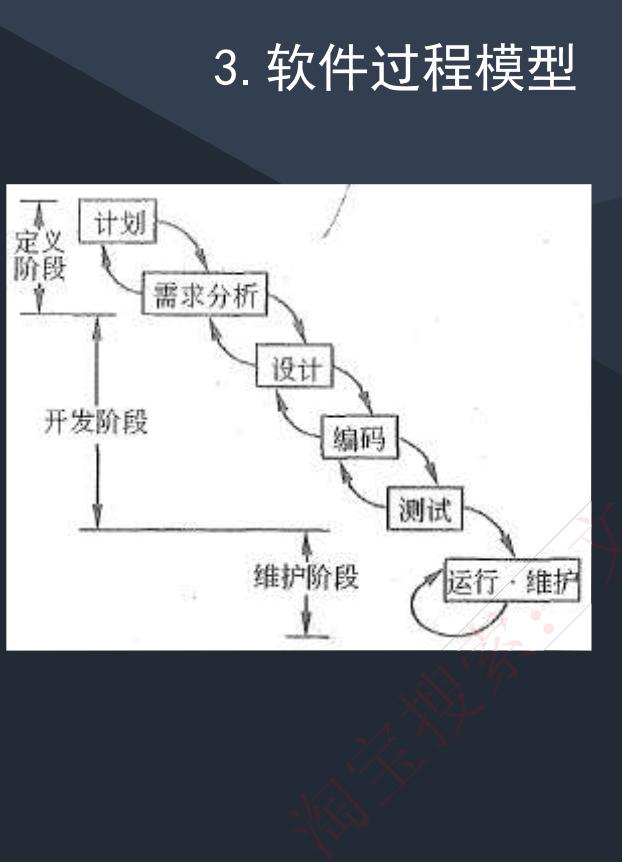

$\bullet$  瀑布模型(SDLC)：瀑布模型是一个经典的软件生命周期模型，一般将软件开发分为：可行性分析（计划）、需求分析、软件设计（概要设计、详细设计）、编码（含单元测试）、测试、运行维护等几个阶段。

# $\bullet$  瀑布模型特点

（1）从上一项开发活动接受该项活动的工作对象作为输入。（2）利用这一输入，实施该项活动应完成的工作内容（3）给出该项活动的工作成果，作为输出传给下一项开发活动。（4）对该项活动的实施工作成果进行评审。若其工作成果得到确认，则继续进行下一项开发活动；否则返回前一项，甚至更前项的活动。尽量减少多个阶段间的反复。以相对来说较小的费用来开发软件

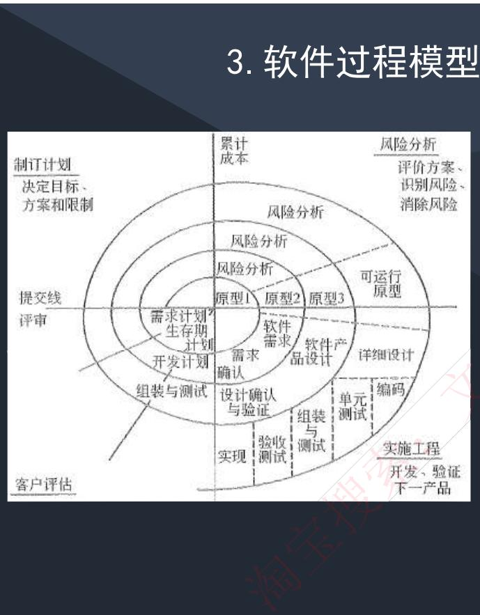

螺旋模型是一个演化软件过程模型，将原型实现的迭代特征与线性顺序（瀑布）模型中控制的和系统化的方面结合起来。在螺旋模型中，软件开发是一系列的增量发布。

开发过程具有周期性重复的螺旋线状。四个象限分别标志每个周期所划分的四阶段：制订计划、风险分析、实施工程和客户评估。螺旋模型强调了风险分析，特别适用于庞大而复杂的、高风险的系统。

# 软件过程模型

原型化模型第一步就是创建一个快速原型，能够满足项目干系人与未来的用户可以与原型进行交互，再通过与相关干系人进行充分的讨论和分析，最终弄清楚当前系统的需求，进行了充分的了解之后，在原型的基础上开发出用户满意的产品。

原型法认为在很难一下子全面准确地提出用户需求的情况下，原型应当具备的特点如下。

（1）实际可行

（2）具有最终系统的基本特征

（3）构造方便、快速，造价低。原型法的特点在于原型法对用户的需求是动态响应、逐步纳入的。

# 软件过程模型

$\bullet$  增量模型：首先开发核心模块功能，而后与用户确认，之后再开发次核心模块的功能，即每次开发一部分功能，并与用户需求确认，最终完成项目开发，优先级最高的服务最先交付。

$\bullet$  特点：但由于并不是从系统整体角度规划各个模块，因此不利于模块划分。难点在于如何将客户需求划分为多个增量。与原型不用的是增量模型的每一次增量版本都可作为独立可操作的作品，而原型的构造一般是为了演示。

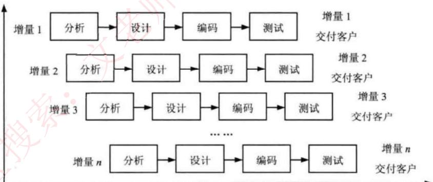

# 软件过程模型

$\bullet$  喷泉模型：是一种以用户需求为动力，以对象作为驱动的模型，适合于面向对象的开发方法。使开发过程具有迭代性和无间隙性。

$\bullet$  基于构件的开发模型CBSD：利用预先包装的构件来构造应用系统。构件可以是组织内部开发的构件，也可以是商品化成品软件构件。特点是增强了复用性，在系统开发过程中，会构建一个构件库，供其他系统复用，因此可以提高可靠性，节省时间和成本。

$\bullet$  形式化方法模型：建立在严格数学基础上的一种软件开发方法，主要活动是生成计算机软件形式化的数学规格说明。

# 考试真题

假设某软件公司与客户签订合同开发一个软件系统，系统的功能有较清晰的定义，且客户对交付时间有严格要求，则该系统的开发最适宜采用

A.瀑布模型 
B.原型模型 
C.V模型 
D.螺旋模型

答案：A

解析：功能清晰，也即需求较明确，有这样的关键字都是考察瀑布模型，牢记总结的记忆关键字。

以下关于螺旋模型的叙述中，不正确的是（）

A.它是风险驱动的，要求开发人员必须具有丰富的风险评估知识和经验  
B.它可以降低过多测试或测试不足带来的风险  
C.它包含维护周期，因此维护和开发之间没有本质区别  
D.它不适用于大型软件开发

答案：D

解析：螺旋模型的特点是风险分析，应对风险的都正确，螺旋模型适合大型软件开发。

# 软件过程模型

# $\bullet$  敏捷模型

开发宣言：个体和交互胜过过程和工具、可以工作的软件胜过面面俱到的文档、客户合作胜过合同谈判、响应变化胜过遵循计划。

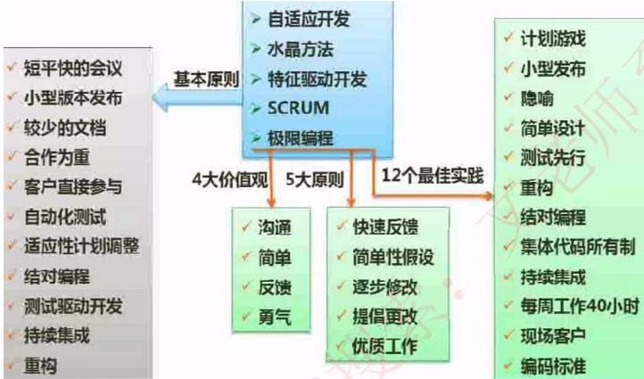

敏捷方法区别于其他方法的两个特点：

（1）是“适应性”而非“预设性”。（2）是“面向人的”而非“面向过程的”。

敏捷方法的核心思想：

（1）敏捷方法是适应型，而非可预测型。拥抱变化，适应变化。（2）敏捷方法是以人为本，而非以过程为本。发挥人的特性。（3）选代增量式的开发过程。以原型开发思想为基础，采用法代增量式开发，发行版本小型化。

# 软件过程模型

$\bullet$  主要敏捷方法：

（1）极限编程（XP）。基础和价值观是交流、朴素、反馈和勇气，即任何一个软件项目都可以从4个方面入手进行改善：加强交流：从简单做起：寻求反馈；勇于实事求是。

$\bullet$  XP是一种近螺旋式的开发方法，它将复杂的开发过程分解为一个个相对比较简单的小周期：通过积极的交流、反馈以及其他一系列的方法，开发人员和客户可以非常清楚开发进度、变化、待解决的问题和潜在的困难等，并根据实际情况及时地调整开发过程。

$\bullet$  XP提倡测试先行，为了将以后出现bug的几率降到最低。

（2）水晶系列方法。与XP方法一样，都有以人为中心的理念，但在实践上有所不同。其目的是发展一种提倡“机动性的”方法，包含具有共性的核心元素，每个都含有独特的角色、过程模式、工作产品和实践。

（3）并列争球法（Scrum）。是一种迭代的增量化过程，把每段时间（如30天）一次的迭代称为一个“冲刺”（Sprint），并按需求的优先级别来实现产品，多个自组织和自治的小组并行地递增实现产品。

（4）特性驱动开发方法（FDD）。是一个迭代的开发模型。认为有效的软件开发需要3个要素：人、过程和技术。有5个核心过程：开发整体对象模型、构造特征列表、计划特征开发、特征设计和特征构建。

# 软件过程模型

$\bullet$  统一过程模型（RUP） $\bullet$  RUP描述了如何有效地利用商业的、可靠的方法开发和部署软件，是一种重量级过程。RUP类似一个在线的指导者，它可以为所有方面和层次的程序开发提供指导方针、模版以及事例支持。

$\bullet$  RUP软件开发生命周期是一个二维的软件开发模型，RUP中有9个核心工作流，如下：- 业务建模：理解待开发系统所在的机构及其商业运作，确保所有参与人员对待开发系统所在的机构有共同的认识，评估待开发系统对所在机构的影响。- 需求：定义系统功能及用户界面，使客户知道系统的功能，使开发人员理解系统的需求，为项目预算及计划提供基础。- 分析与设计：把需求分析的结果转化为分析与设计模型。- 实现：把设计模型转换为实现结果，对开发的代码做单元测试，将不同实现人员开发的模块集成为可执行系统。- 测试：检查各子系统之间的交互、集成，验证所有需求是否均被正确实现，对发现的软件质量上的缺陷进行归档，对软件质量提出改进建议。- 部署：打包、分发、安装软件，升级旧系统；培训用户及销售人员，并提供技术支持。- 配置与变更管理：跟踪并维护系统开发过程中产生的所有制品的完整性和一致性。- 项目管理：为软件开发项目提供计划、人员分配、执行、监控等方面的指导，为风险管理提供框架。- 环境：为软件开发机构提供软件开发环境，即提供过程管理和工具的支持。

# 软件过程模型

$\bullet$  RUP把软件开发生命周期划分为多个循环，每个循环生成产品的一个新的版本，每个循环依次由4个连续的阶段组成，每个阶段完成确定的任务。这4个阶段如下。初始阶段：定义最终产品视图和业务模型，并确定系统范围。细化阶段：设计及确定系统的体系结构，制订工作计划及资源要求。构造阶段：构造产品并继续演进需求、体系结构、计划直至产品提交。移交阶段：把产品提交给用户使用。

$\bullet$  RUP中定义了如下一些核心概念，理解这些概念对于理解RUP很有帮助。- 角色：Who的问题。角色描述某个人或一个小组的行为与职责。RUP预先定义了很多角色，如体系结构师、设计人员、实现人员、测试员和配置管理人员等，并对每一个角色的工作和职责都做了详尽的说明。活动：How的问题。活动是一个有明确目的的独立工作单元。制品：What的问题。制品是活动生成、创建或修改的一段信息。- 工作流：When的问题。工作流描述了一个有意义的连续的活动序列，每个工作流产生一些有价值的产品，并显示了角色之间的关系。

# 软件过程模型

$\bullet$  RUP的特点：

（1）用例驱动：需求分析、设计、实现和测试等活动都是用例驱动的。（2）以体系结构为中心：包括系统的总体组织和全局控制、通信协议等。是一个多维的结构，会采用多个视图来描述。在典型的4+1视图模型中：

$\bullet$  分析人员和测试人员关心的是系统的行为，会侧重于用例视图；最终用户关心的是系统的功能，会侧重于逻辑视图；程序员关心的是系统的配置、装配等问题，会侧重于实现视图；系统集成人员关心的是系统的性能、可伸缩性、吞吐率等问题，会侧重于进程视图； $\bullet$  系统工程师关心的是系统的发布、安装、拓扑结构等问题，会侧重于部署视图。

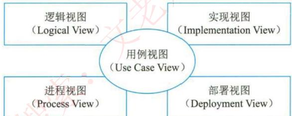

（3）迭代与增量。把整个项目开发分为多个迭代过程。在每次迭代中，只考虑系统的一部分需求，进行分析、设计、实现、测试和部署等过程；每次迭代是在已完成部分的基础上进行的，每次增加一些新的功能实现，以此进行下去，直至最后项目的完成。

# 6 逆向工程

$\bullet$  软件复用是将已有软件的各种有关知识用于建立新的软件，以缩减软件开发和维护的资源。软件复用是提高软件生产力和质量的一种重要技术。早期的软件复用主要是代码级复用，被复用的知识专指程序，后来扩大到包括领域知识、开发经验、设计决定、体系结构、需求、设计、代码和文档等一切有关方面。

逆向工程：软件的逆向工程是分析程序，力图在比源代码更高抽象层次上建立程序的表示过程，逆向工程是设计的恢复过程。逆向工程的四个级别：

实现级：包括程序的抽象语法树、符号表、过程的设计表示。

结构级：包括反映程序分量之间相互依赖关系的信息，例如调用图、结构图、程序和数据结构。

功能级：包括反映程序段功能及程序段之间关系的信息，例如数据和控制流模型。领域级：包括反映程序分量或程序诸实体与应用领域概念之间对应关系的信息，例如R- R模型。

其中，领域级抽象级别最高，完备性最低，实现级抽象级别最低，完备性最高。

# 逆向工程

与逆向工程相关的概念有重构、设计恢复、再工程和正向工程。

（1）重构是指在同一抽象级别上转换系统描述形式。

（2）设计恢复是指借助工具从已有程序中抽象出有关数据设计、总体结构设计和过程设计等方面的信息。

（3）再工程是指在逆向工程所获得信息的基础上，修改或重构已有的系统，产生系统的一个新版本。再工程是对现有系统的重新开发过程，包括逆向工程、新需求的考虑过程和正向工程三个步骤。它不仅能从已存在的程序中重新获得设计信息，而且还能使用这些信息来重构现有系统，以改进它的综合质量。在利用再工程重构现有系统的同时，一般会增加新的需求，包括增加新的功能和改善系统的性能。

（4）正向工程是指不仅从现有系统中恢复设计信息，而且使用该信息去改变或重构现有系统，以改善其整体质量。

# 考试真题

应用系统构建中可以采用多种不同的技术，（）可以将软件某种形式的描述转换为更高级的抽象表现形式，而利用这些获取的信息，（）能够对现有系统进行修改或重构，从而产生系统的一个新版本。

A.逆向工程（Reverse Engineering) 
B.系统改进(System Improvement) 
C.设计恢复(DesignRecovery） 
D.再工程(Re-engineering) 
A.逆向工程（(Reverse Engineering) 
B.系统改进(System Improvement) 
C.设计恢复(DesignRecovery） 
D.再工程(Re-engineering)

答案：A D

在软件系统工具中，版本控制工具属于（），软件评价工具属于（）。

A.软件开发工具B.软件维护工具C.编码与排错工具D.软件管理和软件支持工具A.逆向工程工具B.开发信息库工具C.编码与排错工具D.软件管理和软件支持工具

答案：B

解析：软件系统工具通常可以按软件过程活动将软件工具分为软件开发工具、软件维护工具、软件管理和软件支持工具。软件开发工具：需求分析工具、设计工具、编码与排错工具。软件维护工具：版本控制工具、文档分析工具、开发信息库工具、逆向工程工具、再工程工具。软件管理和软件支持工具：项目管理工具、配置管理工具、软件评价工具、软件开发工具的评价和选择。

# 软件需求

软件需求：是指用户对系统在功能、行为、性能、设计约束等方面的期望。是指用户解决问题或达到目标所需的条件或能力，是系统或系统部件要满足合同、标准、规范或其他正式规定文档所需具有的条件或能力，以及反映这些条件或能力的文档说明。

分为需求开发和需求管理两大过程，如下所示：

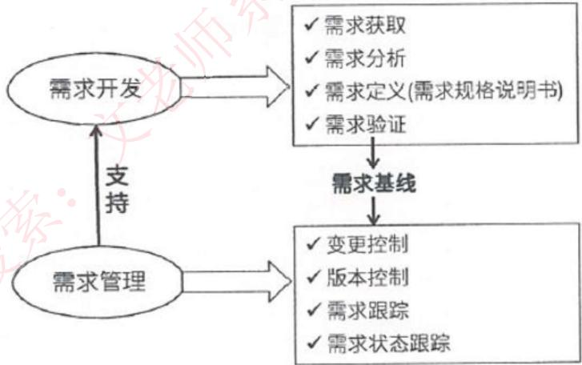

# 软件需求

$\bullet$  业务需求：反映企业或客户对系统高层次的目标要求，通常来自项目投资人、客户、市场营销部门或产品策划部门。通过业务需求可以确定项目视图和范围。

$\bullet$  用户需求：描述的是用户的具体目标，或用户要求系统必须能完成的任务。即描述了用户能使用系统来做什么。通常采取用户访谈和问卷调查等方式，对用户使用的场景进行整理，从而建立用户需求。

$\bullet$  系统需求：从系统的角度来说明软件的需求，包括功能需求、非功能需求和设计约束等。

1）功能需求：也称为行为需求，规定了开发人员必须在系统中实现的软件功能，用户利用这些功能来完成任务，满足业务需要。

2）非功能需求：指系统必须具备的属性或品质，又可以细分为软件质量属性（如可维护性、可靠性、效率等）和其他非功能需求。

3）设计约束：也称为限制条件或补充规约，通常是对系统的一些约束说明，例如必须采用国有自主知识产权的数据库系统，必须运行在UNIX操作系统之下等。

# 考试真题

软件需求开发是指从情况收集、分析和评价到编写文档、评审等一系列产生需求的活动，分为获取情况、分析、（）和评审四个阶段。

A.制订规格说明 
B.形成需求基线 
C.跟踪需求变更 
D.控制需求版本

答案A

某软件公司正在承担开发一个字处理器的任务。在需求分析阶段，公司的相关人员整理出一些相关的系统需求，其中，“找出文档中的拼写错误并提供一个替换项列表来供选择替换拼错的词”属于（）；“显示提供替换词的对话框以及实现整个文档范围的替换”属于（）；“用户能有效地纠正文档中的拼写错误”属于（）。

A.业务需求 
B.用户需求 
C.功能需求 
D.性能需求

A.业务需求 
B.用户需求 
C.功能需求 
D.性能需求

A.业务需求 
B.用户需求 
C.功能需求 
D.性能需求

答案：B C A

# 需求获取

需求获取：是一个确定和理解不同的项目干系人的需求和约束的过程。

常见的需求获取法包括：

常见的需求获取法包括：(1) 用户访谈：1对1- 3，有代表性的用户。其形式包括结构化和非结构化两种。(2) 问卷调查：用户多，无法一一访谈。(3) 呆样：从种群中系统地选出有代表性的样本集的过程。样本数量  $= 0.25^{*}$ （可信度因子/错误率）²(4) 情节串联板：一系列图片，通过这些图片来讲故事。(5) 联合需求计划（JRP）：通过联合各个关键用户代表、系统分析师、开发团队代表一起，通过有组织的会议来讨论需求。(6) 需求记录技术：任务卡片、场景说明、用户故事、Volere白卡。

# 考试真题

需求获取是确定和理解不同的项目干系人的需求和约束的过程，需求获取是否科学、准备充分，对获取出来的结果影响很大。在多种需求获取方式中，（）方法具有良好的灵活性，有较宽广的应用范围，但存在获取需求时信息量大、记录较为困难、需要足够的领转知识等问题。（）方法基于数理统计原理，不仅可以用于收集数据，还可以用于采集访谈用户或者是采集观察用户，并可以减少数据收集偏差。（）方法通过高度组织的群体会议来分析企业内的问题，并从中获取系统需求。

A.用户访谈 
B.问卷调查 
C.联合需求计划 
D.采样A.用户访谈 
B.问卷调查 
C.联合需求计划 
D.采样A.用户访谈 
B.问卷调查 
C.联合需求计划 
D.采样答案：A 
D 
C

# 需求分析

需求分析：一个好的需求应该具有无二义性、完整性、一致性、可测试性、确定性、可跟踪性、正确性、必要性等特性，因此，需要分析人员把杂乱无章的用户要求和期望转化为用户需求，这就是需求分析的工作。

# 需求分析的任务

（1）绘制系统上下文范围关系图  
（2）创建用户界面原型  
（3）分析需求的可行性  
（4）确定需求的优先级  
（5）为需求建立模型  
（6）创建数据字典  
（7）使用QFD（质量功能部署）

# 需求分析

# 结构化的需求分析

结构化特点：自顶向下，逐步分解，面向数据。

三大模型：功能模型（数据流图）、行为模型（状态转换图）、数据模型（E- R图）以及数据字典。

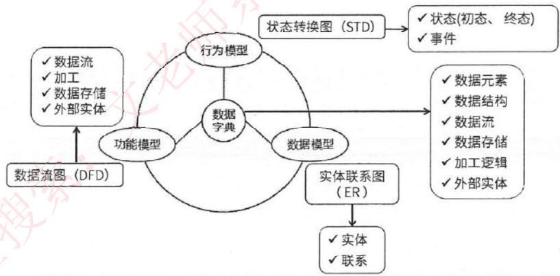

# 需求分析

# 数据流图DFD

基本图形元素：外部实体、加工、数据存储、数据流。

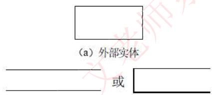  
（c）数据存储（Data Store）

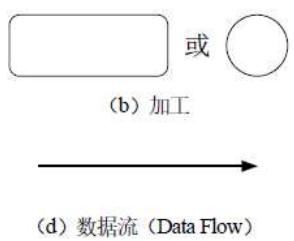

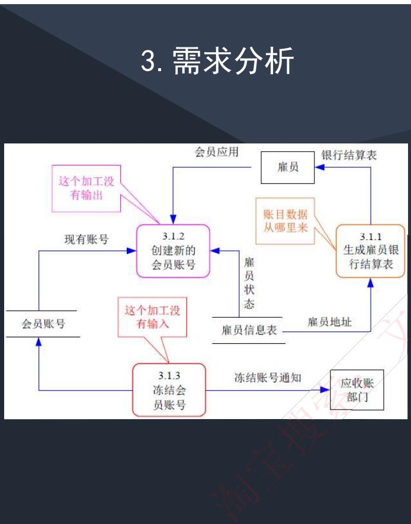

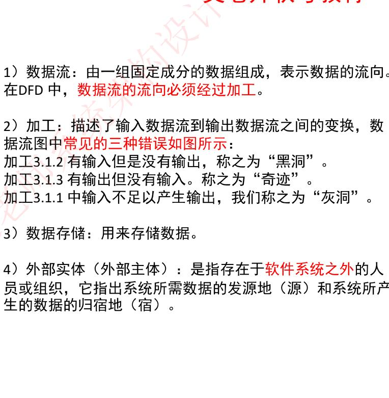

1）数据流：由一组固定成分的数据组成，表示数据的流向。在DFD中，数据流的流向必须经过加工。

2）加工：描述了输入数据流到输出数据流之间的变换，数据流图中常见的三种错误如图所示：加工3.1.2有输入但是没有输出，称之为“黑洞”。加工3.1.3有输出但没有输入。称之为“奇迹”。加工3.1.1中输入不足以产生输出，我们称之为“灰洞”。

3）数据存储：用来存储数据。

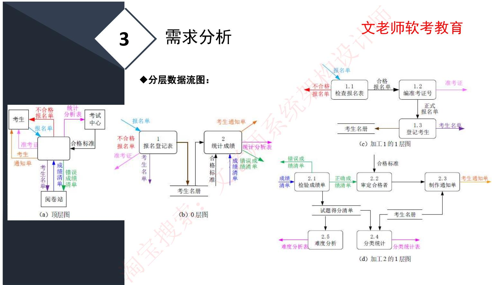

# 需求分析

# 数据字典DD

数据流图描述了系统的分解，但没有对图中各成分进行说明。数据字典就是为数据流图中的每个数据流、文件、加工，以及组成数据流或文件的数据项做出说明。

数据字典有以下4类条目：数据流、数据项、数据存储和基本加工。

<table><tr><td>符号</td><td>含义</td><td>举例及说明</td></tr><tr><td>=</td><td>被定义为</td><td></td></tr><tr><td>+</td><td>与</td><td>x=a+b, 表示x由a和b组成</td></tr><tr><td>...</td><td>或</td><td>x=[a|b], 表示x由a或b组成</td></tr><tr><td>......</td><td>重复</td><td>x-(a), 表示x由0个或多个a组成</td></tr></table>

加工逻辑也称为“小说明”。常用的加工逻辑描述方法有结构化语言、判定表和判定树3种。

# 需求定义

需求定义（软件需求规格说明书SRS）：是需求开发活动的产物，编制该文档的目的是使项目干系人与开发团队对系统的初始规范有一个共同的理解，使之成为整个开发工作的基础。SRS是软件开发过程中最重要的文档之一，对于任何规模和性质的软件项目都不应该缺少。

# 需求定义方法

（1）严格定义也称为预先定义，需求的严格定义建立在以下的基本假设之上：所有需求都能够被预先定义。开发人员与用户之间能够准确而清晰地交流。采用图形（或文字）可以充分体现最终系统。

（2）原型方法，迭代的循环型开发方式，需要注意的问题：并非所有的需求都能在系统开发前被准确地说明。项目干系人之间通常都存在交流上的困难，原型提供了克该服困难的一个手段。特点：需要实际的、可供用户参与的系统模型。有合适的系统开发环境。反复是完全需要和值得提倡的，需求一旦确定，就应遵从严格的方法。

# 需求验证

需求验证（需求验证：也称为需求确认，目的是与用户一起确认需求无误，对需求规格说明书SAS进行评审和测试，包括两个步骤：需求评审：正式评审和非正式评审。需求测试：设计概念测试用例。

需求验证通过后，要请用户签字确认，作为验收标准之一，此时，这个需求规格说明书就是需求基线，不可以再随意更新，如果需要更改必须走需求变更流程。

# 需求管理

$\bullet$  定义需求基线：通过了评审的需求说明书就是需求基线，下次如果需要变更需求，就需要按照流程来一步步进行。需求的流程及状态如下图所示：

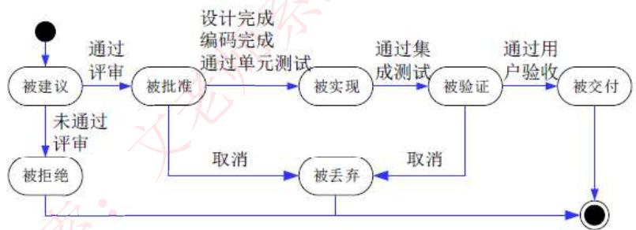  
图11-17需求状态的变化

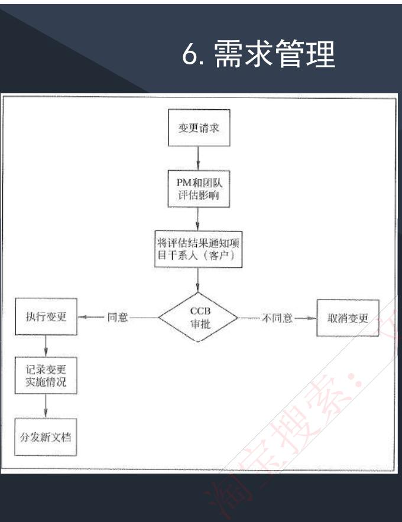

需求变更和风险

主要关心需求变更过程中的需求风险管理，带有风险的做法有：无足够用户参与、忽略了用户分类、用户需求的不断增加、模棱两可的需求、不必要的特性、过于精简的SRS、不准确的估算。

$\bullet$  变更产生的原因：外部环境的变化、需求和设计做的不够完整、新技术的出现、公司机构重组造成业务流程的变化。

$\bullet$  变更控制委员会CCB：也称为配置控制委员会，其任务时对建议的配置项变更做出评价、审批，以及监督已经批准变更的实施。

# 需求管理

$\bullet$  双向跟踪，两个层次，如下图所示：

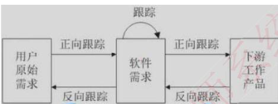

<table><tr><td>用例</td><td>UC-1</td><td>UC-2</td><td>UC-3</td><td>……</td><td>UC-n</td></tr><tr><td>原始需求</td><td></td><td></td><td></td><td></td><td></td></tr><tr><td>FR-1</td><td></td><td></td><td></td><td></td><td></td></tr><tr><td>FR-2</td><td></td><td></td><td></td><td></td><td></td></tr><tr><td>FR-n</td><td></td><td></td><td></td><td></td><td></td></tr></table>

$\bullet$  正向跟踪表示用户原始需求是否都实现了，反向跟踪表示软件实现的是否都是用户要求的，不多不少，可以用原始需求和用例表格（需求跟踪矩阵）来表示：

$\bullet$  若原始需求和用例有对应，则在对应栏打对号，若某行都没有对号，表明原始需求未实现，正向跟踪发现问题；若某列都没有对号，表明有多余功能用例，软件实现了多余功能，反向跟踪发现问题。

# 考试真题

（）是关于需求管理正确的说法。A. 为达到过程能力成熟度模型第二级，组织机构必须具有3个关键过程域  B. 需求的稳定性不属于需求属性  C. 需求变更的管理过程遵循变更分析和成本计算、问题分析和变更描述、变更实现的顺序  D. 变更控制委员会对项目中任何基线工作产品的变更都可以做出决定

答案：D

在结构化分析中，用数据流图描述（）。当采用数据流图对一个图书馆管理系统进行分析时，（）是一个外部实体。

A. 数据对象之间的关系，用于对数据建模  
B. 数据在系统中如何被传送或变换，以及如何对数据流进行变换的功能或子功能，用于对功能建模  
C. 系统对外部事件如何响应，如何动作，用于对行为建模  
D. 数据流图中的各个组成部分

A. 读者  
B. 图书  
C. 借书证  
D. 借阅

答案：BA

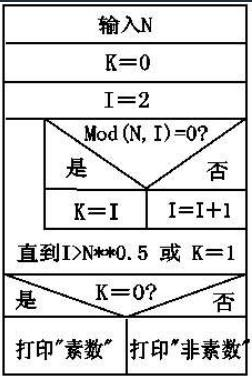

# 处理流程设计

$\bullet$  流程表示工具

程序流程图（Program Flow Diagram，PFD）用一些图框表示各种操作，它独立于任何一种程序设计语言，比较直观、清晰，易于学习掌握。任何复杂的程序流程图都应该由顺序、选择和循环结构组合或嵌套而成。

IPO图也是流程描述工具，用来描述构成软件系统的每个模块的输入、输出和数据加工。

N- S图容易表示嵌套和层次关系，并具有强烈的结构化特征。但是当问题很复杂时，N- S图可能很大，因此不适合于复杂程序的设计。

问题分析图（PAD）是一种支持结构化程序设计的图形工具。PAD具有清晰的逻辑结构、标准化的图形等优点，更重要的是，它引导设计人员使用结构化程序设计方法，从而提高程序的质量。

# 处理流程设计

$\bullet$  业务流程重组BPR

BPR是对企业的业务流程进行根本性的再思考和彻底性的再设计，从而获得可以用诸如成本、质量、服务和速度等方面的业绩来衡量的显著性的成就。BPR设计原则、系统规划和步骤如下图所示：

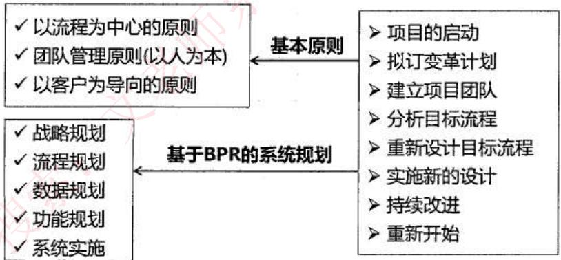

# 处理流程设计

$\bullet$  业务流程管理BPMBPM是一种以规范化的构造端到端的卓越业务流程为中心，以持续的提高组织业务绩效为目的的系统化方法。

BPM与BPR管理思想最根本的不同就在于流程管理并不要求对所有的流程进行再造。构造卓越的业务流程并不是流程再造，而是根据现有流程的具体情况，对流程进行规范化的设计

流程管理包含三个层面：规范流程、优化流程和再造流程

# 考试真题

流程设计的任务是设计出系统所有模块和它们之间的相互关系，并具体设计出每个模块内部的功能和处理过程。以下关于流程设计的叙述，正确的是（）。

A.任何复杂的程序流程图都应该由顺序、选择、循环结构构成B.IPO图不适合用来进行流程设计C.PAD图是一种支持原型化设计方法的图形工具D.N-S图容易表示嵌套关系和层次关系，特别适合于设计非常复杂的流程答案：A

业务流程重组(BusinessProcessReengineering，BPR)是针对企业业务流程的基本问题进行回顾，其核心思路是对业务流程的（）改造，BPR过程通常以（）为中心。

A、增量式 B、根本性 C、选代式 D、保守式A、流程 B、需求 C、组织 D、资源

答案：BA

# 系统设计

$\bullet$  系统设计主要目的：为系统制定蓝图，在各种技术和实施方法中权衡利弊，精心设计，合理地使用各种资源，最终勾画出新系统的详细设计方法。

$\bullet$  系统设计方法：结构化设计方法，面向对象设计方法。

$\bullet$  系统设计的主要内容：概要设计、详细设计。

$\bullet$  概要设计基本任务：又称为系统总体结构设计，是将系统的功能需求分配给软件模块，确定每个模块的功能和调用关系，形成软件的模块结构图，即系统结构图。

$\bullet$  详细设计的基本任务：模块内详细算法设计、模块内数据结构设计、数据库的物理设计、其他设计（代码、输入/输出格式、用户界面）、编写详细设计说明书、评审。

# 系统设计

系统设计基本原理

抽象化；自顶而下，逐步求精；信息隐蔽；模块独立（高内聚，低耦合）。

系统设计原则

保持模块的大小适中；尽可能减少调用的深度；多扇入，少扇出；单入口，单出口；模块的作用域应该在模块之内；功能应该是可预测的。

# 系统设计

$\bullet$  系统设计基本原理：抽象、模块化、信息隐蔽、模块独立。

衡量模块独立程度的标准有两个：耦合性和内聚性。内聚程度从低到高如下表

<table><tr><td>所示：</td><td>内聚分类</td><td>定义</td><td>记忆关键字</td></tr><tr><td></td><td>偶然内聚。</td><td>一个模块内的各处理元素之间没有任何联系。</td><td>无直接关系。</td></tr><tr><td></td><td>逻辑内聚。</td><td>模块内执行若干个逻辑上相似的功能，通过参数确定该模块完成哪一个功能。</td><td>逻辑相似、参数决定。</td></tr><tr><td></td><td>时间内聚。</td><td>把需要同时执行的动作组合在一起形成的模块。</td><td>同时执行。</td></tr><tr><td></td><td>过程内聚。</td><td>一个模块完成多个任务，这些任务必须按指定的过程执行。</td><td>指定的过程顺序。</td></tr><tr><td></td><td>通信内聚。</td><td>模块内的所有处理元素都在同一个数据结构上操作，或者各处理使用相同的输入数据或者产生相同的输出数据。</td><td>相同数据结构、相同输入输出。</td></tr><tr><td></td><td>顺序内聚。</td><td>一个模块中的各个处理元素都密切相关于同一功能且必须顺序执行，前一个功能元素的输出就是下一个功能元素的输入。</td><td>顺序执行、输入为输出。</td></tr><tr><td></td><td>功能内聚。</td><td>最强的内聚，模块内的所有元素共同作用完成一个功能，缺一不可。</td><td>共同作用、缺一不可。</td></tr></table>

# 系统设计

$\bullet$  耦合程度从低到高如下表所示：

<table><tr><td>耦合分类</td><td>定义</td><td>记忆关键字</td></tr><tr><td>无直接耦合。</td><td>两个模块之间没有直接的关系，它们分别从属于不同模块的控制与调用，不传递任何信息。</td><td>直接关系。</td></tr><tr><td>数据耦合。</td><td>两个模块之间有调用关系，传递的是简单的数据值，相当于高级语言中的值传递。</td><td>传递数据值调用。</td></tr><tr><td>标记耦合。</td><td>两个模块之间传递的是数据结构。</td><td>传递数据结构。</td></tr><tr><td>控制耦合。</td><td>一个模块调用另一个模块时，传递的是控制变量，被调用模块通过该控制变量的值有选择的执行模块内的某一功能。</td><td>控制变量、选择执行某一功能。</td></tr><tr><td>外部耦合。</td><td>模块间通过软件之外的环境联合（如 I/O 将模块耦合到特定的设备、格式、通信协议上）时。</td><td>软件外部环境。</td></tr><tr><td>公共耦合。</td><td>通过一个公共数据环境相互作用的那些模块间的耦合。</td><td>公共数据结构。</td></tr><tr><td>内容耦合。</td><td>当一个模块直接使用另一个模块的内部数据，或通过非正常入口转入另一个模块内部时。</td><td>模块内部关联。</td></tr></table>

# 考试真题

某模块中各个处理元素都密切相关于同一功能且必须顺序执行，前一处理元素的输出就是下一处理元素的输入，则该模块的内聚类型为（）内聚

A、过程 B、时间 C、顺序 D、逻辑答案：C

已知模块A给模块B传递数据结构x，则这两个模块的耦合类型为（）。

A.数据耦合 
B.公共耦合 
C.外部耦合 
D.标记耦合

答案：D解析：特别说明是数据结构，不是数据，数据结构是标记耦合。

# 考试真题

系统设计是根据系统分析的结果，完成系统的构建过程。系统设计的主要内容包括（）；系统总体结构设计的主要任务是将系统的功能需求分配给软件模块，确定每个模块的功能和调用关系，形成软件的（）。

A.概要设计和详细设计 
B.架构设计和对象设计C.部署设计和用例设计 
D.功能设计和模块设计A.用例图 
B.模块结构图 
C.系统部署图 
D.类图答案：A B

以下关于软件系统模块结构设计的叙述中，正确的是（）。

A.当模块扇出过大时，应把下级模块进一步分解为若干个子模块B.当模块扇出过小时，应适当增加中间的控制模块C.模块的扇入大，表示模块的复杂度较高D.模块的扇入大，表示模块的复用程度高答案：D

# 人机界面设计

$\spadesuit$  人机界面设计三大黄金原则：

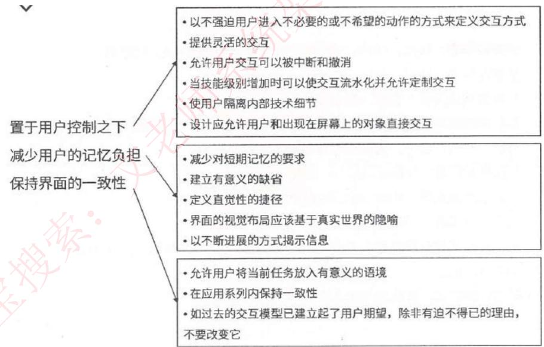

# 测试原则和方法

$\bullet$  系统测试是为了发现错误而执行程序的过程，成功的测试是发现了至今尚未发现的错误的测试。

# 测试原则：

$\bullet$  应尽早并不断的进行测试； $\bullet$  测试工作应该避免由原开发软件的人或小组承担； $\bullet$  在设计测试方案时，不仅要确定输入数据，而且要根据系统功能确定预期的输出结果； $\bullet$  既包含有效、合理的测试用例，也包含不合理、失效的用例； $\bullet$  检验程序是否做了该做的事，且是否做了不该做的事； $\bullet$  严格按照测试计划进行； $\bullet$  妥善保存测试计划和测试用例； $\bullet$  测试用例可以重复使用或追加测试。

# 测试原则和方法

软件测试方法可分为静态测试和动态测试。

静态测试：指被测试程序不在机器上运行，而采用人工检测和计算机辅助静态分析的手段对程序进行检测，包括对文档的静态测试和对代码的静态测试。对文档的静态测试主要以检查单的形式进行，而对代码的静态测试，包括桌前检查、代码审查、代码走查的方式。使用这种方法能够有效地发现  $30\% - 70\%$  的逻辑设计和编码错误。

动态测试：指在计算机上实际运行程序进行软件测试，一般采用白盒测试和黑盒测试方法。

黑盒测试法：功能性测试，不了解软件代码结构，根据功能设计用例，测试软件功能。

白盒测试法：结构性测试，明确代码流程，根据代码逻辑设计用例，进行用例覆盖。

# 测试阶段

（1）单元测试：也称为模块测试，测试的对象是可独立编译或汇编的程序模块、软件构件或00软件中的类（统称为模块），测试依据是软件详细设计说明书。

（2）集成测试：目的是检查模块之间，以及模块和已集成的软件之间的接口关系，并验证已集成的软件是否符合设计要求。测试依据是软件概要设计文档。

（3）确认测试：主要用于验证软件的功能、性能和其他特性是否与用户需求一致。根据用户的参与程度，通常包括以下类型：内部确认测试：主要由软件开发组织内部按照SRS进行测试。Alpha测试：用户在开发环境下进行测试。Beta测试：用户在实际使用环境下进行测试，通过改测试后，产品才能交付用户。验收测试：针对SRS，在交付前以用户为主进行的测试。其测试对象为完整的、集成的计算机系统。验收测试的目的是，在真实的用户工作环境下，检验软件系统是否满足开发技术合同或SRS。验收测试的结论是用户确定是否接收该软件的主要依据。除应满足一般测试的准入条件外，在进行验收测试之前，应确认被测软件系统已通过系统测试。

# 测试阶段

（4）系统测试：测试对象是完整的、集成的计算机系统；测试的目的是在真实系统工作环境下，验证完成的软件配置项能否和系统正确连接，并满足系统/子系统设计文档和软件开发合同规定的要求。测试依据是用户需求或开发合同。主要内容包括功能测试、健壮性测试、性能测试、用户界面测试、安全性测试、安装与反安装测试等，其中，最重要的工作是进行功能测试与性能测试。功能测试主要采用黑盒测试方法；性能测试主要指标有响应时间、吞吐量、并发用户数和资源利用率等。

（5）配置项测试：测试对象是软件配置项，测试目的是检验软件配置项与SRS的一致性。测试的依据是SRS。在此之间，应确认被测软件配置项已通过单元测试和集成测试。

（6）回归测试：测试目的是测试软件变更之后，变更部分的正确性和对变更需求的符合性，以及软件原有的、正确的功能、性能和其他规定的要求的不损害性。

# 考试真题

软件确认测试也称为有效性测试，主要验证（）。确认测试计划通常是在需求分析阶段完成的。根据用户的参与程度不同，软件确认测试通常包括（）。

A.系统中各个单元模块之间的协作性B.软件与硬件在实际运行环境中能否有效集成C.软件功能、性能及其它特性是否与用户需求一致D.程序模块能否正确实现详细设计说明中的功能、性能和设计约束等要求

A.黑盒测试和白盒测试B.一次性组装测试和增量式组装测试C.内部测试、Alpha、Beta和验收测试D.功能测试、性能测试、用户界面测试和安全性测试

答案：C

软件测试一般分为两个大类：动态测试和静态测试。前者通过运行程序发现错误，包括（）等方法；后者采用人工和计算机辅助静态分析的手段对程序进行检测，包括（）等方法。

A.边界值分析、逻辑覆盖、基本路径B.桌面检查、逻辑覆盖、错误推测C.桌面检查、代码审查、代码走查D.错误推测、代码审查、基本路径A.边界值分析、逻辑覆盖、基本路径B.桌面检查、逻辑覆盖、错误推测C.桌面检查、代码审查、代码走查D.错误推测、代码审查、基本路径答案：A，C

# 测试用例的设计

$\bullet$  黑盒测试用例：将程序看做一个黑盒子，只知道输入输出，不知道内部代码，由此设计出测试用例，分为下面几类：

$\bullet$  等价类划分：把所有的数据按照某种特性进行归类，而后在每类的数据里选取一个即可。等价类测试用例的设计原则：设计一个新的测试用例，使其尽可能多地覆盖尚未被覆盖的有效等价类，重复这一步，直到所有的有效等价类都被覆盖为止；设计一个新的测试用例，使其仅覆盖一个尚未被覆盖的无效等价类，重复这一步，直到所有的无效等价类都被覆盖为止。

$\bullet$  边界值划分：将每类的边界值作为测试用例，边界值一般为范围的两端值以及在此范围之外的与此范围间隔最小的两个值，如年龄范围为0- 150，边界值为0,150，- 1,151四个。

$\bullet$  错误推测：没有固定的方法，凭经验而言，来推测有可能产生问题的地方，作为测试用例进行测试。

$\bullet$  因果图：由一个结果来反推原因的方法，具体结果具体分析，没有固定方法。

# 测试用例的设计

白盒测试用例：知道程序的代码逻辑，按照程序的代码语句，来设计覆盖代码分支的测试用例，覆盖级别从低至高分为下面几种：

（1）语句覆盖SC：逻辑代码中的所有语句都要被执行一遍，覆盖层级最低，因为执行了所有的语句，不代表执行了所有的条件判断。

（2）判定覆盖DC：逻辑代码中的所有判断语句的条件的真假分支都要覆盖一次。

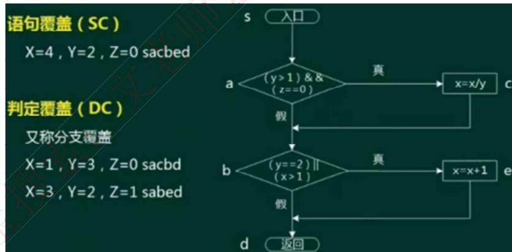

# 测试用例的设计

（3）条件覆盖CC：针对每一个判断条件内的每一个独立条件都要执行一遍真和假。（4）条件判定组合覆盖CDC：同时满足判定覆盖和条件覆盖。

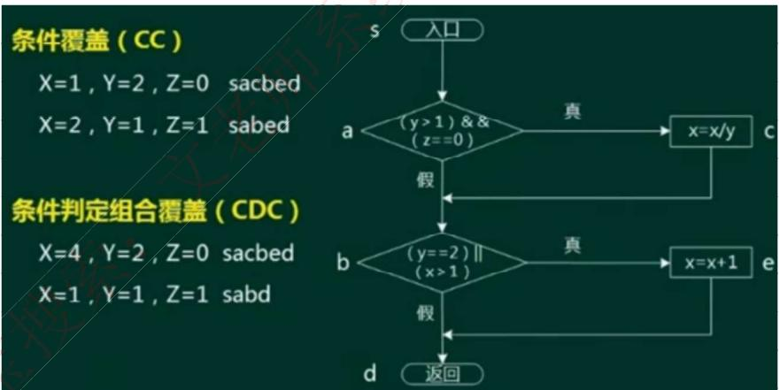

# 测试用例的设计

（5）路径覆盖：逻辑代码中的所有可行路径都覆盖了，覆盖层级最高。

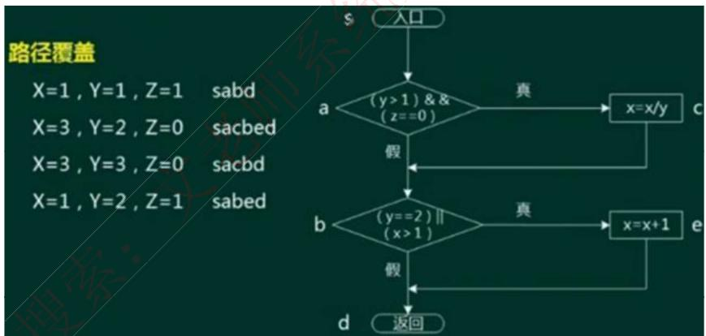

# 考试真题

招聘系统要求求职的人年龄在20岁到60岁之间（含），学历为本科、硕士或者博士，专业为计算机科学与技术、通信工程或者电子工程。其中（ ）不是好的测试用例。

A.（20,本科，电子工程） 
B.（18,本科，通信工程）C.（18，大专，电子工程） 
D.（25，硕士，生物学）

答案：C

以下关于测试的叙述中，正确的是（ ）。

A.实际上，可以采用穷举测试来发现软件中的所有错误B.错误很多的程序段在修改后错误一般会非常少C.测试可以用来证明软件没有错误D.白盒测试技术中，路径覆盖法往往能比语句覆盖法发现更多的错误答案：D

# 考试真题

采用白盒测试方法对下图进行测试，设计了4个测试用例：  $①(x = 0,y = 3)$  ，  $②(x = 1,y = 2)$  ，  $③(x = - 1$ $y = 2)$  ，  $④(x = 3,y = 1)$  。至少需要测试用例  $①②$  才能完成(35)覆盖，至少需要测试用例  $①②③$  或  $①②$ $④$  才能完成(36)覆盖。

A.语句 
B.条件 
C.判定／条件 
D.路径

A.语句 
B.条件 
C.判定／条件 
D.路径

C.判定／条件 
D.路径

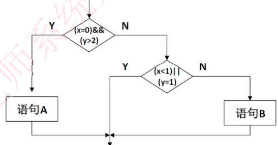

答案：AD

解析：可根据问题将测试用例代入执行，  $①②$  会执行语句A和语句B，但只覆盖第一个条件，因此是语句覆盖；  $①②$  覆盖了第一个条件的真假，执行了第一个条件的Y和N以及第二个条件的N，而 $③$  或者  $④$  又执行到了第二个条件的Y，因此流程中所有分支都走到了，是路径覆盖。

# 调试

$\bullet$  调试是发现错误，调试是找出错误的代码和原因。

$\bullet$  调试需要确定错误的准确位置；确定问题的原因并设法改正；改正后要进行回归测试。

$\bullet$  调试的方法有：蛮力法、回溯法（从出错的地方开始，向回找）、原因排除法（找出所有可能的原因，逐一进行排除，具体包括演绎法、归纳法、二分法）。

# 软件度量

$\bullet$  软件的两种属性：外部属性指面向管理者和用户的属性，可直接测量，一般为性能指标。内部属性指软件产品本身的的属性，如可靠性等，只能间接测量。

$\bullet$  McCabe度量法：又称为环路复杂度，假设有向图中有向边数为m，节点数为n，则此有向图的环路复杂度为m- nt2。

注意m和n代表的含义不能混淆，可以用一个最简单的环路来做特殊值记忆此公式，另外，针对一个程序流程图，每一个分支边（连线）就是一条有向边，每一条语句（语句框）就是一个顶点。

# 考试真题

下图用白盒测试方法进行测试，图中有（）条路径，采用McCabe度量计算该程序图的环路复杂性为（）

A、3 B、4 C、5 D、6 A、3 B、4 C、5 D、6 答案：BB

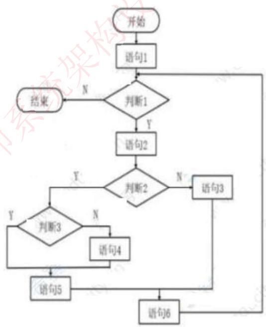

# 1.系统转换

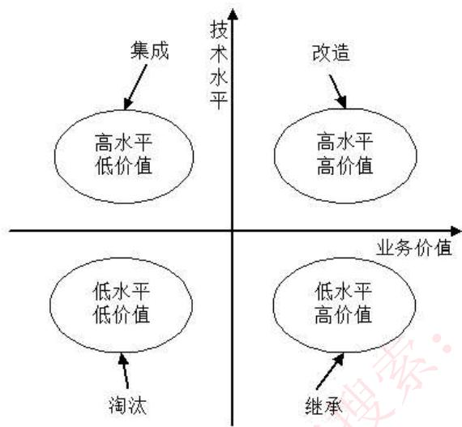

$\bullet$  遗留系统是指任何基本上不能进行修改和演化以满足新的变化了的业务需求的信息系统，它通常具有以下特点：

（1）系统虽然完成企业中许多重要的业务管理工作，但仍然不能完全满足要求。一般实现业务处理电子化及部分企业管理功能，很少涉及经营决策。

（2）系统在性能上已经落后，采用的技术已经过时。例如，多采用主机/终端形式或小型机系统，软件使用汇编语言或第三代程序设计语言的早期版本开发，使用文件系统而不是数据库。

（3）通常是大型的软件系统，已经融入企业的业务运作和决策管理机制之中，维护工作十分困难。

（4）没有使用现代信息系统建设方法进行管理和开发，现在基本上已经没有文档，很难理解。

# 系统转换

$\bullet$  系统转换是指新系统开发完毕，投入运行，取代现有系统的过程，需要考虑多方面的问题，以实现与老系统的交接，有以下三种转换计划：

$\bullet$  直接转换：现有系统被新系统直接取代了，风险很大，适用于新系统不复杂，或者现有系统已经不能使用的情况。优点是节省成本。

$\bullet$  并行转换：新系统和老系统并行工作一段时间，新系统经过试运行后再取代，若新系统在试运行过程中有问题，也不影响现有系统的运行，风险极小，在试运行过程中还可以比较新老系统的性能，适用于大型系统。缺点是耗费人力和时间资源，难以控制两个系统间的数据转换。

$\bullet$  分段转换：分期分批逐步转换，是直接和并行转换的集合，将大型系统分为多个子系统，依次试运行每个子系统，成熟一个子系统，就转换一个子系统。同样适用于大型项目，只是更耗时，而且现有系统和新系统间混合使用，需要协调好接口等问题。

$\bullet$  数据转换与迁移：将数据从旧数据库迁移到新数据库中。有三种方法：系统切换前通过工具迁移、系统切换前采用手工录入、系统切换后通过新系统生成。

# 系统维护

$\bullet$  系统的可维护性可以定义为维护人员理解、改正、改动和改进这个软件的难易程度，其评价指标如下：

（1）易分析性。软件产品诊断软件中的缺陷或失效原因或识别待修改部分的能力。（2）易改变性。软件产品使指定的修改可以被实现的能力，实现包括编码、设计和文档的更改。（3）稳定性。软件产品避免由于软件修改而造成意外结果的能力。（4）易测试性。软件产品使已修改软件能被确认的能力。（5）维护性的依从性。软件产品遵循与维护性相关的标准或约定的能力。

$\bullet$  系统维护包括硬件维护、软件维护和数据维护，其中软件维护类型如下：正确性维护：发现了bug而进行的修改。适应性维护：由于外部环境发生了改变，被动进行的对软件的修改和升级。完善性维护：基于用户主动对软件提出更多的需求，修改软件，增加更多的功能，使其比之前的软件功能、性能更高，更加完善。预防性维护：对未来可能发生的bug进行预防性的修改。

# 考试真题

对于遗留系统的评价框架如下图所示，那么处于“高水平、低价值”区的遗留系统适合于采用的演化策略为（）。

A. 淘汰 
B. 继承 
C. 改造 
D. 集成答案：D

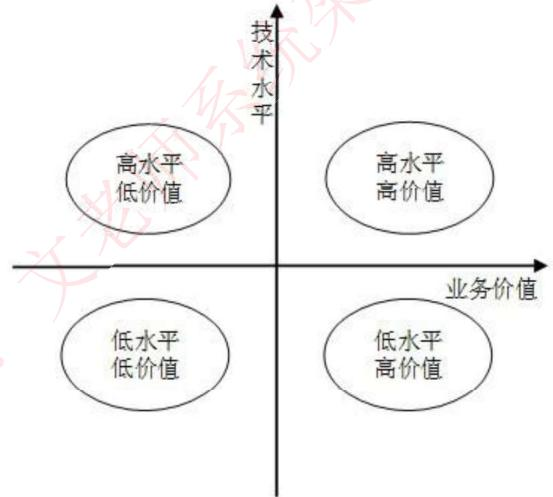

# 考试真题

以下关于软件维护和可维护性的叙述中，不正确的是（）。

A. 软件维护要解决软件产品交付用户之后运行中发生的各种问题  
B. 软件的维护期通常比开发期长得多，其投入也大得多  
C. 进行质量保证审查可以提高软件产品的可维护性  
D. 提高可维护性是在软件维护阶段考虑的问题答案：D

某企业由于外部市场环境和管理需求的变化对现有软件系统提出新的需求，则对该软件系统进行的维护属于维护。

A. 正确性  
B. 完善性  
C. 适应性  
D. 预防性答案：C

# 净室软件工程

$\bullet$  净室软件工程是一种应用数学与统计学理论以经济的方式生产高质量软件的工程技术，力图通过严格的工程化的软件过程达到开发中的零缺陷或接近零缺陷。净室方法不是先制作一个产品，再去消除缺陷，而是要求在规约和设计中消除错误，然后以“净”的方式制作，可以降低软件开发中的风险，以合理的成本开发出高质量的软件。

$\bullet$  在净室软件工程背后的哲学是：通过在第1次正确地书写代码增量，并在测试前验证它们的正确性，来避免对成本很高的错误消除过程的依赖。它的过程模型是在代码增量积聚到系统的过程的同时，进行代码增量的统计质量验证。它甚至提倡开发者不需要进行单元测试，而是进行正确性验证和统计质量控制。

$\bullet$  净室软件工程（CSE）的理论基础主要是函数理论和抽样理论。

# $\bullet$  净室软件工程应用技术手段：

1. 统计过程控制下的增量式开发。2.基于函数的规范与设计。3.正确性验证。CSE的核心4.统计测试和软件认证。

# $\bullet$  净室软件工程在使用过程的一些缺点：

（1）CSE太理论化，需要更多的数学知识。其正确性验证的步骤比较困难且比较耗时。（2）CSE开发小组不进行传统的模块测试，这是不现实的。（3）CSE也会带有传统软件工程的一些弊端。

# 基于构件的软件工程

$\bullet$  基于构件的软件工程（CBSE）是一种基于分布对象技术、强调通过可复用构件设计与构造软件系统的软件复用途径。CBSE体现了“购买而不是重新构造”的哲学，将软件开发的重点从程序编写转移到了基于已有构件的组装。用于CBSE的构件应该具备以下特征。

（1）可组装型：对于可组装的构件，所有外部交互必须通过公开定义的接口进行。同时它还必须对自身信息的外部访问。（2）可部署性：软件必须是自包含的，必须能作为一个独立实体在提供其构件模型实现的构件平台上运行。构件总是二进制形式，无须在部署前编译。（3）文档化：构件必须是完全文档化的，用户根据文档来判断构件是否满足需求。（4）独立性：构件应该是独立的，应该可以在无其他特殊构件的情况下进行组装和部署，如确实需要其他构件提供服务，则应显示声明。（5）标准化：构件标准化意味着在CBSE过程中使用的构件必须符合某种标准化的构件模型。构件模型定义了构件实现、文档化以及开发的标准，其包含的模型要素为： $\bullet$  接口。构件通过构件接口来定义，构件模型规定应如何定义构件接口以及在接口定义中应该包含的要素，如操作名、参数以及异常等。 $\bullet$  使用信息。为使构件远程分布和访问，必须给构件一个特定的、全局唯一的名字或句柄。构件元数据是构件本身相关的数据，比如构件的接口和属性信息。 $\bullet$  部署。构件模型包括一个规格说明，指出应该如何打包构件使其部署成为一个独立的可执行实体。部署信息中包含有关包中内容的信息和它的二进制构成的信息。

# 基于构件的软件工程

$\bullet$  构件模型提供了一组被构件使用的通用服务，这种服务包括以下两种。平台服务，允许构件在分布式环境下通信和互操作。支持服务，这是很多构件需要的共性服务。例如，构件都需要的身份认证服务。中间件实现共性的构件服务，并提供这些服务的接口。

$\bullet$  CBSE过程是支持基于构件组装的软件开发过程，过程中的6个主要活动：系统需求概览、识别候选构件、根据发现的构件修改需求、体系结构设计、构件定制与适配、组装构件创建系统。

$\bullet$  CBSE过程与传统软件开发过程不同点：

（1）CBSE早期需要完整的需求，以便尽可能多地识别出可复用的构件。（2）在过程早期阶段根据可利用的构件来细化和修改需求。如果可利用的构件不能满足用户需求，就应该考虑由复用构件支持的相关需求。（3）在系统体系结构设计完成后，会有一个进一步的对构件搜索及设计精化的活动。可能需要为某些构件寻找备用构件，或者修改构件以适合功能和架构的要求。（4）开发就是将已经找到的构件集成在一起的组装过程。

# 基于构件的软件工程

$\bullet$  构件组装是指构件相互直接集成或是用专门编写的“胶水代码”将它们整合在一起来创造一个系统或另一个构件的过程。常见的组装构件有以下3种组装方式。1. 顺序组装。通过按顺序调用已经存在的构件，可以用两个已经存在的构件来创造一个新的构件。如上一个构件输出作为下一个构件的输入。2. 层次组装。这种情况发生在一个构件直接调用自另一个构件所提供的服务时。被调用的构件为调用的构件提供所需的服务。二者之间接口匹配兼容。3. 叠加组装。这种情况发生在两个或两个以上构件放在一起来创建一个新构件的时候。这个新构件合并了原构件的功能，从而对外提供了新的接口。外部应用可以通过新接口来调用原有构件的接口，而原有构件不互相依赖，也不互相调用。这种组装类型适合于构件是程序单元或者构件是服务的情况。

$\bullet$  构件组装的三种不兼容问题（通过编写适配器解决）：

（1）参数不兼容。接口每一侧的操作有相同的名字，但参数类型或参数个数不相同。（2）操作不兼容。提供接口和请求接口的操作名不同。（3）操作不完备。一个构件的提供接口是另一个构件请求接口的一个子集，或者相反。

# 谢谢！

