# 面向对象技术

## 历年真题考情

本章节每年考察3-5分左右。

## 第二版更新

对应第二版教材5.3.2（面向对象基础、分析设计）小节以及2.6.2里的4. 建模语言（UML），有了比较大变动，原版教材是单独一个章节，而新版没有单独章节，内容也都是分散的，而且还缺少了历年真题常考的UML图、设计模式、设计原则等重要内容，这里我们还是必须保留这些内容，不然没法做真题了。

**本章主要内容包括：**

*   面向对象开发
*   统一建模语言UML
*   设计模式

## 面向对象开发

1.  **对象：** 由数据及其操作所构成的封装体，是系统中用来描述客观事物的一个实体，是构成系统的一个基本单位。一个对象通常可以由对象名、属性和方法3个部分组成。
2.  **类：** 现实世界中实体的形式化描述，类将该实体的属性（数据）和操作（函数）封装在一起。对象是类的实例，类是对象的模板。
    *   类可以分为三种：**实体类**、**接口类（边界类）**和**控制类**。
        *   **实体类**的对象表示现实世界中真实的实体，如人、物等。
        *   **接口类（边界类）**的对象为用户提供一种与系统合作交互的方式，分为人和系统两大类。其中人的接口可以是显示屏、窗口、Web窗体、对话框、菜单、列表框、其他显示控制、条形码、二维码或者用户与系统交互的其他方法。系统接口涉及到把数据发送到其他系统，或者从其他系统接收数据。
        *   **控制类**的对象用来控制活动流，充当协调者。
3.  **抽象：** 通过特定的实例抽取共同特征以后形成概念的过程。它强调主要特征，忽略次要特征。一个对象是现实世界中一个实体的抽象，一个类是一组对象的抽象，抽象是一种单一化的描述，它强调给出与应用相关的特性，抛弃不相关的特性。
4.  **封装：** 是一种信息隐蔽技术，将相关的概念组成一个单元模块，并通过一个名称来引用。面向对象封装是将数据和基于数据的操作封装成一个整体对象，对数据的访问或修改只能通过对象对外提供的接口进行。
5.  **继承：** 表示类之间的层次关系（父类与子类），这种关系使得某类对象可以继承另外一类对象的特征，又可分为单继承和多继承。
6.  **多态：** 不同的对象收到同一个消息时产生完全不同的结果。包括参数多态（不同类型参数多种结构类型）、包含多态（父子类型关系）、过载多态（类似于重载，一个名字不同含义）、强制多态（强制类型转换）四种类型。多态由继承机制支持，将通用消息放在抽象层，具体不同的功能实现放在低层。
7.  **接口：** 描述对操作规范的说明，其只说明操作应该做什么，并没有定义操作如何做。
8.  **消息：** 体现对象间的交互，通过它向目标对象发送操作请求。
9.  **覆盖：** 子类在原有父类接口的基础上，用适合于自己要求的实现去置换父类中的相应实现。即在子类中重定义一个与父类同名同参的方法。
10. **函数重载：** 与覆盖要区分开，函数重载与子类父类无关，且函数是同名不同参数。
11. **绑定：** 是一个把过程调用和响应调用所需要执行的代码加以结合的过程。在一般的程序设计语言中，绑定是在编译时进行的，叫作静态绑定。动态绑定则是在运行时进行的，因此，一个给定的过程调用和代码的结合直到调用发生时才进行。

### 考试真题

> 一个类中可以拥有多个名称相同而参数表（参数类型或参数个数或参数类型顺序）不同的方法，称为（）。
>
> A. 方法标记
> B. 方法调用
> C. 方法重载
> D. 方法覆盖
>
> **答案：C**

> 在某销售系统中，客户采用扫描二维码进行支付。若采用面向对象方法开发该销售系统，则客户类属于（）类，二维码类属于（）类。
>
> **第一空选项：**
> A. 接口
> B. 实体
> C. 控制
> D. 状态
>
> **第二空选项：**
> A. 接口
> B. 实体
> C. 控制
> D. 状态
>
> **答案：B A**

### 面向对象的分析与设计

*   **面向对象的分析：** 是为了确定问题域，理解问题。包含五个活动：认定对象、组织对象、描述对象间的相互作用、确定对象的操作、定义对象的内部信息。
*   **面向对象需求建模：**
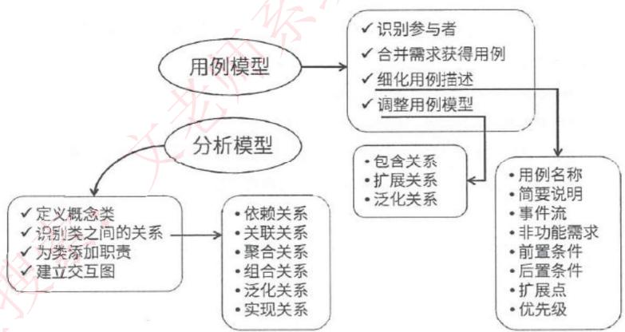
*   **面向对象的设计：** 是设计分析模型和实现相应源代码，设计问题域的解决方案，与技术相关。OOD同样应遵循抽象、信息隐蔽、功能独立、模块化等设计准则。
*   面向对象的**分析模型**主要由顶层架构图、用例与用例图、领域概念模型构成；**设计模型**则包含以包图表示的软件体系结构图、以交互图表示的用例实现图、完整精确的类图、针对复杂对象的状态图和用以描述流程化处理过程的活动图等。
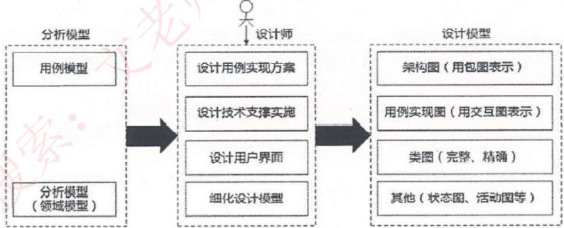

### 面向对象的设计原则

1.  **单一责任原则：** 就一个类而言，应该仅有一个引起它变化的原因。即，当需要修改某个类的时候原因有且只有一个，让一个类只做一种类型责任。
2.  **开放-封闭原则：** 软件实体（类、模块、函数等）应该是可以扩展的，即开放的；但是不可修改的，即封闭的。
3.  **里氏替换原则：** 子类型必须能够替换掉他们的基类型。即，在任何父类可以出现的地方，都可以用子类的实例来赋值给父类型的引用。
4.  **依赖倒置原则：** 抽象不应该依赖于细节，细节应该依赖于抽象。即，高层模块不应该依赖于低层模块，二者都应该依赖于抽象。
5.  **接口分离原则：** 不应该强迫客户依赖于它们不用的方法。接口属于客户，不属于它所在的类层次结构。即：依赖于抽象，不要依赖于具体，同时在抽象级别不应该有对于细节的依赖。这样做的好处就在于可以最大限度地应对可能的变化。

### 面向对象的测试

一般来说，对面向对象软件的测试可分为下列4个层次进行。

1.  **算法层：** 测试类中定义的每个方法，基本上相当于传统软件测试中的单元测试。
2.  **类层：** 测试封装在同一个类中的所有方法与属性之间的相互作用。在面向对象软件中类是基本模块，因此可以认为这是面向对象测试中所特有的模块测试。
3.  **模板层：** 测试一组协同工作的类之间的相互作用，大体上相当于传统软件测试中的集成测试，但是也有面向对象软件的特点（例如，对象之间通过发送消息相互作用）。
4.  **系统层：** 把各个子系统组装成完整的面向对象软件系统，在组装过程中同时进行测试。

### 考试真题

> 面向对象的分析模型主要由顶层架构图、用例与用例图和（）构成：设计模型则包含以（）表示的软件体系结构图、以交互图表示的用例实现图、完整精确的类图、描述复杂对象的（）和用以描述流程化处理过程的活动图等。
>
> **第一空选项：**
> A. 数据流模型
> B. 领域概念模型
> C. 功能分解图
> D. 功能需求模型
>
> **第二空选项：**
> A. 模型视图控制器
> B. 组件图
> C. 包图
> D. 2层、3层或N层
>
> **第三空选项：**
> A. 序列图
> B. 协作图
> C. 流程图
> D. 状态图
>
> **答案：B C D**

> 在面向对象设计的原则中、（）原则是指抽象不应该依赖于细节，细节应该依赖于抽象，即应针对接口编程，而不是针对实现编程。
>
> A. 开闭
> B. 里氏替换
> C. 最少知识
> D. 依赖倒置
>
> **答案：D**

## 统一建模语言UML

*   **UML（统一建模语言）：** 是一种可视化的建模语言，而非程序设计语言，支持从需求分析开始的软件开发的全过程。
*   从总体上来看，UML的结构包括**构造块**、**规则**和**公共机制**三个部分。
    1.  **构造块：** UML有三种基本的构造块，分别是**事物（thing）**、**关系（relationship）**和**图（diagram）**。事物是UML的重要组成部分，关系把事物紧密联系在一起，图是多个相互关联的事物的集合。
    2.  **公共机制：** 公共机制是指达到特定目标的公共UML方法。
    3.  **规则：** 规则是构造块如何放在一起的规定。
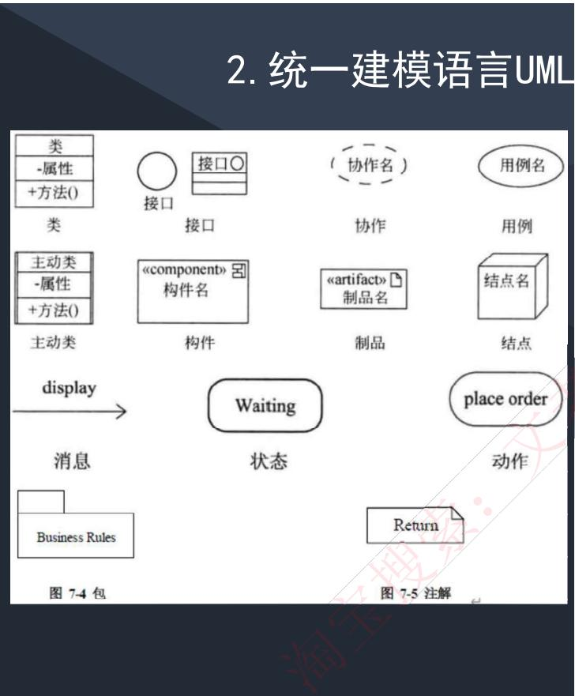

*   **UML事物**
    *   **结构事物：** 模型的静态部分，如类、接口、用例、构件等。
    *   **行为事物：** 模型的动态部分，如交互、活动、状态机。
    *   **分组事物：** 模型的组织部分，如包。
    *   **注释事物：** 模型的解释部分，依附于一个元素或一组元素之上对其进行约束或解释的简单符号。
*   **UML关系**
    *   **依赖：** 一个事物的语义依赖于另一个事物的语义的变化而变化。
    *   **关联：** 是一种结构关系，描述了一组链，链是对象之间的连接。分为组合和聚合，都是部分和整体的关系，其中组合事物之间关系更强。两个类之间的关联，实际上是两个类所扮演角色的关联，因此，两个类之间可以有多个由不同角色标识的关联。
    *   **泛化：** 一般/特殊的关系，子类和父类之间的关系。
    *   **实现：** 一个类元指定了另一个类元保证执行的契约。
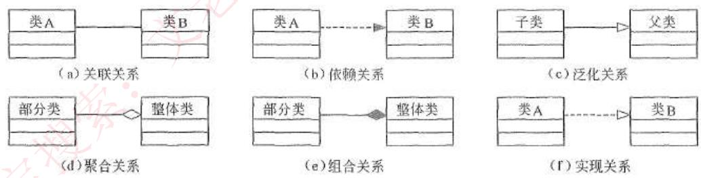

### 考试真题

> 采用面向对象方法进行软件开发时，将汽车作为一个系统。以下（）之间不属于组成（Composition）关系。
>
> A. 汽车和座位
> B. 汽车和车窗
> C. 汽车和发动机
> D. 汽车和音乐系统
>
> **答案：D**
>
> *(注：原答案为B，但通常音乐系统是可选配置，而车窗是基本组成部分，因此D更符合非组成关系。此处按常见理解修正，实际考试请以教材为准。)*

> 如图所示的UML类图中，Shop和Magazine之间为（）关系，Magazine和Page之间为（）关系。UML类图通常不用于对（）进行建模。
>
> **第一空选项：**
> A. 关联
> B. 依赖
> C. 组合
> D. 继承
>
> **第二空选项：**
> A. 关联
> B. 组合
> C. 依赖
> D. 继承
>
> **第三空选项：**
> A. 系统的词汇
> B. 简单的协作
> C. 逻辑数据库模式
> D. 对象快照
>
> **答案：A B D**
>
> *(注：原答案为A C，但图中空心菱形代表聚合，实心菱形代表组合，Page是Magazine的组成部分，关系更强，应为组合。)*

### UML图的分类

UML 2.0 提供了多种图，通常分为两大类：结构图和行为图。

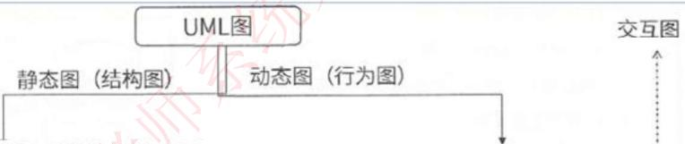

*   **结构图 (Structure Diagrams)**
    *   **类图 (Class Diagram):** 一组类、接口、协作和它们之间的关系。
    *   **对象图 (Object Diagram):** 一组对象及它们之间的关系。
    *   **构件图 (Component Diagram):** 系统的物理结构。
    *   **部署图 (Deployment Diagram):** 软硬件之间映射。
    *   **制品图 (Artifact Diagram):** 系统的物理结构。
    *   **包图 (Package Diagram):** 由模型本身分解而成的组织单元，以及他们之间的依赖关系。
    *   **组合结构图 (Composite Structure Diagram):** 一个封装的类和它的接口。
*   **行为图 (Behavior Diagrams)**
    *   **用例图 (Use Case Diagram):** 系统与外部参与者的交互。
    *   **顺序图 (Sequence Diagram):** 强调按时间顺序。
    *   **通信图 (Communication Diagram / Collaboration Diagram):** 强调组织结构。
    *   **定时图 (Timing Diagram):** 强调实际时间。
    *   **交互概览图 (Interaction Overview Diagram):** 交互和活动图的混合。
    *   **状态图 (State Machine Diagram):** 状态转换变迁。
    *   **活动图 (Activity Diagram):** 类似程序流程图，并行行为。

### 常用UML图详解

*   **类图 (Class Diagram):** 静态图，为系统的静态设计视图，展现一组对象、接口、协作和它们之间的关系。
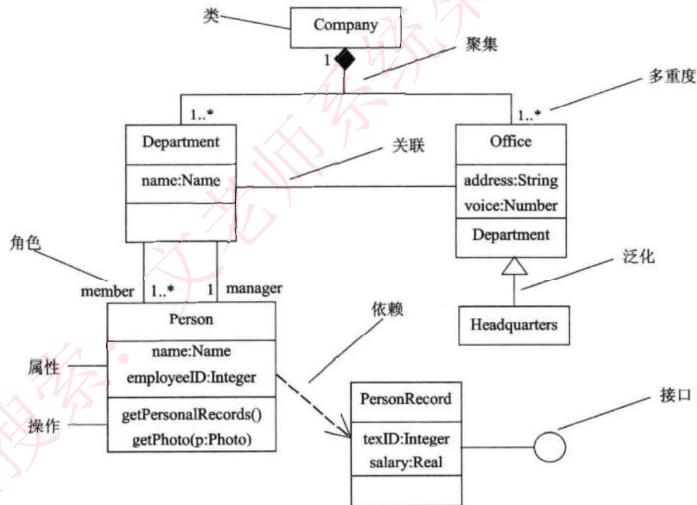
*图 UML类图*

*   **对象图 (Object Diagram):** 静态图，展现某一时刻一组对象及它们之间的关系，为类图的某一快照。在没有类图的前提下，对象图就是静态设计视图。
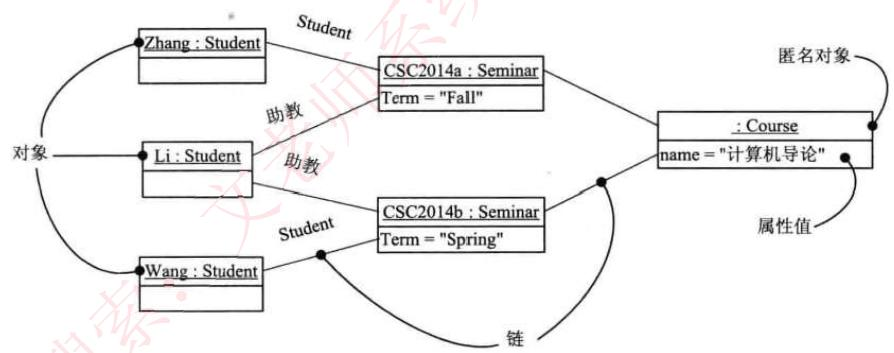

*   **用例图 (Use Case Diagram):** 静态图，展现了一组用例、参与者以及它们之间的关系。用例图中的参与者是人、硬件或其他系统可以扮演的角色；用例是参与者完成的一系列操作，用例之间的关系有扩展、包含、泛化。
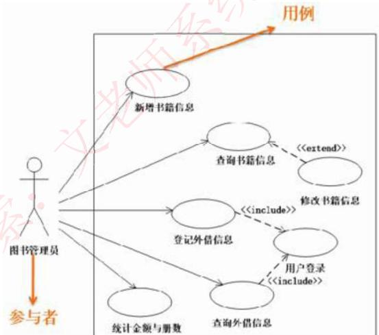

*   **序列图 (Sequence Diagram):** 即顺序图，动态图，是场景的图形化表示，描述了以时间顺序组织的对象之间的交互活动。有**同步消息**（进行阻塞调用，调用者中止执行，等待控制权返回，需要等待返回消息，用实心三角箭头表示），**异步消息**（发出消息后继续执行，不引起调用者阻塞，也不等待返回消息，由空心箭头表示）、**返回消息**（由从右到左的虚线箭头表示）三种。
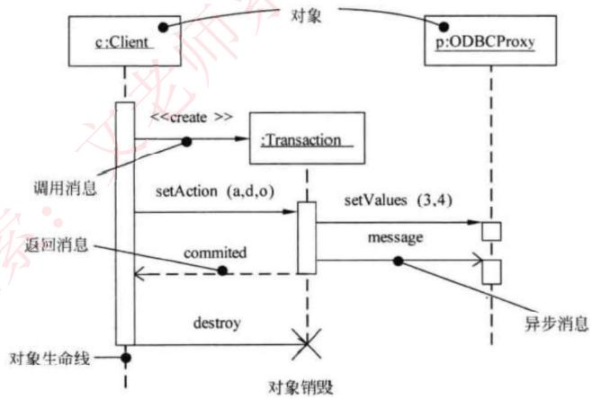

*   **通信图 (Communication Diagram):** 动态图，即协作图，强调参加交互的对象的组织。
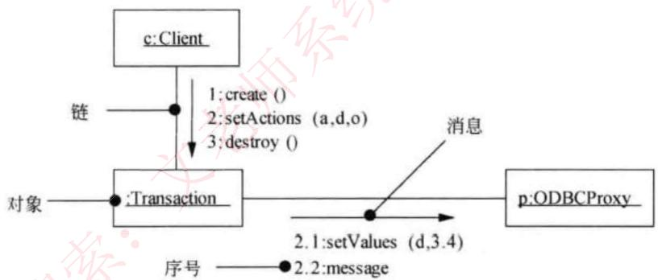

*   **状态图 (State Machine Diagram):** 动态图，展现了一个状态机，描述单个对象在多个用例中的行为，包括简单状态和组合状态。转换可以通过事件触发项触发，事件触发后相应的监护条件会进行检查。状态图中转换和状态是两个独立的概念。图中方框代表状态，箭头上的代表触发事件，实心圆点为起点和终点。
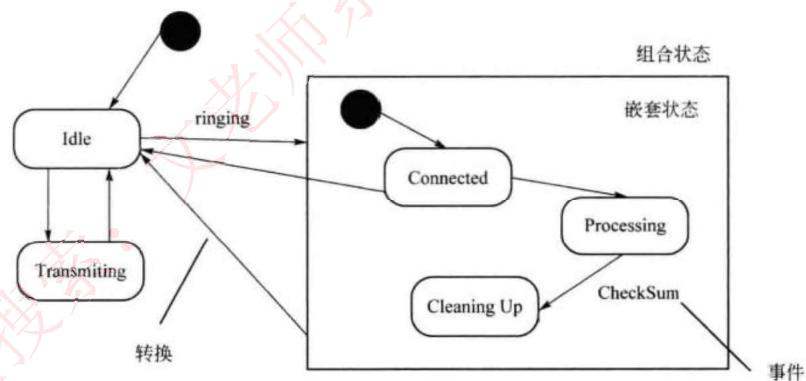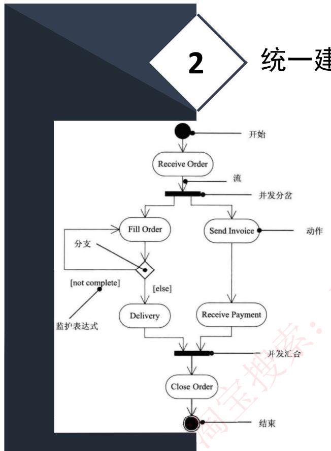

*   **活动图 (Activity Diagram):** 动态图，是一种特殊的状态图，展现了在系统内从一个活动到另一个活动的流程。活动的分岔和汇合线是一条水平粗线。牢记下图中并发分岔、并发汇合、监护表达式、分支、流等名词及含义。每个分岔的分支数代表了可同时运行的线程数。活动图中能够并行执行的是在一个分岔粗线下的分支上的活动。

*   **构件图 (Component Diagram):** 静态图，为系统静态实现视图，展现了一组构件之间的组织和依赖。
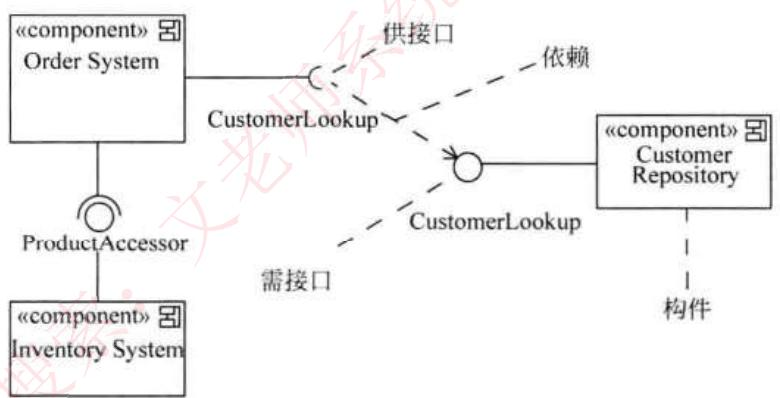

*   **部署图 (Deployment Diagram):** 静态图，为系统静态部署视图，部署图物理模块的节点分布。它与构件图相关，通常一个结点包含一个或多个构件。其他依赖关系类似于包依赖，因此部署组件之间的依赖是单向的类似于包含关系。
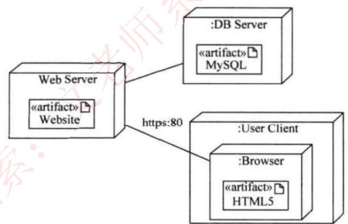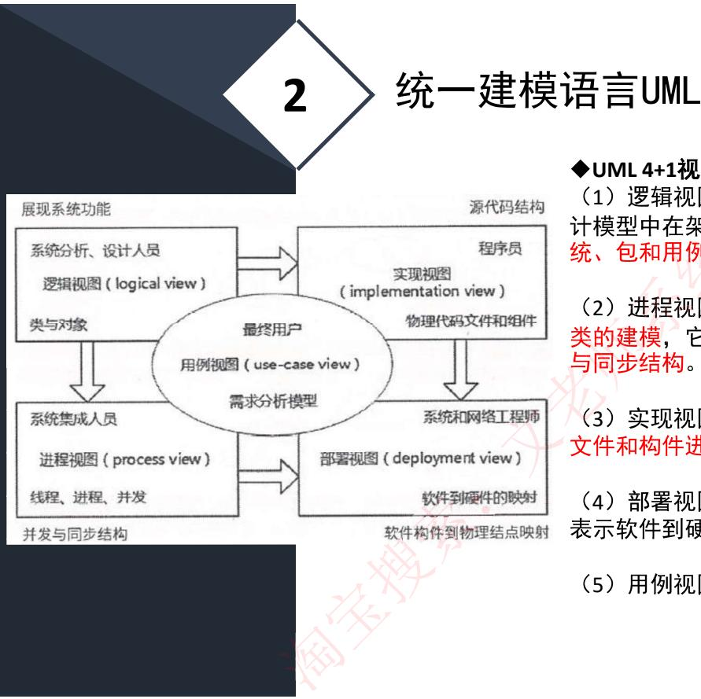

### UML 4+1视图

1.  **逻辑视图：** 逻辑视图也称为设计视图，它表示了设计模型中在架构方面具有重要意义的部分，即类、子系统、包和用例实现的子集。
2.  **进程视图：** 进程视图是可执行线程和进程作为活动类的建模，它是逻辑视图的一次执行实例，描述了并发与同步结构。
3.  **实现视图：** 实现视图对组成基于系统的物理代码的文件和构件进行建模。
4.  **部署视图：** 部署视图把构件部署到一组物理节点上，表示软件到硬件的映射和分布结构。
5.  **用例视图：** 用例视图是最基本的需求分析模型。

### 考试真题

> 用例（use case）用来描述系统对事件做出响应时所采取的行动。用例之间是具有相关性的。在一个会员管理系统中，会员注册时可以采用电话和邮件两种方式。用例“会员注册”和“电话注册”、“邮件注册”之间是（）关系。
>
> A. 包含（include）
> B. 扩展（extend)
> C. 泛化（generalize）
> D. 依赖（depends on）
>
> **答案：C**

> 以下关于UML状态图的叙述中，不正确的是（）
>
> A. 活动可以在状态内执行，也可以在迁移时执行
> B. 若事件触发一个没有特定监护条件的迁移，则对象离开当前状态
> C. 迁移可以包含事件触发器，监护条件和状态
> D. 事件触发迁移
>
> **答案：B** *(注：原答案为B，迁移可以包含事件触发器、监护条件和**动作 (Action)**，而非状态 (State)，故C也不完全正确。但B的表述“对象离开当前状态”是正确的，不正确的点在于未提及监护条件为真。此题可能存在争议。)*

> 在UML提供的系统视图中，（）是逻辑视图的一次执行实例，描述了并发与同步结构；（）是最基本的需求分析模型。
>
> **第一空选项：**
> A. 进程视图
> B. 实现视图
> C. 部署视图
> D. 用例视图
>
> **第二空选项：**
> A. 进程视图
> B. 实现视图
> C. 部署视图
> D. 用例视图
>
> **答案：A D**

> 如下所示的UML图是（），图中（I）表示（），（Ⅱ）表示（）。
>
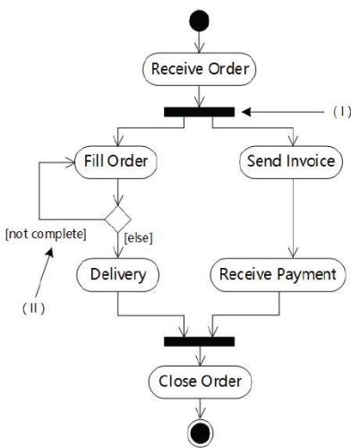
>
> **第一空选项：**
> A. 序列图
> B. 状态图
> C. 通信图
> D. 活动图
>
> **第二空选项（I）：**
> A. 合并/分叉
> B. 分支
> C. 合并/汇合
> D. 流
>
> **第三空选项（II）：**
> A. 分支/条件
> B. 监护表达式
> C. 动作名
> D. 流名称
>
> **答案：D A B** *(注：(I)是分叉/汇合，(II)是监护表达式，选项组合最接近的是A和B，分支通常指菱形判断后的路径，监护表达式写在方括号内)*

## 设计模式

**设计模式：** 每一个设计模式描述了一个在我们周围不断重复发生的问题，以及该问题的解决方案的核心。这样，你就能一次又一次地使用该方案而不必做重复劳动。设计模式的核心在于提供了相关问题的解决方案，使得人们可以更加简单方便的复用成功的设计和体系结构。

**四个基本要素：** 模式名称、问题（应该在何时使用模式）、解决方案（设计的内容）、效果（模式应用的效果）。

**惯用法：** 是最低层的模式，关注软件系统的设计与实现，实现时通过某种特定的程序设计语言来描述构件与构件之间的关系。每种编程语言都有它自己特定的模式，即语言的惯用法。例如引用计数就是 C++ 语言中的一种惯用法。

### 创建型设计模式

| 模式名称 | 定义 | 记忆关键字 |
| :--- | :--- | :--- |
| **Abstract Factory (抽象工厂)** | 提供一个接口，可以创建一系列相关或相互依赖的对象，而无需指定它们具体的类 | 抽象接口 |
| **Builder (构建器)** | 将一个复杂类的表示与其构造相分离，使得相同的构建过程能够得出不同的表示 | 类和构造分离 |
| **Factory Method (工厂方法)** | 定义一个创建对象的接口，但由子类决定需要实例化哪一个类。使得子类实例化过程推迟 | 子类决定实例化 |
| **Prototype (原型)** | 用原型实例指定创建对象的类型，并且通过拷贝这个原型来创建新的对象 | 原型实例，拷贝 |
| **Singleton (单例)** | 保证一个类只有一个实例，并提供一个访问它的全局访问点 | 唯一实例 |

### 结构型设计模式

| 模式名称 | 定义 | 记忆关键字 |
| :--- | :--- | :--- |
| **Adapter (适配器)** | 将一个类的接口转换成用户希望得到的另一种接口。它使原本不相容的接口得以协同工作 | 转换，兼容接口 |
| **Bridge (桥接)** | 将类的抽象部分和它的实现部分分离开来，使它们可以独立的变化 | 抽象和实现分离 |
| **Composite (组合)** | 将对象组合成树型结构以表示“整体-部分”的层次结构，使得用户对单个对象和组合对象的使用具有一致性 | 整体-部分，树形结构 |
| **Decorator (装饰)** | 动态的给一个对象添加一些额外的职责。它提供了用子类扩展功能的一个灵活的替代，比派生一个子类更加灵活 | 附加职责 |
| **Facade (外观)** | 定义一个高层接口，为子系统中的一组接口提供一个一致的外观，从而简化了该子系统的使用 | 对外统一接口 |
| **Flyweight (享元)** | 提供支持大量细粒度对象共享的有效方法 | 细粒度，共享 |
| **Proxy (代理)** | 为其他对象提供一种代理以控制这个对象的访问 | 代理控制 |

### 行为型设计模式

| 模式名称 | 定义 | 记忆关键字 |
| :--- | :--- | :--- |
| **Chain of Responsibility (职责链)** | 通过给多个对象处理请求的机会，减少请求的发送者与接收者之间的耦合。将接收对象链接起来，在链中传递请求，直到有一个对象处理这个请求 | 传递请求、职责、链接 |
| **Command (命令)** | 将一个请求封装为一个对象，从而可用不同的请求对客户进行参数化，将请求排队或记录请求日志，支持可撤销的操作 | 日志记录、可撤销 |
| **Interpreter (解释器)** | 给定一种语言，定义它的文法表示，并定义一个解释器，该解释器用来根据文法表示来解释语言中的句子 | 解释器，虚拟机 |
| **Iterator (迭代器)** | 提供一种方法来顺序访问一个聚合对象中的各个元素而不需要暴露该对象的内部表示 | 顺序访问，不暴露内部 |
| **Mediator (中介者)** | 用一个中介对象来封装一系列的对象交互。它使各对象不需要显式地相互调用，从而达到低耦合，还可以独立的改变对象间的交互 | 不直接引用 |
| **Memento (备忘录)** | 在不破坏封装性的前提下，捕获一个对象的内部状态，并在该对象之外保存这个状态，从而可以在以后将该对象恢复到原先保存的状态 | 保存，恢复 |
| **Observer (观察者)** | 定义对象间的一种一对多的依赖关系，当一个对象的状态发生改变时，所有依赖于它的对象都得到通知并自动更新 | 通知、自动更新 |
| **State (状态)** | 允许一个对象在其内部状态改变时改变它的行为 | 状态变成类 |
| **Strategy (策略)** | 定义一系列算法，把它们一个个封装起来，并且使它们之间可互相替换，从而让算法可以独立于使用它的用户而变化 | 算法替换 |
| **Template Method (模板方法)** | 定义一个操作中的算法骨架，而将一些步骤延迟到子类中，使得子类可以不改变一个算法的结构即可重新定义算法的某些特定步骤 | 数据和操作分离 |
| **Visitor (访问者)** | 表示一个作用于某对象结构中的各元素的操作，使得在不改变各元素的类的前提下定义作用于这些元素的新操作 | 数据和操作分离 |

### 考试真题

> 设计模式描述了一个出现在特定设计语境中的设计再现问题，并为它的解决方案提供了一个经过充分验证的通用方案，不同的设计模式关注解决不同的问题。例如，抽象工厂模式提供一个接口，可以创建一系列相关或相互依赖的对象，而无需指定它们具体的类，它是一种（54）模式；（55）模式将类的抽象部分和它的实现部分分离出来，使它们可以独立变化，它属于（56）模式；（57）模式将一个请求封装为一个对象，从而可用不同的请求对客户进行参数化，将请求排队或记录请求日志，支持可撤销的操作。
>
> **(54)** A. 组合型 B. 结构型 C. 行为型 D. 创建型
> **(55)** A. Bridge B. Proxy C. Prototype D. Adapter
> **(56)** A. 组合型 B. 结构型 C. 行为型 D. 创建型
> **(57)** A. Command B. Facade C. Memento D. Visitor
>
> **答案：(54) D, (55) A, (56) B, (57) A**

> 欲开发一个绘图软件，要求使用不同的绘图程序绘制不同的图形，该绘图软件的扩展性要求将不断扩充新的图形和新的绘图程序，以绘制直线和图形为例，得到如下图所示的类图，该设计采用（）模式将抽象部分与其实现部分分离，使它们都可以独立的变化。其中（）定义了实现类接口，该模式适用于（）的情况，该模式属于（）模式。
>
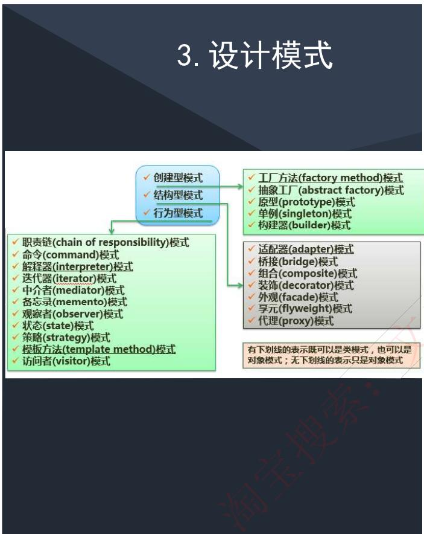
>
> **第一空选项：**
> A. 适配器 (Adapter)
> B. 装饰 (Decorator)
> C. 桥接 (Bridge)
> D. 组合 (Composite)
>
> **第二空选项：**
> A. Shape
> B. Circle和Rectangle
> C. V1Drawing和V2Drawing
> D. Drawing
>
> **第三空选项：**
> A. 不希望在抽象和它的实现部分之间有一个固定判定关系
> B. 想表示对象的部分-整体层次结构
> C. 想使用一个已经存在的类，而它的接口不符合要求
> D. 在不影响其他对象的情况下，以动态透明的方式给单个对象添加职责
>
> **第四空选项：**
> A. 创建型对象
> B. 结构型对象
> C. 行为型对象
> D. 结构型类
>
> **答案：C D A B**

