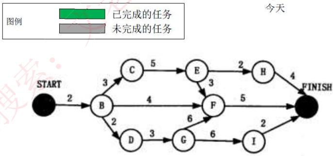
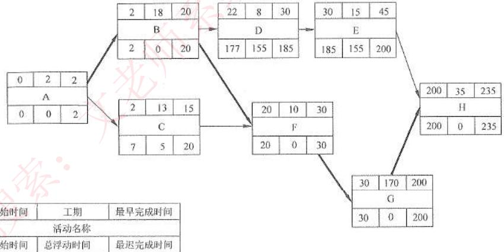
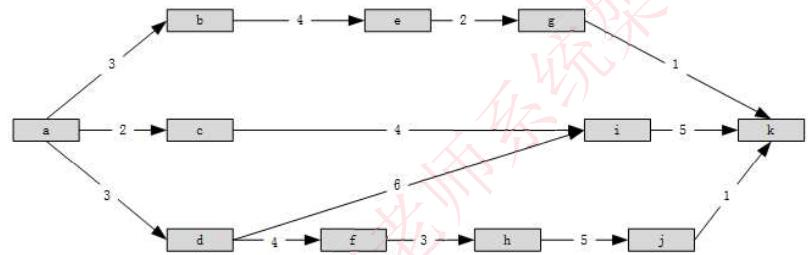

# 项目管理

# 历年真题考情：

本章节近几年都没怎么考到，以后也应该不会考。

# 第二版更新：

第二版更新：第二版教材里对应第5.7节，但是描述很少，也只有进度、配置、质量、风险四个管理，每个管理都只介绍了基本定义，像老早会考到的范围、需求都给删了，也没有配置风险具体内容，更没有进度关键路径计算那些了，而且真题也没考了，所以本章节做了大量删减，剩下的大家看看就可以，不用在意。

# 进度管理

$\bullet$  进度管理就是采用科学的方法，确定进度目标，编制进度计划和资源供应计划，进行进度控制，在与质量、成本目标协调的基础上，实现工期目标。

具体来说，包括以下过程：

具体来说，包括以下过程：（1）活动定义：确定完成项目各项可交付成果而需要开展的具体活动。（2）活动排序：识别和记录各项活动之间的先后关系和逻辑关系。（3）活动资源估算：估算完成各项活动所需要的资源类型和效益。（4）活动历时估算：估算完成各项活动所需要的具体时间。（5）进度计划编制：分析活动顺序、活动持续时间、资源要求和进度制约因素，制订项目进度计划。（6）进度控制：根据进度计划开展项目活动，如果发现偏差，则分析原因或进行调整。

# 进度管理

$\bullet$  进度安排的常用图形描述方法有Gantt图（甘特图）和项目计划评审技术（Program Evaluation& Review Technique，PERT）图。

<table><tr><td colspan="13">时间</td></tr><tr><td rowspan="2">任务</td><td colspan="12">2008年</td></tr><tr><td>1月</td><td>2月</td><td>3月</td><td>4月</td><td>5月</td><td>6月</td><td>7月</td><td>8月</td><td>9月</td><td>10月</td><td>11月</td><td>12月</td></tr><tr><td>任务1</td><td></td><td></td><td></td><td></td><td></td><td></td><td></td><td></td><td></td><td></td><td></td><td></td></tr><tr><td>任务2</td><td></td><td></td><td></td><td></td><td></td><td></td><td></td><td></td><td></td><td></td><td></td><td></td></tr><tr><td>任务3</td><td></td><td></td><td></td><td></td><td></td><td></td><td></td><td></td><td></td><td></td><td></td><td></td></tr></table>

# 进度管理

# 关键路径法

关键路径：是项目的最短工期，但却是从开始到结束时间最长的路径。进度网络图中可能有多条关键路径，因为活动会变化，因此关键路径也在不断变化中。关键活动：关键路径上的活动，最早开始时间  $\equiv$  最晚开始时间。通常，每个节点的活动会有如下几个时间：

（1）最早开始时间（ES），某项活动能够开始的最早时间。（2）最早结束时间（EF），某项活动能够完成的最早时间。EF=ES+工期（3）最迟结束时间（LF）。为了使项目按时完成，某项活动必须完成的最迟时间。（4）最迟开始时间（LS）。为了使项目按时完成，某项活动必须开始的最迟时间。LS=LF-工期

# 进度管理

$\bullet$  这几个时间通常作为每个节点的组成部分，如图所示：

顺推：最早开始ES=所有前置活动最早完成EF的最大值；最早完成EF=最早开始ES+持续时间。逆推：最晚完成LF=所有后续活动最晚开始LS的最小值；最晚开始LS=最晚完成LF- 持续事件。下面教材原图有误，视频里有详细勘误。

# 进度管理

$\bullet$  总浮动时间：在不延误项目完工时间且不违反进度制约因素的前提下，活动可以从最早开始时间推迟或拖延的时间量，就是该活动的进度灵活性。正常情况下，关键活动的总浮动时间为零。

$\bullet$  总浮动时间  $\equiv$  最迟开始LS- 最早开始ES或最迟完成LF- 最早完成EF或关键路径- 非关键路径时长。

$\bullet$  自由浮动时间：是指在不延误任何紧后活动的最早开始时间且不违反进度制约因素的前提下，活动可以从最早开始时间推迟或拖延的时间量。

$\bullet$  自由浮动时间  $\equiv$  紧后活动最早开始时间的最小值- 本活动的最早完成时间。

# 考试真题

下图中(单位：周)显示的项目历时总时长是（）周。在项目实施过程中，活动d- i比计划延期了2周，活动a- c实际工期是6周，活动f- h比计划提前了1周，此时该项目的历时总时长为（）周。

A.14 
B.18 
C.16 
D.13 
A.14 
B.18 
C.16 
D.17

【答案】C C

【解析】关键路径是最长的一条路径。题干的图示并不复杂，所以直接可以数出来，发现路径adfhjk是最长的，所以他是关键路径，总时长用路径的活动周期相加即可，等于16。题干所说的实施过程，影响了3条路径，分别是acik，adik和原来的关键路径adfhjk。按照其调整，三条路径的时长分别是：acik=15，adik=16，adfhjk=15，故项目历时总时长还是16周。

# 考试真题

某项目包含A、B、C、D、E、F、G七个活动，各活动的历时估算和逻辑关系如下表所示，则活动c的总浮动时间是（）天，项目工期是（）天。

A、0 B、1 C、2 D、3 A、14 B、15 C、16 D、17

【答案】DD

<table><tr><td>活动名称</td><td>紧前活动</td><td>活动历时</td></tr><tr><td>A</td><td>-</td><td>2</td></tr><tr><td>B</td><td>A</td><td>4</td></tr><tr><td>C</td><td>A</td><td>5</td></tr><tr><td>D</td><td>A</td><td>6</td></tr><tr><td>E</td><td>B C</td><td>4</td></tr><tr><td>F</td><td>D</td><td>6</td></tr><tr><td>G</td><td>E F</td><td>3</td></tr></table>

【解析】选择题的这种表格题，逻辑关系清晰的，可以直接根据表格列举出各路径长度，找出最长的。逻辑关系不清晰的，根据表格画出网络图，然后再找。ABEG=2+4+4+3=13；ACEG=2+5+4+3=14；ADFG=2+6+6+3=17活动C的总浮动=17- C活动所在路径的最长路径14=3。

# 软件配置管理

$\bullet$  配置管理是为了系统地控制配置变更，在系统的整个生命周期中维持配置的完整性和可跟踪性，而标识系统在不同时间点上配置的学科。

$\bullet$  在GB/T11457- 2006中将“配置管理”正式定义为：“应用技术的和管理的指导和监控方法以标识和说明配置项的功能和物理特征，控制这些特征的变更，记录和报告变更处理和实现状态并验证与规定的需求的遵循性。”

$\bullet$  配置管理包括6个主要活动：制订配置管理计划、配置标识、配置控制、配置状态报告、配置审计、发布管理和交付。

# 软件配置管理

$\bullet$  配置项：GB/T11457- 2006对配置项的定义为：“为配置管理设计的硬件、软件或二者的集合，在配置管理过程中作为一个单个实体来对待”。

$\bullet$  以下内容都可以作为配置项进行管理：外部交付的软件产品和数据、指定的内部软件工作产品和数据、指定的用于创建或支持软件产品的支持工具、供方/供应商提供的软件和客户提供的设备/软件。

$\bullet$  典型配置项包括项目计划书、需求文档、设计文档、源代码、可执行代码、测试用例、运行软件所需的各种数据，它们经评审和检查通过后进入配置管理。

$\bullet$  每个配置项的主要属性有：名称、标识符、文件状态、版本、作者、日期等。

$\bullet$  配置项可以分为基线配置项和非基线配置项两类，例如，基线配置项可能包括所有的设计文档和源程序等；非基线配置项可能包括项目的各类计划和报告等。

$\bullet$  所有配置项的操作权限应由CMO（配置管理员）严格管理，基本原则是：基线配置项向开发人员开放读取的权限；非基线配置项向PM、CCB及相关人员开放。

# 软件配置管理

$\bullet$  配置项的状态可分为“草稿”“正式”和“修改”三种。配置项刚建立时，其状态为“草稿”。配置项通过评审后，其状态变为“正式”。此后若更改配置项，则其状态变为“修改”。当配置项修改完毕并重新通过评审时，其状态又变为“正式”。如图所示。

# 软件配置管理

# $\bullet$  配置项版本号

（1）处于“草稿”状态的配置项的版本号格式为0.YZ，YZ的数字范围为01～99。随着草稿的修正，YZ的取值应递增。YZ的初值和增幅由用户自己把握。（2）处于“正式”状态的配置项的版本号格式为X.Y，X为主版本号，取值范围为1～9。Y为次版本号，取值范围为0～9。配置项第一次成为“正式”文件时，版本号为1.0。如果配置项升级幅度比较小，可以将变动部分制作成配置项的附件，附件版本依次为1.0，1.1.。当附件的变动积累到一定程度时，配置项的值可适量增加，Y值增加一定程度时，X值将适量增加。当配置项升级幅度比较大时，才允许直接增大X值。（3）处于“修改”状态的配置项的版本号格式为X.YZ。配置项正在修改时，一般只增大Z值，X.Y值保持不变。当配置项修改完毕，状态成为“正式”时，将Z值设置为0，增加X.Y值。参见上述规则（2）。

$\bullet$  配置项版本管理：在项目开发过程中，绝大部分的配置项都要经过多次的修改才能最终确定下来。对配置项的任何修改都将产生新的版本。由于我们不能保证新版本一定比旧版本“好”，所以不能抛弃旧版本。版本管理的目的是按照一定的规则保存配置项的所有版本，避免发生版本丢失或混淆等现象，并且可以快速准确地查找到配置项的任何版本。

# 质量管理

$\bullet$  质量是软件产品特性的综合，表示软件产品满足明确（基本需求）或隐含（期望需求）要求的能力。质量管理是指确定质量方针、目标和职责，并通过质量体系中的质量计划、质量控制、质量保证和质量改进来使其实现的所有管理职能的全部活动；

$\bullet$  主要包括以下过程：

（1）质量规划：识别项目及其产品的质量要求和标准，并书面描述项目将如何达到这些要求和标准的过程。

（2）质量保证：一般是每隔一定时间（例如，每个阶段末）进行的，主要通过系统的质量审计（软件评审）和过程分析来保证项目的质量。

（3）质量控制：实时监控项目的具体结果，以判断它们是否符合相关质量标准，制订有效方案，以消除产生质量问题的原因。

# 风险管理

$\bullet$  风险管理就是要对项目风险进行认真的分析和科学的管理，这样，是能够避开不利条件、少受损失、取得预期的结果并实现项目目标的，能够争取避免风险的发生或尽量减小风险发生后的影响。但是，完全避开或消除风险，或者只享受权益而不承担风险是不可能的。

$\bullet$  风险管理计划编制：如何安排与实施项目的风险管理，制定下列各步的计划。

$\bullet$  风险识别：识别出项目中已知和可预测的风险，确定风险的来源、产生的条件、描述风险的特征以及哪些项目可以产生风险，形成一个风险列表。

$\bullet$  风险定性分析：对已经识别的风险进行排序，确定风险可能性与影响、确定风险优先级、确定风险类型。

$\bullet$  风险定量分析：进一步了解风险发生的可能性具体由多大，后果具体由多严重。包括灵敏度分析、期望货币价值分析、决策树分析、蒙特卡罗模拟。

$\bullet$  风险应对计划编制：对每一个识别出来的风险来分别制定应对措施，这些措施组成的文档称为风险应对计划。包括消极风险（避免策略、转移策略、减轻策略）；积极风险（开拓、分享、强大）。

$\bullet$  风险监控：监控风险计划的执行，检测残余风险，识别新的风险，保证风险计划的执行，并评价这些计划对减少风险的有效性。

# 风险管理

$\bullet$  在信息系统项目中，从宏观上来看，风险可以分为项目风险、技术风险和商业风险。

$\bullet$  项目风险是指潜在的预算、进度、个人（包括人员和组织）、资源、用户和需求方面的问题，以及它们对项目的影响。项目复杂性、规模和结构的不确定性也构成项目的（估算）风险因素。项目风险威胁到项目计划，一旦项目风险成为现实，可能会拖延项目进度，增加项目的成本。

$\bullet$  技术风险是指潜在的设计、实现、接口、测试和维护方面的问题。此外，规格说明的多义性、技术上的不确定性、技术陈旧、最新技术（不成熟）也是风险因素。技术风险威胁到待开发系统的质量和预定的交付时间。如果技术风险成为现实，开发工作可能会变得很困难或根本不可能。

$\bullet$  商业风险威胁到待开发系统的生存能力，主要有以下5种不同的商业风险：

（1）市场风险。开发的系统虽然很优秀但不是市场真正所想要的。（2）策略风险。开发的系统不再符合企业的信息系统战略。（3）销售风险。开发了销售部门不清楚如何推销的系统。（4）管理风险。由于重点转移或人员变动而失去上级管理部门的支持。（5）预算风险。开发过程没有得到预算或人员的保证。

# 谢谢！

