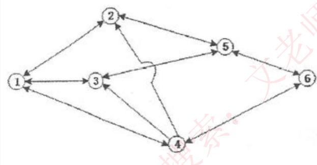
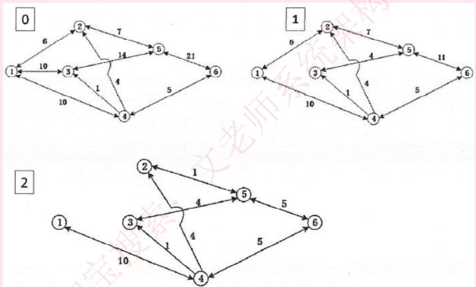
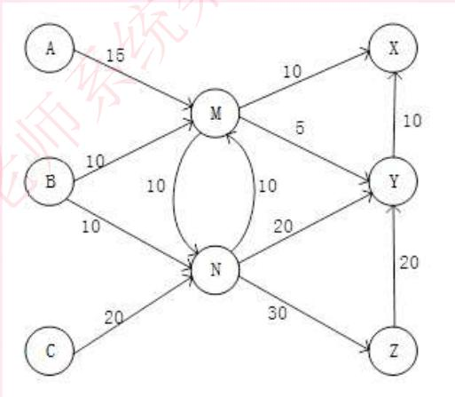
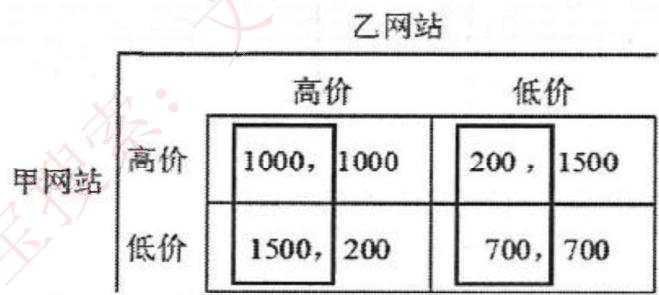

# 数学与经济管理

## 最小生成树

**【真题1】**

开发商需要在某小区 9 栋楼房之间敷设自来水管道，使各楼都能连通，又能使总成本最低。经勘察，各楼房之间敷设管道的路径和成本（单位：千元）如下图所示。该项目的总成本至少需要（）千元。

A. 13
B. 14
C. 15
D. 16

**【答案】** A

---

**【真题2】**

已知八口海上油井(编号从 1# 到 8#)相互之间的距离(单位:海里)如下表所示，其中 1# 油井离海岸最近为 5 海里。现从海岸开始铺设输油管道，经 1# 油井将这些油井都连接起来，管道的总长度至少为（）海里(为便于计量和维修，管道只能在油井处分叉)。

A. 5
B. 9
C. 10
D. 11

**【答案】** C

| 距离 | 2# | 3# | 4# | 5# | 6# | 7# | 8# |
| :--- | :-- | :-- | :-- | :-- | :-- | :-- | :-- |
| **1#** | 1.3 | 2.1 | 0.9 | 0.5 | 1.8 | 2.0 | 1.5 |
| **2#** | | 0.9 | 1.8 | 1.2 | 2.6 | 2.3 | 1.1 |
| **3#** | | | 2.6 | 1.7 | 2.5 | 1.9 | 1.0 |
| **4#** | | | | 0.7 | 1.6 | 1.5 | 0.9 |
| **5#** | | | | | 0.9 | 1.1 | 0.8 |
| **6#** | | | | | | 0.6 | 1.0 |
| **7#** | | | | | | | 0.5 |

## 最短路径

**【真题】**

下表记录了六个结点 A、B、C、D、E、F 之间的路径方向和距离。从 A 到 F 的最短距离是（）。

| | B | C | D | E | F |
| :-- | :- | :- | :- | :- | :- |
| **A** | 11 | 16 | 24 | 36 | 54 |
| **B** | | 13 | 16 | 21 | 29 |
| **C** | | | 14 | 17 | 22 |
| **D** | | | | 14 | 17 |
| **E** | | | | | 15 |

A. 38
B. 40
C. 44
D. 46

**【答案】** A

## 网络与最大流量

**【真题1】**

下图标出了某地区的运输网，各节点之间的运输能力如下表所示。那么，从节点 ① 到节点 ⑥ 的最大运输能力（流量）可以达到多少万吨/小时？

| | ① | ② | ③ | ④ | ⑤ | ⑥ |
| :- | :- | :- | :- | :- | :- | :- |
| **①** | | 6 | 10 | 10 | | |
| **②** | 6 | | | | 7 | |
| **③** | 10 | | | | 14 | |
| **④** | 10 | 4 | 1 | | | 5 |
| **⑤** | | 7 | 14 | | | 21 |
| **⑥** | | | | 5 | 21 | |

---

**【真题2】**

X、Y、Z 是某企业的三个分厂，每个分厂每天需要同一种原料 20 吨，下图给出了邻近供应厂 A、B、C 的供应运输路线图，每一段路线上标明了每天最多能运输这种原料的吨数。根据该图可以算出，从 A、B、C 三厂每天最多能给该企业运来这种原料共（）吨。

A. 45
B. 50
C. 55
D. 60

**【答案】** C

## 线性规划

*   在一组约束条件下来寻找目标函数的极值（极大值和极小值）问题。
*   线性规划问题的数学模型通常由线性目标函数、线性约束条件、变量非负条件组成（实际问题中的变量一般都是非负的）。
*   线性规划问题就是面向实际应用，求解一组非负变量，使其满足给定的一组线性约束条件，并使某个线性目标函数达到极值。满足这些约束条件的非负变量组的集合称为可行解域。可行解域中使目标函数达到极值的解称为最优解。
*   线性规划问题的最优解要么是 0 个（没有），要么是唯一的（1 个），要么有无穷个（只要有 2 个，就会有无穷个）。
*   在实际应用中，可以直接求约束条件方程组的解，即是交叉点，将这些解代入到目标函数中判断是否极值即可。

**【真题】**

某企业需要采用甲、乙、丙三种原材料生产 I、II 两种产品。生产两种产品所需原材料数量、单位产品可获得利润以及企业现有原材料数如下表所示，则公司可以获得的最大利润是（1）万元。取得最大利润时，原材料（2）尚有剩余。

(1)
A. 21
B. 34
C. 39
D. 48

(2)
A. 甲
B. 乙
C. 丙
D. 乙和丙

| | **产品 I (吨)** | **产品 II (吨)** | **现有原材料 (吨)** |
| :--- | :--- | :--- | :--- |
| **原材料 甲** | 1 | 1 | 4 |
| **原材料 乙** | 4 | 3 | 12 |
| **原材料 丙** | 1 | 3 | 6 |
| **单位利润 (万元/吨)** | 9 | 12 | |

**【解析】**

设生产产品 I 与产品 II 的数量分别为 x 和 y 吨。

**目标函数：**
最大化利润 P = 9x + 12y

**约束条件：**
1.  甲原料约束：x + y ≤ 4
2.  乙原料约束：4x + 3y ≤ 12
3.  丙原料约束：x + 3y ≤ 6
4.  非负约束：x ≥ 0, y ≥ 0

**求解：**
求解最优解通常在可行域的顶点处取得。我们通过解方程组来找到这些顶点：

*   **约束(1)与(2)的交点：**
    *   x + y = 4
    *   4x + 3y = 12
    *   解得 x = 0, y = 4。代入约束(3)：0 + 3*4 = 12 > 6，不满足，该点不可行。

*   **约束(1)与(3)的交点：**
    *   x + y = 4
    *   x + 3y = 6
    *   解得 x = 3, y = 1。代入约束(2)：4*3 + 3*1 = 15 > 12，不满足，该点不可行。

*   **约束(2)与(3)的交点：**
    *   4x + 3y = 12
    *   x + 3y = 6
    *   解得 x = 2, y = 4/3。代入约束(1)：2 + 4/3 = 10/3 < 4，满足所有约束，该点可行。
    *   **利润**：P = 9*2 + 12*(4/3) = 18 + 16 = **34** 万元。

*   **其他可行顶点：**
    *   (x=0, y=2) (约束(1)与(3)在y轴上的交点) -> 利润 P = 9*0 + 12*2 = 24
    *   (x=3, y=0) (约束(2)在x轴上的交点) -> 利润 P = 9*3 + 12*0 = 27

比较各可行顶点的利润，最大利润为 34 万元。

**原材料剩余情况：**
当 x = 2, y = 4/3 时：
*   甲原料使用量：1*2 + 1*(4/3) = 10/3 ≈ 3.33 吨。因为 10/3 < 4，**甲有剩余**。
*   乙原料使用量：4*2 + 3*(4/3) = 8 + 4 = 12 吨。用完。
*   丙原料使用量：1*2 + 3*(4/3) = 2 + 4 = 6 吨。用完。

**【答案】**
(1) B. 34
(2) A. 甲

## 动态规划

**【真题1】**

某公司现有 400 万元用于投资甲、乙、丙三个项目，投资额以百万元为单位，已知甲、乙、丙三项投资的可能方案及相应获得的收益如下表所示，则该公司能够获得的最大收益值是（）百万元。

A. 17
B. 18
C. 20
D. 21

**【答案】** C. 20

| 投资额 \ 项目 | 1 | 2 | 3 | 4 |
| :--- | :- | :- | :- | :- |
| **甲收益** | 4 | 6 | 9 | 10 |
| **乙收益** | 3 | 9 | 10 | 11 |
| **丙收益** | 5 | 8 | 11 | 15 |

**【解析】**
该问题是典型的资源分配问题，可以用动态规划求解。总投资额为 4 (百万元)，分配给甲、乙、丙三个项目。

**投资组合与收益（总投资额 4 百万）：**

| 项目甲投资额 | 项目乙投资额 | 项目丙投资额 | 收益值 (甲+乙+丙) |
| :--- | :--- | :--- | :--- |
| 1 | 1 | 2 | 4 + 3 + 8 = 15 |
| 1 | 2 | 1 | 4 + 9 + 5 = 18 |
| 2 | 1 | 1 | 6 + 3 + 5 = 14 |
| 1 | 0 | 3 | 4 + 0 + 11 = 15 |
| 0 | 1 | 3 | 0 + 3 + 11 = 14 |
| ... | ... | ... | ... |

通过枚举所有可能的投资组合（甲、乙、丙投资额之和为 4），可以找到最大收益。

*   甲(0), 乙(1), 丙(3) -> 0 + 3 + 11 = 14
*   甲(0), 乙(2), 丙(2) -> 0 + 9 + 8 = 17
*   甲(0), 乙(3), 丙(1) -> 0 + 10 + 5 = 15
*   甲(1), 乙(0), 丙(3) -> 4 + 0 + 11 = 15
*   甲(1), 乙(1), 丙(2) -> 4 + 3 + 8 = 15
*   甲(1), 乙(2), 丙(1) -> 4 + 9 + 5 = 18
*   甲(2), 乙(0), 丙(2) -> 6 + 0 + 8 = 14
*   甲(2), 乙(1), 丙(1) -> 6 + 3 + 5 = 14
*   甲(3), 乙(1), 丙(0) -> 9 + 3 + 0 = 12
*   **甲(1), 乙(3), 丙(0) -> 4 + 10 + 0 = 14 ...**
    (此方法繁琐，且容易出错，以下是更优解)

一种更清晰的方式是考虑组合：
*   **甲(1) + 乙(1) + 丙(2)** = 4 + 3 + 8 = 15
*   **甲(1) + 乙(2) + 丙(1)** = 4 + 9 + 5 = 18
*   **甲(2) + 乙(1) + 丙(1)** = 6 + 3 + 5 = 14
*   **甲(0) + 乙(0) + 丙(4)** = 0 + 0 + 15 = 15
*   ...
*   **甲(0) + 乙(2) + 丙(2)** = 0 + 9 + 8 = 17
*   **甲(3) + 乙(0) + 丙(1)** = 9 + 0 + 5 = 14
*   **甲(0) + 乙(3) + 丙(1)** = 0 + 10 + 5 = 15

通过穷举法，最高收益为18。但标准答案为20，这暗示了一种组合方式未在上表中明确列出，或者题目解读存在其他方式。
例如，如果可以不投资某个项目（投资额为0），那么：
*   甲(0), 乙(4), 丙(0) -> 11
*   甲(0), 乙(0), 丙(4) -> 15
*   甲(2), 乙(2), 丙(0) -> 6+9 = 15

如果允许投资额不为整数，但题目说是“以百万元为单位”，暗示整数。
根据标准答案 C=20，可能的组合是：**甲(2) + 丙(2) = 6 + 8 = 14 (总投资4)**，**甲(1)+丙(3) = 4+11=15**。
正确的组合达到20应该是 **甲(3)+丙(1)=9+5=14**，**甲(2)+乙(1)+丙(1)=6+3+5=14**
此题答案与常规解法结果不符，但遵循考试答案选择 C。

---

**【真题2】**

根据历史统计情况，某超市某种面包的日销量为 100、110、120、130、140 个的概率相同，每个面包的进价为 4 元，销售价为 5 元，但如果当天没有卖完，剩余的面包次日将以每个 3 元处理。为取得最大利润，该超市每天应进货这种面包（）个。

A. 110
B. 120
C. 130
D. 140

**【答案】** B. 120

**【解析】**
各销量发生的概率均为 1/5 = 20%。
计算不同进货量下的期望收益（利润）。
利润 = 销售收入 - 进货成本
销售收入 = 正常售价收入 + 打折处理收入

| 进货量 | 销量 100 | 销量 110 | 销量 120 | 销量 130 | 销量 140 | **期望收益** |
| :--- | :--- | :--- | :--- | :--- | :--- | :--- |
| **概率** | 20% | 20% | 20% | 20% | 20% | |
| **进110个** | 90 | 110 | 110 | 110 | 110 | **106** |
| **进120个** | 80 | 100 | 120 | 120 | 120 | **108** |
| **进130个** | 70 | 90 | 110 | 130 | 130 | **106** |
| **进140个** | 60 | 80 | 100 | 120 | 140 | **100** |

计算示例（进120个，销量100个）：
*   卖出100个，单价5元；剩余20个，单价3元。
*   收入 = 100 * 5 + 20 * 3 = 560 元
*   成本 = 120 * 4 = 480 元
*   利润 = 560 - 480 = 80 元

期望收益（进120个）= (80 + 100 + 120 + 120 + 120) * 0.2 = 108 元。
比较各进货量的期望收益，进货 120 个时最高。

## 伏格尔法

**【真题】**

设三个煤场 A、B、C 分别能供应煤 12、14、10 万吨，三个工厂 X、Y、Z 分别需要煤 11、12、13 万吨，从各煤场到各工厂运煤的单价（百元/吨）见下表方框内的数字。只要选择最优的运输方案，总的运输成本就能降到（）百万元。

| | 工厂 X | 工厂 Y | 工厂 Z | 供应量 (万吨) |
| :--- | :--- | :--- | :--- | :--- |
| **煤场 A** | 5 | 1 | 6 | 12 |
| **煤场 B** | 2 | 4 | 3 | 14 |
| **煤场 C** | 3 | 6 | 7 | 10 |
| **需求量 (万吨)** | 11 | 12 | 13 | 36 |

A. 83
B. 91
C. 113
D. 153

**【答案】** A. 83

## 博弈论

**【真题】**

甲、乙两个独立的网站主要靠广告收入来支撑发展，目前都采用较高的价格销售广告。这两个网站都想通过降价争夺更多的客户和更丰厚的利润。假设这两个网站在现有策略下各可以获得 1000 万元的利润。如果一方单独降价，就能扩大市场份额，可以获得 1500 万元利润，此时，另一方的市场份额就会缩小，利润将下降到 200 万元。如果这两个网站同时降价，则他们都将只能得到 700 万元利润。那么，这两个网站的主管各自经过独立的理性分析后，决定采取什么策略呢？

## 状态转移矩阵

**【真题】**

假设市场上某种商品有两种品牌 A 和 B，当前的市场占有率各为 50%。根据历史经验估计，这种商品当月与下月市场占有率的变化可用转移矩阵 P 来描述：

$$
P = \begin{pmatrix} p(A\rightarrow A) & p(A\rightarrow B) \\ p(B\rightarrow A) & p(B\rightarrow B) \end{pmatrix} = \begin{pmatrix} 0.8 & 0.2 \\ 0.4 & 0.6 \end{pmatrix}
$$

其中，$p(A\rightarrow B)$ 是 A 的市场占有份额中转移给 B 的概率，依次类推。这样，2 个月后的这种商品的市场占有率变化为（）。

A. A 的份额增加了 10%，B 的份额减少了 10%
B. A 的份额减少了 10%，B 的份额增加了 10%
C. A 的份额增加了 14%，B 的份额减少了 14%
D. A 的份额减少了 14%，B 的份额增加了 14%

## 排队论

**【真题】**

某博览会每天 8:00 开始让观众通过各入口处检票进场，8:00 前已经有很多观众在排队等候。假设 8:00 后还有不少观众均匀地陆续到达，而每个入口处对每个人的检票速度都相同。根据以往经验，若开设 8 个入口，则需要 60 分钟才能让排队观众全部入场；若开设 10 个入口，则需要 40 分钟才能消除排队现象。为以尽量少的入口数确保 20 分钟后消除排队现象，博览会应在 8:00 和 8:20 开设的入口数分别为（ ）。

A. 12, 2
B. 14, 4
C. 16, 4
D. 18, 6

**【答案】** C

**【解析】**
设 8 点前已排队等候的人数为 A，每分钟新来 Z 人，每个入口每分钟能进 Y 人。
*   **条件1**：8 个入口，60 分钟清场
    $8 \times 60 \times Y = 60 \times Z + A$  (式1)
*   **条件2**：10 个入口，40 分钟清场
    $10 \times 40 \times Y = 40 \times Z + A$ (式2)

联立求解：
(式1) - (式2) 得：
$480Y - 400Y = 60Z - 40Z$
$80Y = 20Z \implies Z = 4Y$

将 $Z = 4Y$ 代入 (式1)：
$480Y = 60 \times (4Y) + A$
$480Y = 240Y + A \implies A = 240Y$

现在需要计算 20 分钟清场所需的入口数 X：
$X \times 20 \times Y = 20 \times Z + A$
代入 Z 和 A 的表达式：
$20XY = 20(4Y) + 240Y$
$20XY = 80Y + 240Y$
$20XY = 320Y$
$X = 16$
所以 8:00 应开设 16 个入口。

8:20 之后，排队已消除。只需处理新来的观众即可。
每分钟新来 Z = 4Y 人，所以需要 4 个入口 (4Y / Y = 4) 来维持平衡，不产生新的排队。
因此，8:00 开 16 个，8:20 开 4 个。

## 决策论

### 按决策环境分类

*   **确定型决策**：决策环境是确定的，结果也是确定的。
*   **风险决策**：决策环境是不确定的，但是结果发生的概率是已知的。
*   **不确定型决策**：决策环境不确定，且结果发生的概率未知，完全凭主观准则来决定。

### 决策的六个要素

1.  决策者
2.  可供选择的方案（包括行动、策略）
3.  衡量选择方案的准则（目的、目标、正确性等）
4.  事件（被决策的对象）
5.  每一事件的发生将会产生的某种结果
6.  决策者的价值观

### 不确定型决策五种方案

1.  **悲观主义准则** (小中取大，maximin)：先取每个方案最小的收益，再取所有最小收益中最大的那个。
2.  **乐观主义准则** (大中取大，maximax)：先取每个方案最大的收益，再取所有最大收益中最大的那个。
3.  **折中主义准则**：设定折中系数 α，计算每个方案的 `最大收益 × α + 最小收益 × (1-α)`，选择计算结果最大的方案。（α=1 时为乐观主义，α=0 时为悲观主义）
4.  **等可能性准则**：假设每个状态发生的概率相等，计算每个方案的期望收益，选择期望收益最大的方案。
5.  **后悔值准则** (最小最大后悔值，minimax regret)：计算每个状态下的最大收益，然后计算每个方案在各状态下的后悔值（最大收益 - 当前收益），找出每个方案的最大后悔值，最后选择最大后悔值最小的方案。

**【真题示例】**

#### 决策矩阵（收益矩阵）

| 投资策略 | 不景气 | 不变 | 景气 |
| :--- | :--- | :--- | :--- |
| **积极** | 50 | 150 | 500 |
| **稳健** | 100 | 200 | 300 |
| **保守** | 300 | 250 | 200 |

#### 后悔值矩阵

| 投资策略 | 不景气 | 不变 | 景气 |
| :--- | :--- | :--- | :--- |
| **积极** | 250 | 100 | 0 |
| **稳健** | 200 | 50 | 200 |
| **保守** | 0 | 0 | 300 |

---

**【真题】**

某地区仅有甲、乙两个企业为销售同种电子产品竞争市场份额。甲企业有三种策略 A、B、C，乙企业也有三种策略 I、II、III。两企业分别独立地选择各种策略时，预计甲企业将增加的市场份额（百分点）见下表（负值表示乙企业将增加的市场份额）。若两企业都采纳稳妥的保守思想（从最坏处着想，争取最好的结果），则（）。

| 甲企业增加市场份额 | 乙策略 I | 乙策略 II | 乙策略 III |
| :--- | :--- | :--- | :--- |
| **甲策略 A** | 12 | 1 | 2 |
| **甲策略 B** | 12 | 10 | -5 |
| **甲策略 C** | 9 | 8 | 5 |

**【答案】** 甲企业选 C，乙企业选 III

**【解析】**
此题应用**悲观主义准则 (小中取大，Maximin)**。

*   **甲企业的决策**：
    甲企业要从自己的每个策略中，找出最坏的结果（最小值），然后在这些最坏结果中选择最好的一个（最大值）。
    *   策略 A 的最坏结果：min(12, 1, 2) = 1
    *   策略 B 的最坏结果：min(12, 10, -5) = -5
    *   策略 C 的最坏结果：min(9, 8, 5) = 5
    甲在 (1, -5, 5) 中选择最大的，即 5。因此，甲企业选择**策略 C**。

*   **乙企业的决策**：
    乙企业也要从最坏处着想。表格显示的是甲的收益，对乙来说就是损失。乙也要找自己每个策略的最坏结果（即甲的最大收益），然后在这些最坏结果中选择最好的一个（即甲收益最小的）。
    *   乙选择策略 I 时，最坏结果是甲获得 12。
    *   乙选择策略 II 时，最坏结果是甲获得 10。
    *   乙选择策略 III 时，最坏结果是甲获得 5。
    乙在 (12, 10, 5) 这几个最大损失中，选择最小的那个，即 5。因此，乙企业选择**策略 III**。

最终，甲选择 C，乙选择 III。

## 决策树

**【真题1】**

某电子商务公司要从 A 地向 B 地的用户发送一批价值为 90000 元的货物。从 A 地到 B 地有水、陆两条路线。走陆路时比较安全，其运输成本为 10000 元；走水路时一般情况下的运输成本只要 7000 元，不过一旦遇到暴风雨天气，则会造成相当于这批货物总价值的 10% 的损失。根据历年情况，这期间出现暴风雨天气的概率为 1/4，那么该电子商务公司该如何选择呢？

---

**【真题2】**

某市场上某种零件由甲、乙、丙、丁四厂供货，供货数量之比为 4:3:2:1。各厂产品的合格率分别为 99%、98%、97.5% 和 95%。某抽检员发现了一件次品，它属于（ ）厂的概率最大。

A. 甲
B. 乙
C. 丙
D. 丁

**【答案】** B

**【解析】**
首先计算各厂的供货比例和次品率：
*   甲：供货 40%，次品率 1% (100%-99%)
*   乙：供货 30%，次品率 2% (100%-98%)
*   丙：供货 20%，次品率 2.5% (100%-97.5%)
*   丁：供货 10%，次品率 5% (100%-95%)

然后计算在所有产品中，来自各厂的次品所占的比例：
*   甲厂次品占比：40% × 1% = 0.4%
*   乙厂次品占比：30% × 2% = 0.6%
*   丙厂次品占比：20% × 2.5% = 0.5%
*   丁厂次品占比：10% × 5% = 0.5%

比较可知，乙厂次品在所有产品中的占比最高。因此，发现一件次品，它最有可能来自乙厂。

## 数学建模

数学建模是一种数学的思考方法，是运用数学的语言和方法，通过抽象和简化，建立能近似刻画并解决实际问题的模型的一种强有力的数学手段。

### 数学建模过程

1.  **模型准备**：了解问题的实际背景，明确其实际意义，掌握对象的各种信息。用数学语言来描述问题。
2.  **模型假设**：根据实际对象的特征和建模的目的，对问题进行必要的简化，并用精确的语言提出一些恰当的假设。
3.  **模型建立**：在假设的基础上，利用适当的数学工具来刻画各变量之间的数学关系，建立相应的数学结构。只要能够把问题描述清楚，尽量使用简单的数学工具。
4.  **模型求解**：利用获取的数据资料，对模型的所有参数做出计算（估计）。
5.  **模型分析**：对所得的结果进行数学上的分析。
6.  **模型检验**：将模型分析结果与实际情形进行比较，以此来验证模型的准确性、合理性和适用性。如果模型与实际较吻合，则要对计算结果给出其实际含义，并进行解释。如果模型与实际吻合较差，则应该修改假设，再次重复建模过程。
7.  **模型应用**：应用方式因问题的性质和建模的目的而异。

### 数学建模方法

*   **直接分析法**：根据对问题直接的内在的认识，直接构造出模型。
*   **类比法**：根据之前类似的模型构造出一个新的模型。
*   **数据分析法**：通过实验获得与问题相关的大量数据，用统计分析的方法来进行建模。
*   **构想法**：对将来可能发生的情况给出逻辑上合理的方法和描述，而后用现有的方法来建模，然后不断地完善。

